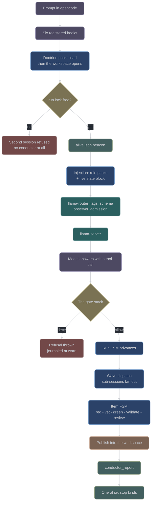

# The prompt atlas

A single map of everything that happens to a prompt between the moment you press enter in
opencode and the moment work lands in your workspace — every hook, gate, fork, state
transition and log line, in the order it happens.

This page is the entry point. The map itself is an interactive page you open in a browser:

```bash
node conductor/tools/build-atlas.ts docs/atlas.html
open docs/atlas.html
```

It has three views. **Map** is the default: the journey in eleven bands, each node clickable
for what it does, what it exists to prevent, every way it can refuse you, what it writes to
the journal, and where it lives in the code. **Graph** is the same nodes as a pannable
directed graph. **Log index** is every record conductor can write, what it means when you
see it, and which node writes it.

## Why this is generated and not drawn

A hand-drawn picture of this system is wrong the day after it is drawn, and a picture cannot
be tested. So the map is data — `conductor/tools/atlas.ts` — and its **node set is pinned to
the code**:

| Pinned against | Source | Atlas node kind |
| --- | --- | --- |
| The 22 `conductor_*` tools | `CONDUCTOR_TOOL_NAMES` (`conductor/adapter/tools.ts`) | `tool` |
| The 8 run FSM positions | `RUN_STATES` (`conductor/core/fsm-run.ts`) | `runState` |
| The 7 item FSM positions | `ITEM_STATES` (`conductor/core/fsm-item.ts`) | `itemState` |
| The 6 stop kinds | `STOP_KINDS` (`conductor/core/stops.ts`) | `stop` |
| The registered opencode hooks | `declaredHookKeys()` (`conductor/core/wiring-manifest.ts`) | `hook` |
| The closed journal vocabulary | `EVENTS` (`conductor/core/journal-events.ts`) | any node's `logs` |

`conductor/tests/atlas.test.ts` asserts the pin **in both directions**, which catches two
opposite defects. Vocabulary-to-atlas catches growth the map never heard about: add a tool,
widen an event, register a seventh hook, and the run goes red until the map follows.
Atlas-to-vocabulary catches rot: a node describing a tool that was deleted is how a map
starts lying while still passing a spot check. Every `path:line` anchor is checked to name a
file that is really on disk, and every edge endpoint must resolve to a real node.

What is **not** pinned, deliberately: the edges and the prose. No module states the pipeline
order in one place, so a person writes it and a reader checks it. The drift that actually
happens is "a gate was added and the map never heard about it", and that is the half the
test owns.

## Read it as a specification, not a recording

Every claim on the page describes what the code at this revision specifies, and a specification
is not an observation. Task 13.2 — the live smoke — **has** been run since this page was
written ([`conductor/SMOKE.md`](../conductor/SMOKE.md), measured 2026-08-21), and the 14.2 arm
campaign has run since that
([`docs/build/artifacts/14.2-arm-campaign.md`](build/artifacts/14.2-arm-campaign.md)). Both
found defects in numbers this page cannot anticipate — twenty-two in the smoke, nine in the
campaign's own measurement apparatus — so read the map as what the code *intends* and those two
records as what it *did*. Where they disagree, the records win.

Nodes carrying a `caveat` chip are the places the code is known to depart
from the obvious reading; read those first. They include the gaps worth knowing before a
live test: the git gate does not see through most command wrappers, a gate crash on an
unguarded call fails open, `fetchMetricsSummary` has no production caller so every report
records `Router contact: ABSENT`, and two journal event names are declared but never
emitted by any call site.

## The spine

The full map has 101 nodes. This is the shape they hang off.



## What to watch during a live test

The map's **Log index** view is the reference, but three things are worth knowing before you
start.

**The default file level is `info`,** so debug and trace records are absent unless you raise
it. `CONDUCTOR_LOG=trace` turns everything on; `CONDUCTOR_LOG=gates:debug,fanout:trace` is
per component. `error` and `warn` are always written regardless of threshold, and an unknown
level in that variable is ignored rather than allowed to silence a component by typo.

**Failures before a run directory exists land only on stderr.** The journal cannot be written
until a run dir exists, so a missing doctrine pack or a contended lock leaves its only trace
in opencode's stderr. Capture it.

**Check the beacon first.** `.conductor/state/alive.json` is the whole of the "is conductor
actually running?" check — the plan's visible session banner is not wired. A plugin that
failed to load looks exactly like a plugin that loaded and allowed everything.

## See also

- [Prompt lifecycle](prompt-lifecycle.md) — the same journey in prose, at reading length.
- [Run lifecycle](user/run-lifecycle.md) — the user-facing version.
- [Gates and hatches](user/gates-and-hatches.md) — the gate stack in evaluation order.
- [Observability](user/observability.md) — what a run writes, and where.
- [Observability internals](developer/observability-internals.md) — the journal, the lock and
  the beacon in detail.
