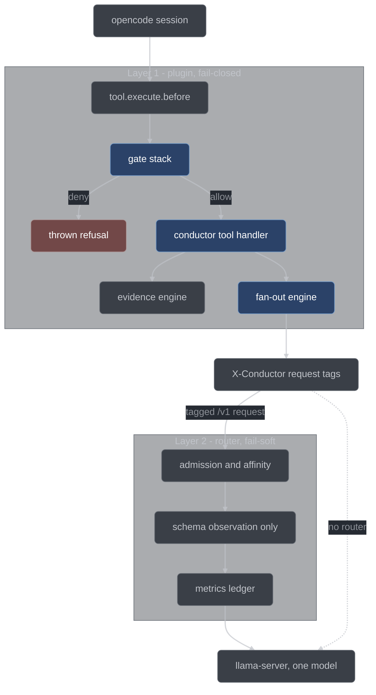
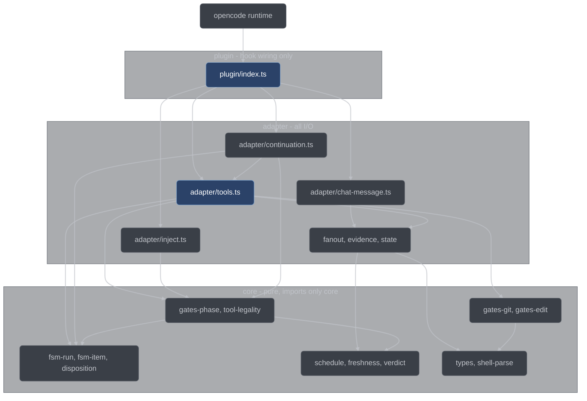

# Architecture

The structural reference for the conductor harness: what each layer owns, why the
dependency between them points the way it does, how layer 1 is put together internally,
and the two paths — a prompt and a tool call — that every other behavior hangs off. Read
this before changing anything.

## Three layers

The split follows from one structural fact and one design rule. The fact: **only the opencode
plugin can see a tool call**. `tool.execute.before` is the single point where an action can be
refused before it happens; nothing downstream ever learns a tool was invoked, let alone which
files it wanted to write. So every gate lives in layer 1, and a router-side gate is not a
design option that lost — it is impossible. The rule: a layer earns its existence by doing a
job the layer above *cannot* do. Layer 2 exists because there are exactly four such jobs, all
about the model server rather than the model's behavior.

### Layer 1 — the conductor plugin

**Owns.** All enforcement. The run and item state machines, the four gates, the twenty-two
`conductor_*` tools that are the only way to advance the machine, the evidence engine that
runs the tests itself, the fan-out engine that drives sub-sessions over the opencode SDK, the
evidence/decision/anomaly/question ledgers, doctrine injection, and the structured journal.

**Cannot do.** It does not own the model server. It cannot cap in-flight requests, cannot
influence when llama-server reuses a slot, cannot honestly validate the schema conformance of
output it also produced, and sees only the requests it issued.

**Failure posture: fail-closed.** A crash inside gate evaluation while the call is guarded
denies the call. Guardedness comes from the real parse, not the tool name: a git segment in
the command, a write-shaped target in the command, or a tool that writes, advances conductor
state, or spawns a child. A harmless read fails open. Either way the crash is journaled as
`gates/gate-crash`, so a fail-open is never a silent one.

### Layer 2 — llama-router

**Owns.** Wall-clock and measurement. It is a C++23 reverse proxy in front of
`llama-server` that passes `/v1/*` through transparently, including SSE streaming, and
serves `/conductor/*` for its own health and metrics endpoints. Everything else 404s.

| Router job                                                                                              | Why the plugin cannot do it                                                                                      | Payoff                                                                                                                                       |
| ------------------------------------------------------------------------------------------------------- | ---------------------------------------------------------------------------------------------------------------- | -------------------------------------------------------------------------------------------------------------------------------------------- |
| Admission control (cap in-flight, priority queue)                                                       | The plugin does not own the server; concurrent sub-sessions would thrash a 20 GB model and exceed its slot count | Six parallel reviewers do not grind generation to a halt                                                                                     |
| Group affinity (requests sharing a declared prefix group run contiguously)                              | The plugin cannot influence server slot-reuse timing                                                             | N reviewers share one huge prefix (diff + plan + rubric); keeping it KV-hot is the largest single wall-clock lever available under one model |
| Schema observation (a tagged request should carry a schema; non-streaming responses checked against it) | The claimant would be validating its own claim                                                                   | An independent record of how often local-model structured output actually conforms — the POC's schema-compliance dataset                     |
| Metrics ledger (tokens, timings, queue wait per request)                                                | The plugin sees only its own requests                                                                            | The POC's cost numbers are measured, not estimated                                                                                           |

**Cannot do.** It cannot enforce process. It never sees a tool call, an item, or an FSM
position. It knows a request's role, priority, and group only because layer 1 told it, via
headers added through `chat.headers`: `X-Conductor-Role`, `X-Conductor-Priority`
(`interactive` | `review` | `batch`), `X-Conductor-Group` (the prefix-affinity group id — the
session's worktree/tree path, or failing that its item id, and omitted entirely for a session
with neither, which the router treats as ungrouped), and `X-Conductor-Schema: required` on
structured-output requests.
Untagged requests are treated as `interactive` and bypass nothing — admission still applies.

**Failure posture: fail-soft.** The router runs under a small supervisor loop with capped
exponential backoff, because `serve.py` execs into the session shell and cannot supervise
anything directly. While the router is down, the plugin's router client detects it, fails
over to the upstream base URL for the remainder of the session, journals a `router.failover`
warning, and marks the run's metrics partial. Two failovers in one session stop retrying the
router entirely.

Swap-cost batching is deliberately absent: under one model for every role there are no swaps
to batch. It, and per-role model routing, live in the plan's stretch section.

### Layer 3 — the wiring

**Owns.** Putting the other two in front of `llama-server`.
[`scripts/serve.py`](../../scripts/serve.py) generates a session-scoped opencode config. It
takes `--router` / `--no-router` (defaulting to the router when the binary exists), launches the
router under its supervisor against a generated `conductor-router.json`, and merges
[`conductor/opencode-fragment.json`](../../conductor/opencode-fragment.json) — agent
definitions, permissions, and the plugin path — into that config through
[`scripts/conductor_wiring.py`](../../scripts/conductor_wiring.py). That merge is what makes
the harness travel: `cd` into any repo, run `serve.py`, and the plugin is loaded there. First-run
repo setup is the plugin's own `conductor_setup` tool, not `serve.py`'s job.

**Cannot do.** It makes no runtime decisions. Once the shell is live, `serve.py` is gone.

**Failure posture.** One number, derived once: the `llama-server` command's `--parallel
<slots>` and the router config's `maxInflightPerModel` both come from `parallel.maxReaders`,
so they cannot drift apart — otherwise the read fan-out could serialize upstream while
admission control cheerfully admitted four at a time.

### The layers in one picture



## Why the dependency direction is load-bearing

Layer 2 is fail-soft and layer 1 is fail-closed. That asymmetry is the whole reason the
two-layer split is safe, and it decomposes into three commitments.

**Process integrity never depends on the router being up.** Every gate, every FSM
transition, every piece of re-derived evidence, and every ledger write happens inside the
plugin, on the machine, with no network hop involved. Kill the router mid-run and the
enforcement is unchanged; the run gets slower and its metrics get marked partial.

**The router never converts a request the direct path would have served into a failure.**
This is the sharper half. A tagged request arriving without a schema is journaled, counted as
`schemaMissing`, and **proxied unchanged**. A non-streaming tagged response is validated
against the declared schema and the verdict recorded in the metrics line — the body is
returned **verbatim** either way. An earlier design returned 400 on a missing schema field
and wrapped non-conforming bodies in an error envelope; both were removed, because a plugin
bug that is survivable without the router must not become fatal with it.
`schema.rejectOnMissing` exists in the router config, defaults to `false`, and stays `false`
in the base build. Enforcing structured output belongs to the fan-out engine's own receipt
validation, which runs in both configurations; what the router uniquely provides is an
*independent* record, and a record needs no authority to produce.

**`--no-router` runs the identical process, and that is a tested claim.** The G5 equivalence
check runs the scripted end-to-end pipeline twice — once with the router in the loop, once with
`--no-router` — and asserts the same terminal state, the same item dispositions, and the same
commit set. The claim appears in several places in the design; that check is what makes it true
rather than aspirational.

Reverse the dependency and the system breaks: every gate would inherit the router's
availability, and "the router crashed" would become "the run was ungated".

## Inside layer 1

Layer 1 is three tiers with a strict import direction: the plugin entry wires hooks,
adapters do I/O, and core decides. Nothing points back up.



**The rule is mechanical, not aspirational.** [`tests/purity.test.ts`](../../conductor/tests/purity.test.ts)
scans every file under `core/` and fails the suite if an import is not a relative specifier
resolving inside `conductor/core/`, or if the source contains a forbidden runtime token — an
I/O module, a runtime global, a `fetch(` call, `process.env`, or `Date.now`. Every input a
core function needs arrives as an argument, including the clock, which is what makes the
gates and the FSMs testable as truth tables with no fixture repo and no subprocess. A second
scan covers the dual-runtime rule: adapters and the plugin run under opencode's Bun runtime
in production and under Node type stripping in tests, so they may use only Node-compatible
built-ins, and any file containing a subprocess-shaped call must import the one sanctioned
subprocess module.

### Core modules

| Module                                                               | Responsibility                                                                                         |
| -------------------------------------------------------------------- | ------------------------------------------------------------------------------------------------------ |
| [`core/types.ts`](../../conductor/core/types.ts)                     | Every schema as a TS type *and* a hand-written JSON Schema, plus the subset validator `validate`       |
| [`core/shell-parse.ts`](../../conductor/core/shell-parse.ts)         | Quote-aware tokenizer, operator segmentation, git command/subcommand detection, glob scope matching    |
| [`core/gates-git.ts`](../../conductor/core/gates-git.ts)             | The git deny matrix: enumerated-allow over parsed tokens, default-deny for anything unlisted           |
| [`core/gates-edit.ts`](../../conductor/core/gates-edit.ts)           | The session-registry decision, the edit-scope and freeze decisions, and the bash write-shape extractor |
| [`core/gates-phase.ts`](../../conductor/core/gates-phase.ts)         | `legalTools(run, items, questions, repoConfigured, publishEnabled)` → `{legal, recommended, why}`      |
| [`core/tool-legality.ts`](../../conductor/core/tool-legality.ts)     | The per-tool declaration table — where each tool may be called and by whom — and the override gates    |
| [`core/tool-bindings.ts`](../../conductor/core/tool-bindings.ts)     | Which handler serves each tool, and which inputs the composition root supplies                         |
| [`core/fsm-run.ts`](../../conductor/core/fsm-run.ts)                 | The eight run positions and their legal, forward-only transitions                                      |
| [`core/fsm-item.ts`](../../conductor/core/fsm-item.ts)               | The seven item positions, the behavioral and non-behavioral chains, and the annotation rule            |
| [`core/disposition.ts`](../../conductor/core/disposition.ts)         | The one item/run disposition derivation, and the one cause-to-stop-kind closer                         |
| [`core/schedule.ts`](../../conductor/core/schedule.ts)               | Wave computation — dependency readiness, scope disjointness, caps — and the per-stage read fan-out     |
| [`core/freshness.ts`](../../conductor/core/freshness.ts)             | The start-stamp freshness rule and the failure-class resolution table                                  |
| [`core/verdict.ts`](../../conductor/core/verdict.ts)                 | `verdictKind` and `findingSurvives`: an unevidenced refutation abstains, and an abstention upholds     |
| [`core/stops.ts`](../../conductor/core/stops.ts)                     | The stop-kind vocabulary, the single terminality definition, and the termination rule                  |
| [`core/decide.ts`](../../conductor/core/decide.ts)                   | Decision-protocol helpers: option scoring, human-territory classification, the two-options rule        |
| [`core/provenance.ts`](../../conductor/core/provenance.ts)           | Which artifacts carry a human's authority, and where a human writes them                               |
| [`core/planning.ts`](../../conductor/core/planning.ts)               | The decompose validation table and the plan placeholder scan, as named rejections                      |
| [`core/queue-amend.ts`](../../conductor/core/queue-amend.ts)         | The queue-amendment op vocabulary and what applying it to a queue means                                |
| [`core/vet-criteria.ts`](../../conductor/core/vet-criteria.ts)       | The five TEST_VET criteria as data, behind the schema, the pack, and both prompts                      |
| [`core/review-witness.ts`](../../conductor/core/review-witness.ts)   | The reviewer read witness: nonce, diff contact, and the check that a lens opened the diff              |
| [`core/receipt-floor.ts`](../../conductor/core/receipt-floor.ts)     | The fixer-receipt floor: a fix must touch a file its finding names                                     |
| [`core/reply-protocol.ts`](../../conductor/core/reply-protocol.ts)   | The named sub-session reply statuses and the exact-token pushback matcher                              |
| [`core/commit-message.ts`](../../conductor/core/commit-message.ts)   | The commit-message template and the trailer denylist conductor never signs                             |
| [`core/mechanics.ts`](../../conductor/core/mechanics.ts)             | The doctrine packs' generated mechanics block, derived from the tool table and the legality machine    |
| [`core/journal-events.ts`](../../conductor/core/journal-events.ts)   | The closed per-component event vocabulary and the level defaults                                       |
| [`core/vocab-registry.ts`](../../conductor/core/vocab-registry.ts)   | The four cross-language vocabularies and every site that restates them                                 |
| [`core/wiring-manifest.ts`](../../conductor/core/wiring-manifest.ts) | Every hook, tool binding, and module wire the composition root must register                           |
| [`core/preflight.ts`](../../conductor/core/preflight.ts)             | Spec currency against HEAD, and the live-artifact check that binds an artifact to its run's ledger     |

### Adapter modules

| Module                                                                 | Responsibility                                                                                                           |
| ---------------------------------------------------------------------- | ------------------------------------------------------------------------------------------------------------------------ |
| [`adapter/state.ts`](../../conductor/adapter/state.ts)                 | The `.conductor/` store: atomic writes, the run lock, the liveness beacon, run/item records, the stale-red registry      |
| [`adapter/journal.ts`](../../conductor/adapter/journal.ts)             | The leveled JSONL journal with an injected console sink and gzip rotation                                                |
| [`adapter/evidence.ts`](../../conductor/adapter/evidence.ts)           | *The* evidence writer: runs the test and verify commands, classifies the failure, appends `evidence.jsonl`               |
| [`adapter/quarantine.ts`](../../conductor/adapter/quarantine.ts)       | Out-of-repo move-aside and restore of the foreign red set, with a crash-safe manifest                                    |
| [`adapter/questions.ts`](../../conductor/adapter/questions.ts)         | The surfaced-question ledger, and clearing `blocked` on the items that named a question                                  |
| [`adapter/gitio.ts`](../../conductor/adapter/gitio.ts)                 | Read-only git queries, argv-only, never through a shell                                                                  |
| [`adapter/fanout.ts`](../../conductor/adapter/fanout.ts)               | The sub-session pool over the SDK: create → prompt → collect, with independent receipt validation and a per-job watchdog |
| [`adapter/inject.ts`](../../conductor/adapter/inject.ts)               | System-prompt append, per-role sampling params, router headers, and the fail-closed pack load at init                    |
| [`adapter/router-client.ts`](../../conductor/adapter/router-client.ts) | Router metrics and the fail-soft failover latch, absorbing every failure rather than propagating it                      |
| [`adapter/chat-message.ts`](../../conductor/adapter/chat-message.ts)   | The `chat.message` hook body: create the run, or route a mid-run prompt into the live one                                |
| [`adapter/tools.ts`](../../conductor/adapter/tools.ts)                 | `gateBeforeToolCall`, the tool-name inventory, tool classification, and the stage-tool handlers                          |
| [`adapter/continuation.ts`](../../conductor/adapter/continuation.ts)   | The `session.idle` re-prompt engine, the run-closure fold, the ask-gate, and run teardown                                |
| [`adapter/worktrees.ts`](../../conductor/adapter/worktrees.ts)         | Git worktree create/merge/remove for parallel implementers, outside the repo                                             |
| [`adapter/block-and-ask.ts`](../../conductor/adapter/block-and-ask.ts) | The transactional pair — one question plus the item's `blocked` annotation — with its crash repair                       |
| [`adapter/answer-file.ts`](../../conductor/adapter/answer-file.ts)     | The out-of-band answer file the operator drops into the state area                                                       |
| [`adapter/config-io.ts`](../../conductor/adapter/config-io.ts)         | The `.conductor/config.json` reader and the frozen defaults; a malformed config throws rather than reverting             |
| [`adapter/clock.ts`](../../conductor/adapter/clock.ts)                 | The monotonic clock the handlers stamp with, and the stamp-resolution helper freshness reads                             |
| [`adapter/jsonl.ts`](../../conductor/adapter/jsonl.ts)                 | The one tolerant ledger reader: a torn line is skipped and counted, never thrown                                         |

### The plugin entry

[`plugin/index.ts`](../../conductor/plugin/index.ts) exports exactly one thing: the plugin
factory. That is not style. The 1.18.15 loader iterates every export of a plugin module and
throws when one is not a plugin function — skipping the *whole* plugin and leaving the
session ungated. So the shared tool inventory lives in `adapter/tools.ts`, and the entry
imports it.

The factory is construction-safe: it builds closures and schemas, touches no live
opencode service, and does no blocking I/O, so tool registration is unit testable against a
synthetic plugin input with no running opencode. It builds its `tool` map *from*
`CONDUCTOR_TOOL_NAMES` rather than a hand-written literal, so a renamed or forgotten tool
cannot slip through — a test asserts the two never drift.

It registers six hooks: `experimental.chat.system.transform`, `chat.params`, and
`chat.headers` for the injection layer, `chat.message` for prompt intake,
`tool.execute.before` for the gate stack, and `event` for the idle engine and the ask-gate.
[`core/wiring-manifest.ts`](../../conductor/core/wiring-manifest.ts) declares that set, and the
completeness test asserts in both directions that what the factory registers equals what the
manifest declares — a wire that is built and imported but never registered is the failure this
closes.

## One derivation, four readers

`legalTools` in [`core/gates-phase.ts`](../../conductor/core/gates-phase.ts) returns three
things: `legal`, a map from tool name to its argument hint; `recommended`, the single next
tool to run or `null`; and `why`, a non-empty rationale. Four readers consume it:

- **the phase-order gate**, which denies any `conductor_*` call not in `legal`, with a
  reason naming what *is* legal and what is recommended;
- **the system-prompt injection**, which states the same thing to the model every request;
- **the continuation engine**, which re-prompts an idle orchestrator with exactly the
  recommended call;
- **the doctrine mechanics renderer**, which derives the stage sequences the packs teach by
  asking the gate what it recommends at each position, so a renamed tool or a moved FSM edge
  fails the build rather than leaving the doctrine quietly wrong.

The first three describe a live workspace; the renderer pins its two environment inputs to
constants, because a checked-in pack must not vary with any one repo's git mode.

They share one derivation because the alternative is three implementations of the same
question, which eventually disagree — and a disagreement here is the worst kind. If the
injection says one thing and the gate another, the model is told to do something that will
be refused, then told again next turn, and burns the run in a loop it cannot see out of. If
the continuation engine's idea of "next" diverges from the gate's, re-entry becomes a denial
generator.

This is also why the contract is a *set plus a recommendation* and not "the one legal tool".
An earlier draft asserted exactly one tool is legal at any moment, and three subsystems were
specified against that claim. It is false whenever the run has more than one item in flight —
`conductor_mark_green {I1}` and `conductor_submit_test {I2}` are simultaneously legal — and
it was never true of `conductor_status`, `conductor_decide`, or `conductor_surface`, legal in
every non-terminal state. The recommendation restores the single voice without the false
claim: it is deterministic, computed in wave order (DAG depth, then item id, then the item's
own stage order), so the same content yields the same recommendation regardless of how the
items are arranged in the array.

Treat this as an architectural rule, not a convenience. Any new consumer of "what may the
model do now" calls `legalTools`. Nothing re-derives legality from the FSM position directly.

`legalTools` answers *where* a tool may be called, and only that. *Who* may call it, and whether
a tool with no stage of its own is callable at all, is
[`core/tool-legality.ts`](../../conductor/core/tool-legality.ts)'s declaration table, which every
`conductor_*` call passes through before its handler runs. A tool with no row there is refused
rather than run, so the next tool cannot be born guarded by nothing.

## The path of a prompt

An ordered walk from a user's message to a written report, naming the module responsible at
each hop.

1. **`chat.message` arrives.** [`adapter/chat-message.ts`](../../conductor/adapter/chat-message.ts)
   checks the current run. If there is none, or it is terminal, it creates
   `runs/<runId>/run.json` in state `INTAKE`, points `current-run.json` at it, and captures
   the starting facts four later rules read: `startHead`, `startBranch`, `startDirty`, and
   `excludedStaleRed` — the stale-red registry entries in force for this run, reported to the
   user in the first response. A prompt arriving *during* a live run is routed into it as
   orchestrator context, journaled `user.midrun-prompt`, and never starts a second run.
2. **Every request is injected.** [`adapter/inject.ts`](../../conductor/adapter/inject.ts)
   appends the role's doctrine pack(s) verbatim plus a live state block — run state, active
   item, the recommended next tool call with its args, open question count, blocked and
   deferred counts, taint count, overrides remaining — through
   `experimental.chat.system.transform`. Re-stated every request, never remembered.
3. **Classification.** `conductor_classify` dispatches a `mechanical` sub-session with the
   classification schema through [`adapter/fanout.ts`](../../conductor/adapter/fanout.ts),
   then one `skeptic` check; disagreement escalates to the stricter kind. `question` answers
   and ends in `ANSWERED`. `trivial` synthesizes one item, re-checks the trivial limits and
   the behavioral-path arithmetic, and enters `EXECUTING` flagged trivial. `work` stays in
   `INTAKE` with the classification recorded.
4. **Decomposition and planning.** `conductor_decompose` dispatches the `planner`;
   [`core/planning.ts`](../../conductor/core/planning.ts) validates the queue against the
   decomposition table — DAG acyclicity, non-empty scopes, the `behavioral: false` path
   arithmetic, observable acceptance criteria, item size — where every row is a named
   rejection, and the name is what the planner is re-prompted with (`DECOMPOSED`). Then
   `conductor_plan` writes `plan.md` and extracts the design decisions into `decisions.jsonl`
   (`PLANNED`).
5. **Plan review.** `conductor_plan_review` fans out fresh reviewers, one lens each over the
   plan and queue. Each major finding faces refuters and survives per
   [`core/verdict.ts`](../../conductor/core/verdict.ts); surviving majors re-prompt the
   planner and the round increments — a loop internal to the handler that never regresses run
   state. At the round cap each surviving major becomes a question and the items it names are
   marked `blocked`. State `PLAN_REVIEWED`.
6. **The wave driver.** `conductor_dispatch_wave` computes the next wave with
   [`core/schedule.ts`](../../conductor/core/schedule.ts) — dependency-ready, pairwise
   scope-disjoint, not blocked or deferred, within the implementer cap — then *drives* it,
   one async pipeline per member through the fan-out engine. The driver exists because a
   single opencode session executes tool calls sequentially, so a marker-only dispatch would
   require the orchestrator model to emit concurrent tool calls. The design refuses to depend
   on that.
7. **An item's FSM walk.** Per wave member: `conductor_submit_test` (the handler runs the
   test through [`adapter/evidence.ts`](../../conductor/adapter/evidence.ts) and requires a
   legal red), `conductor_vet_test` (fresh critics over the test and the captured red output,
   never the implementation), `conductor_mark_green` (the handler re-runs the test; exit 0
   required), `conductor_validate` ([`adapter/quarantine.ts`](../../conductor/adapter/quarantine.ts)
   moves the foreign red set out of the tree, then the verify is start-stamped and records
   the `HEAD` it judged), `conductor_item_review` (parallel lenses, skeptic refutation,
   path-routed fixes), `conductor_publish` (branch check, stage, format, re-check freshness,
   commit — via `execFile`, never a model-issued `git commit`). State `PUBLISHED`.
8. **Report.** `conductor_report` requires that no item is still *actionable*, re-runs the full
   verify itself with the same foreign-red exclusion, writes `report.md`, and records the stop
   kind [`core/disposition.ts`](../../conductor/core/disposition.ts)'s closer returns for the
   run's persisted dispositions — `done` only when at least one item advanced and nothing is
   outstanding, and never at all when the closing verify came back red. State `REPORTED` — or
   `TRIVIAL_DONE` for a trivial run, which takes the report-lite mode of the same writer.

Every terminal path reaches one of the report writer's three modes — full, lite, or
stop-report. No terminal path writes nothing.

## The path of a tool call

Every tool call the model makes, `conductor_*` or not, passes through one function.

1. **opencode fires `tool.execute.before`.** [`plugin/index.ts`](../../conductor/plugin/index.ts)'s
   hook body is deliberately thin: it reads the command out of the args, resolves an edit
   path *only* when `classifyTool` says the tool is a write (a read tool that happens to carry
   a `filePath` must not be judged by the edit gate), builds the correlation triple, and calls
   `gateBeforeToolCall`. Returning allows; throwing denies, and opencode reads the thrown
   message back to the model as the refusal reason.
2. **The real parse happens once.** `gateBeforeToolCall` looks the session up in the registry,
   then computes three facts with the *same* quote-aware tokenizer the git gate uses
   internally: whether any segment of the command is a git command, which write-shaped paths
   the command targets, and the tool's class (`read`, `write`, `conductor`, `spawn`).
3. **The guarded flag is computed from that parse** — a git segment present, a write-shaped
   target present, or a tool class of `write`, `conductor`, or `spawn` — before any gate runs,
   precisely so it stays reliable when a gate crashes.
4. **The patch tools are refused ahead of everything.** `patch` and `apply_patch` are denied in
   every session, registered or not: a patch body carries its own write targets in a format no
   gate here parses, so the edit-scope gate has nothing to bound it with.
5. **The session-registry gate runs next.** A session with no registry entry may read; every
   write-shaped and every `conductor_*` call from it is denied naming the missing assignment.
   Sub-agent spawning is denied in *every* session, registered or not — the load-bearing half,
   because a model-spawned session would be an unregistered, unscoped writer.
6. **For a bash call, the git gate runs over the whole command,** not per segment, because
   `decideGit` allows non-git commands: running it over every bash command is how a git write
   hidden in a compound command such as `ls && git commit` is still caught. Then any interpreter
   one-liner naming the `.conductor` state area is refused whole, and then the edit-scope gate
   runs over each write-shaped target.
7. **For an edit or write tool, the edit-scope gate runs over the edited path.**
8. **Every deny journals its snapshot** under `gates/deny` at `warn` — tool name, raw args,
   the command or path, and the reason — then throws. The snapshot exists so the decision can
   be reproduced through the pure core function in a test.

Every deny point except the patch refusal first checks for a one-shot override grant keyed to
`{sessionID, gate, itemId}`. A live grant converts exactly one denial of its named gate into an
allow and is deleted in the same breath, journaled as `gates/allow` with `via: "override-grant"`.

The fail-closed guard wraps each pure decision individually. If one crashes, the anomaly is
journaled as `gates/gate-crash` at `error` and the disposition follows the guarded flag: a
guarded call is denied with a reason that says so, a harmless read is allowed.

Two more gates do not live here. The phase-order gate runs at one choke point ahead of every
`conductor_*` handler, which asks `core/tool-legality.ts` who the caller is and `legalTools` where
the run stands before the handler does anything. The ask-gate runs on the `permission.asked` bus
event; its default is deny, and only an `edit` permission backed by an active inline claim is
adjudicated at all. The `question` tool never reaches it: the fragment removes it from every
agent's offered set (`tools.question: false`) and the gate refuses the tool itself, because a
headless run has no operator to answer an ask (register D50).

## State and ledgers

Conductor's runtime state lives in the *target* repository, not in this one. Every path
below is relative to whatever workspace the user `cd`'d into.

```text
<target repo>/.conductor/
├── config.json                 # per-repo config: verify scopes, git mode, caps
├── state/
│   ├── current-run.json        # pointer {runId} | null
│   ├── alive.json              # liveness beacon {pid, startMs, version, sessionID}
│   ├── stale-red.json          # cross-run registry of abandoned red tests
│   ├── halt                    # owner-only halt file; the model never touches it
│   ├── run.lock                # single-writer lock {pid, startMs, sessionID?, token?}
│   ├── run.lock.break.<key>    # transient: an exclusive right to break a stale lock
│   └── run.lock.stale.<key>    # transient: the broken lock, set aside
└── runs/<runId>/
    ├── run.json                # run FSM state + starting facts
    ├── queue.json              # items + dependency DAG
    ├── items/<itemId>.json     # per-item FSM state + evidence refs
    ├── plan.md
    ├── report.md               # written on EVERY terminal stop, not only `done`
    ├── journal.jsonl           # the structured event journal
    ├── evidence.jsonl          # red/green/verify records
    ├── evidence.seq            # the durable evidence-seq reservation counter
    ├── evidence.seq.lock       # the counter's latch
    ├── decisions.jsonl
    ├── anomalies.jsonl         # overrides, gate crashes, disengages
    ├── questions.jsonl         # the blocked-set source
    ├── publish-batch.jsonl     # one record per published item: git mode, staged files, diff, message
    ├── verify-running-<tree>.json  # the per-tree verify marker; its presence is the freeze
    ├── block-intents/          # transient: an in-flight block-and-ask pair
    └── answers/                # the operator's out-of-band answer files
```

The `.conductor/` prefix is registered in the target's `<gitCommonDir>/info/exclude`, never in its
tracked `.gitignore` — the harness must not dirty a target's tracked files with its presence. The
*common* gitdir is the target on purpose: in a linked worktree the per-worktree gitdir is a file
rather than a directory, so composing `<root>/.git/info` there fails, and an exclude written into
a per-worktree gitdir would be inert anyway.

**Atomic write discipline.** Every persisted write goes through `writeFileAtomicSync` in
[`adapter/state.ts`](../../conductor/adapter/state.ts): bytes to a pid-suffixed temp file in
the *same directory* — so the rename is a true same-filesystem atomic swap — then renamed over
the target. If the rename fails, the temp is removed and the old target stays byte-for-byte
intact, so a crash mid-commit can never leave a half-written record for the next run to parse.
The one exception by design is the evidence ledger: an append-only JSONL owned exclusively by
`adapter/evidence.ts`, which every other component reads through the state store.

**The workspace lock.** `run.lock` holds `{pid, startMs, sessionID?, token?}`. A claim is
published by `linkSync` from a fully-written same-directory temp, so the file another session
observes is never partially written. Against an existing lock the store decides: a dead pid
(signal 0 reports `ESRCH`) or an over-age lock is stale, and a live, young, foreign lock means a
second session.

A second session is **refused**, not demoted. `openWorkspace` journals `lock.contended` at `warn`
and throws `WorkspaceLockedError` naming the holder; no store is returned and there is no
read-only mode to fall back into. There is a second refusal with the same code,
`workspaceUnreclaimableError`, thrown when the retry budget is exhausted; it deliberately does not
assert the named pid is alive, and it tells the operator which files to remove by hand.

Breaking a stale lock is a three-part, identity-keyed compare-and-delete rather than an overwrite:
an exclusive `run.lock.break.<key>` file grants the right, the lock is re-read under that right,
and the broken lock is moved aside to `run.lock.stale.<key>`. An opencode crash must never wedge a
workspace, and a lock is never stolen from a process that might still be running.

**Why quarantine and worktrees live outside the repository.** `.git/info/exclude` hides a
directory from *git*. It hides it from nothing else. The verify command is the target repo's
own test command, and every default the design ships — `node --test`, `pytest`,
`go test ./...`, `ctest` — discovers tests by walking the tree, so a red test file parked
under `.conductor/` can still be collected by the very verify it was moved aside to protect,
and a worktree, being a complete second checkout of every test file, is guaranteed to be.
Both therefore live at `<stateHome>/conductor/<workspaceKey>/quarantine/<runId>/` and
`.../worktrees/<runId>/<itemId>/`, where `<stateHome>` is `$XDG_STATE_HOME` or
`~/.local/state`, and `<workspaceKey>` is the first 16 hex characters of the SHA-256 of the repo
root's absolute path, so two checkouts never collide. Per-runner discovery behavior for dot-directories is
a version-dependent accident, measured rather than assumed and recorded in
[`RUNNER-DISCOVERY.md`](../../conductor/docs/RUNNER-DISCOVERY.md); correctness comes from the
files being outside the walked tree entirely.

## Repository layout

```text
llama-leash/
├── conductor/                     # layer 1 — the opencode plugin
│   ├── plugin/index.ts            # the plugin factory: hook wiring only
│   ├── core/                      # pure decision + state-machine modules
│   ├── adapter/                   # all I/O
│   ├── doctrine/                  # the nine markdown doctrine packs
│   ├── tools/                     # dev tools: schema export, replay, audit, checks
│   ├── tests/                     # *.test.ts + fixtures
│   ├── docs/                      # OPERATIONS.md, HONEST-LIMITS.md, RUNNER-DISCOVERY.md
│   ├── opencode-fragment.json     # merged into the session opencode config
│   ├── DECISIONS.md               # the standing-decisions ledger
│   └── tsconfig.json
├── router/                        # layer 2 — the C++ router
│   ├── main.cpp                   # llama-router entry: a thin adapter over cli.hpp
│   ├── *.hpp                      # header-only modules + UPSTREAM_CONTRACT.md
│   └── tests/                     # doctest suites; CMake target `router-tests`
│       └── schemas/               # generated JSON Schemas (gitignored)
├── dashboard/                     # the optional ftxui metrics TUI over the router ledger
├── tools/                         # standalone measurement tools — NOT part of the router
│   └── membench/                  # dependency-free memory-bandwidth probe
├── scripts/                       # layer 3 — the wiring, plus the model harness
├── bench/                         # the benchmark task set
├── extern/llama-cpp/              # pinned llama.cpp submodule
├── cmake/                         # toolchain, warnings, clang-format helpers
├── docs/
├── CMakeLists.txt
├── CMakePresets.json
├── vcpkg.json
└── setup.sh
```

Three deviations from the plan's layout section are user-directed and recorded in
[`docs/build/HANDOFF.md`](../build/HANDOFF.md); the plan itself is immutable, so the record
lives there and in `docs/build/STATE.json`.

| Plan says           | Reality          | Note                                                                                                                                       |
| ------------------- | ---------------- | ------------------------------------------------------------------------------------------------------------------------------------------ |
| `src/`              | `router/`        | The component is named for what it is. In a repo with two components, `src/` names neither                                                 |
| `src/router-tests/` | `router/tests/`  | Only the directory moved — the CMake *target* is still named `router-tests`, which is the ctest name every gate cites                      |
| root `tools/`       | `tools/`         | Standalone measurement tools with no project dependencies, so they sit beside `router/` rather than inside it                              |
| —                   | The include rule | Every in-workspace header is included by its full path from the repo root: `#include "router/version.hpp"`, never `#include "version.hpp"` |

The include rule applies to every in-workspace header, `router/` and `dashboard/` alike: the
REPO ROOT is the only user-code include root, and the three targets that include such a header
— `llama-router`, `router-tests` and `conductor-dashboard` — each get it and nothing else, so an
include names where the header actually lives no matter which file does the including.
`membench` is one self-contained translation unit that includes nothing from the workspace and
sets no include root at all. Generated schemas land in `router/tests/schemas/` and are
gitignored.

One build note follows from the layout: build only the named targets
(`--target llama-router`, `--target router-tests`, `--target membench`). A bare
`cmake --build` also compiles the whole vendored `extern/llama-cpp` tree, which no target in
this project links. A fourth target, `conductor-dashboard`, is built only when
`-DCONDUCTOR_DASHBOARD=ON` is passed: it is the one target that links `ftxui`, and the pure
aggregation header it stands on is exercised by `router-tests` either way.

## See also

- [Core and adapters](core-and-adapters.md) — the module-by-module reference behind the map above
- [State machines](state-machines.md) — the run and item FSMs in full
- [Gates](gates.md) — the four gates, their order, and their deny reasons
- [llama-router](llama-router.md) — layer 2 in detail
- [Project status](project-status.md) — what is built, what is next, what is deferred
