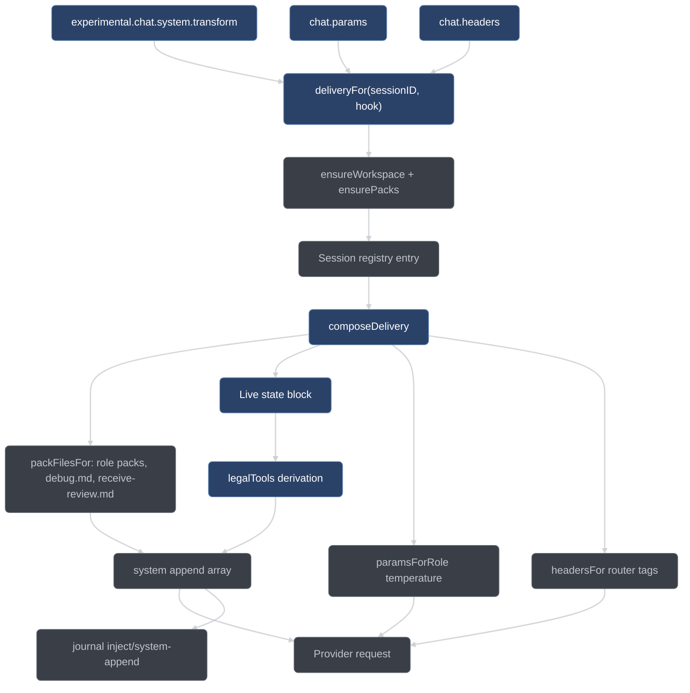

# The doctrine system

How conductor gets rules in front of the model: nine short packs in
[`conductor/doctrine/`](../../conductor/doctrine/), injected into every request by
[`adapter/inject.ts`](../../conductor/adapter/inject.ts). This page covers what is
injected, how, and what it takes to change it.

## Doctrine, not skills

Conductor inherits its working rules from two sources: a skill library (TDD,
systematic debugging, subagent-driven review, verification-before-completion) and a
minimality ruleset called ponytail. Neither is carried over in its original form,
because both are *opt-in*: the model is supposed to notice that a skill applies and
load it.

A local model self-activates an optional skill approximately never. That is the
observed failure the design starts from (plan §0.6), and it is the reason the skill
library is not shipped as skills. Instead each source skill is compiled into a short,
phase-scoped **doctrine pack**, and the plugin injects the pack into the system prompt
of exactly the session that needs it: the test-writer gets the TDD iron law, the
planner gets the ladder and the plan-writing rules, the debugger gets the four-phase
protocol. Nothing has to be activated, because nothing is optional.

Two consequences follow, and they are the whole design:

- **Compression is mandatory.** A pack distills its source skill's iron laws, gate
  functions, rationalization tables, and red-flag lists — it does not quote the skill
  wholesale. The ceiling is 120 lines and 6500 bytes per pack, both pinned by test,
  because these packs ride in the system prompt of a 32k-context local model on every
  single request — and a role can receive two of them at once.
- **Every doctrine obligation that can be a gate is one** (constraint G9). Doctrine never
  carries enforcement on its own. `tdd.md` states the iron law, but RED before GREEN is
  enforced by the item FSM's transition order; `core.md` states the override budget, but
  `maxOverridesPerItem` is counted by the handler. The prose makes the legal path obvious;
  making the illegal path impossible is the gates' job. See [gates.md](gates.md) and
  [state-machines.md](state-machines.md).

Packs are also **client-agnostic**. No pack names opencode, Claude, or Cursor, and a
test asserts it over all nine files. Model-facing text describes the harness, not the
client that happens to host it.

## The port map

The mapping from each source skill to its enforcement point and its doctrine text is
normative (plan §6.1). Enforcement comes first; doctrine second. Some rows have no pack
at all, because the obligation is fully mechanical and prose would add nothing.

| Source                             | Enforcement (mechanical)                                                                                                                                                              | Doctrine (injected)                                                            |
| ---------------------------------- | ------------------------------------------------------------------------------------------------------------------------------------------------------------------------------------- | ------------------------------------------------------------------------------ |
| test-driven-development            | Item FSM order (RED before GREEN is structurally impossible to skip); handler-run red/green; `failureClass: "assertion"` legality; evidence ledger                                    | `tdd.md` — iron law, minimal-code rule, red-flag rationalizations table        |
| testing-anti-patterns              | TEST_VETTED critic lenses; test-adequacy review lens after implementation                                                                                                             | `test-vet.md` — the five anti-patterns as checkable questions                  |
| verification-before-completion     | Every FSM advance re-derives evidence in the handler; `conductor_report` re-runs the full verify itself                                                                               | `core.md` — evidence before claims, forbidden satisfaction phrases             |
| systematic-debugging               | DEBUG sub-state entered on validate failure; `debugFixCap` triggers a surfaced architecture escalation                                                                                | `debug.md` — four phases, one-hypothesis rule, 3-fix architecture question     |
| brainstorming                      | INTAKE classification plus skeptic check; decision records require ≥2 options with scores; human-territory classifier gates the ask                                                   | `core.md` decisions section plus the §6.2 protocol                             |
| writing-plans                      | Plan schema plus placeholder-scan lens in plan review; bite-size enforced by decomposition size checks                                                                                | `plan.md` — exact paths, complete code where acceptance leaves a choice, no-placeholder patterns        |
| subagent-driven-development        | The executor loop *is* this skill: a fresh sub-session per item; spec-before-quality preserved as adjudication order; implementer status protocol including re-split escalation       | `review.md` ordering section                                                   |
| dispatching-parallel-agents        | Wave scheduler independence criteria (dependencies plus scope disjointness)                                                                                                           | `decompose.md` independence section                                            |
| requesting-code-review             | Reviewer lens prompts derive from the code-reviewer template (severity calibration, `file:line` specificity; an empty findings array *is* the approval verdict)                       | `review.md`                                                                    |
| receiving-code-review              | Surviving findings routed to the implementer with a verify-first protocol; pushback goes through one more skeptic round, never silent acceptance                                      | `receive-review.md` — no performative agreement, no gratitude, verify then fix |
| using-git-worktrees                | `adapter/worktrees.ts`                                                                                                                                                                | — (fully mechanical)                                                           |
| finishing-a-development-branch     | The `conductor_publish` and `conductor_report` handlers                                                                                                                               | — (fully mechanical)                                                           |
| executing-plans                    | Superseded by the run FSM itself                                                                                                                                                      | —                                                                              |
| using-superpowers / writing-skills | Obsolete by design: doctrine is always on by injection, so the "skills self-activate zero times" failure is designed out                                                              | —                                                                              |
| **ponytail**                       | Ladder rung plus reuse note required per item; minimality lens in plan review *and* item review; guardrail lens (security, validation, data loss, accessibility) exempt from laziness | `decompose.md` — the seven-rung ladder; `core.md` — lite reminder              |

The pack-less rows matter as much as the rest. Worktrees and branch-finishing are fully
mechanical, `executing-plans` disappears because the run FSM already sequences the work,
and the skills-about-skills row is obsolete because injection removes the problem those
skills existed to manage.

## The nine packs

The packs are the source of truth for their own content. This section says who receives
each one and what its one non-obvious rule is; read the pack itself for the rest.

### [`core.md`](../../conductor/doctrine/core.md)

Received by the orchestrator and the mechanical role, and the fallback for any session
whose role is unrecognized. It carries the run shape, records-over-assertions, the
forbidden completion phrases (`should work`, `should pass`, `looks good`), the decision
ladder, the ask policy, the minimality reminder, and the override budget. Its run-shape
section names no tool at all: it points at the generated mechanics block below it for the
stage sequence, so the pipeline a reader is taught is the one the legality machine
derives. Non-obvious rule: budget **exhaustion
is an `env` stop** — when `maxOverridesPerItem` or `maxOverridesPerRun` is spent, the next
attempt is not granted and is never converted into another override; the run halts. A gate
that needs overriding twice in one run is a defect in the system, and stopping keeps the
trail short enough for a human to read.

### [`decompose.md`](../../conductor/doctrine/decompose.md)

The planner's first pack. It sizes items (its generated block carries the queue gate's own
caps — 5 files, one acceptance cluster, a read-set token budget — rather than a hand-typed
figure), defines `fileScope` disjointness and the `dependsOn` DAG, states the
behavioral / non-behavioral path test, and carries ponytail's seven-rung ladder verbatim:
`skip` < `reuse` < `stdlib` < `platform` < `dependency` < `one-liner` < `minimal-code`.
Non-obvious rule: **prefer a new test file per item** — shared test files couple otherwise
independent items, and quarantine works at file granularity, so one item's quarantine
would take another item's coverage with it.

### [`plan.md`](../../conductor/doctrine/plan.md)

The planner's second pack. Three rules: exact repository-relative paths for every step,
bite-sized steps, and complete code only where the item's `acceptance` and `testScope` leave
a real choice open — everywhere else the step names its path, its symbol and its change and
stops, because the acceptance the planner would be transcribing is the same acceptance the
implementer reads. Non-obvious rule: **"similar to task N" is a named defect**, alongside
to-be-determined steps and bare "add error handling". Cross-references hide exactly the
decisions a plan exists to fix.

### [`tdd.md`](../../conductor/doctrine/tdd.md)

Received by the test-writer and the implementer. It carries the iron law —
`NO PRODUCTION CODE WITHOUT A FAILING TEST` — the red/green/commit cycle, the no-stubs
rule, and a table of seven rationalizations with their rebuttals. Non-obvious rule:
**delete means delete.** Production code written before its test is deleted, not kept "as
reference" and not adapted while the test is written, because adapting it is testing-after
and a test written after passes on the first run.

### [`test-vet.md`](../../conductor/doctrine/test-vet.md)

The reviewer's second pack, used when vetting a submitted test. Five anti-patterns:
testing mock behavior, test-only methods in production, mocking without understanding,
incomplete mocks, integration tests as an afterthought. Non-obvious rule: an **incomplete
mock** is a defect even when the test is green — a mock must mirror the complete structure
the real dependency returns, because downstream code reading a field the mock omitted
fails silently in the test and loudly in production.

### [`debug.md`](../../conductor/doctrine/debug.md)

Received by an implementer whose active item is in DEBUG posture. Four phases in order:
Root Cause Investigation, Pattern Analysis, Hypothesis and Testing, Implementation — one
falsifiable hypothesis at a time, tested with the smallest possible probe. Non-obvious
rule: the **3-fix rule.** After three fixes at the same failure site have each failed,
stop and question the architecture rather than attempt a fourth patch; three failed fixes
means the frame is wrong, not that the fourth guess is due.

### [`review.md`](../../conductor/doctrine/review.md)

The reviewer's primary pack. Severity triad (`major` / `minor` / `nit`), calibration
rules, `file:line` on every finding, one concern per finding, and the shape of a finding
a reader can verify; an empty findings list is a valid, complete review and *is* the
approval. Non-obvious rule: **spec before quality.** While any spec finding from a round
is still surviving, every quality finding raised in the same round is discarded rather
than carried forward — it was judged against code about to change — and re-derived after
the spec fixes land.

### [`skeptic.md`](../../conductor/doctrine/skeptic.md)

Received by the skeptic role. The job is to *refute* the finding in front of it: read the
exact lines cited, trace the path, demand specifics, and judge exactly one finding in
isolation. A finding survives iff the seats that did *not* refute it reach ⌈k/2⌉ of `k`
skeptics, and a tie upholds. Non-obvious rule: **a refutation carries evidence, and one
that does not is an abstention that upholds.** `upheld: false` counts as a refutation only
when `refutationEvidence` names all three of the discriminating input, the run, and the
reading; anything less is recorded as an abstention and counted with the upholds. "I could
not evaluate it" is an abstention; "I tried to break it and could not" is an uphold. The
asymmetry is deliberate: a refutation nobody can audit would otherwise be enough to kill a
true finding. The aggregation is [`core/verdict.ts`](../../conductor/core/verdict.ts).

### [`receive-review.md`](../../conductor/doctrine/receive-review.md)

The pack for a session receiving surviving findings. Verify the claim against the code
before implementing it: a verified claim gets a minimal root-cause fix, a wrong claim gets
a refutation with evidence, an unclear claim gets a question. Performative agreement is
banned by phrase, starting with "You're absolutely right". Non-obvious rule: **never
weaken an assertion to make a finding disappear** — resolving a review comment by quietly
loosening the test is called out as the worst possible fix.

## Injection mechanics

Injection is one composition delivered through three opencode hooks. The composition
root is [`plugin/index.ts`](../../conductor/plugin/index.ts), which registers
`experimental.chat.system.transform`, `chat.params`, and `chat.headers` on the object it
returns to opencode. All three call the same internal `deliveryFor(sessionID, hook)`,
which resolves the workspace, loads the packs, seeds the orchestrator's registry entry,
reads the session's registry entry, and hands the whole lot to `composeDelivery` in
[`adapter/inject.ts`](../../conductor/adapter/inject.ts).

That single seam is the design, not an accident of factoring. If each hook composed its
own answer, a request could carry one role's doctrine and another role's router headers,
and the router's prefix affinity would be a lie. `composeDelivery` returns a `Delivery`
carrying everything one request needs plus what the record of it names: `role`,
`packFiles`, `packDigest`, `stateBlock`, `system`, `params`, `headers`.

The delivery is composed **per request and never cached**. G9's point is that the state
block describes the run at this moment; a memoized delivery would re-state a position the
run has already left.

If composition throws, the failure is journaled once as `state`/`hook.failed` and the hook
appends nothing — conductor failing must not take the user's session down (G5).

**`buildSystemAppend(registryEntry, run, items, questions, packs, ctx)`** builds the body
of `experimental.chat.system.transform`. It returns
`[primaryPack, ...secondaryPacks, stateBlock]`: `append[0]` is the role's primary pack
**verbatim** from the cached map, and the last entry is always the live state block. The
transform hook **appends** these entries onto `output.system`; it never replaces what
opencode already put there. The role-to-pack table is fixed:

| Role                        | Packs appended                   | Temperature | Priority tag  |
| --------------------------- | -------------------------------- | ----------- | ------------- |
| `orchestrator`              | `core.md`                        | 0.4         | `interactive` |
| `planner`                   | `decompose.md`, `plan.md`        | 0.7         | `interactive` |
| `testWriter`                | `tdd.md`                         | 0.5         | `review`      |
| `implementer`               | `tdd.md` (+ `debug.md` in DEBUG) | 0.4         | `review`      |
| `reviewer`                  | `review.md`, `test-vet.md`       | 0.3         | `review`      |
| `skeptic`                   | `skeptic.md`                     | 0.3         | `review`      |
| `mechanical`                | `core.md`                        | 0.1         | `batch`       |
| unknown, incl. unregistered | `core.md` (fallback)             | 0.4         | `interactive` |

A session opencode knows about but conductor does not gets the literal role string
`unregistered` rather than a promotion into one of the seven — it still receives `core.md`,
so an unregistered session is grounded rather than ungoverned, and the receipt says what
it actually was. The three role maps live in `inject.ts` as `ROLE_PACKS`,
`ROLE_TEMPERATURE`, and `ROLE_PRIORITY`; [`core/vocab-registry.ts`](../../conductor/core/vocab-registry.ts)
declares the seven role names once and a generated parity test fails if a role is added to
one map and forgotten in another.

Selection of the pack *files* is factored out as `packFilesFor(registryEntry, items)` so a
caller can name what was delivered without re-deriving the rule. Two conditional secondary
packs ride on top of the role's primaries:

- **`debug.md`** — the role must be `implementer`, the registry entry must name an item,
  and that item must carry `debugging: true`. `tdd.md` stays `append[0]`.
- **`receive-review.md`** — the registry entry must carry `receivingReview: true`.

Both are de-duplicated, so a pack already in the role's row is never appended twice. If a
selected pack is missing from the cache it contributes nothing, and an empty string is
pushed when nothing resolved at all, so `append[0]` is always a string and the state block
is always last.

That de-duplication covers **this list**, and the list is not the only channel. An agent's own
`prompt` in `conductor/opencode-fragment.json` is a second one, and when it carried `core.md`
the model received that pack twice per request — measured at ~1.7k tokens of duplicate on the
13.2 smoke, by a de-duplication that was working exactly as specified on the half it could see.
The orchestrator's prompt is now a 147-character pointer *to* the appended doctrine rather than a
copy of it, which is what makes "never twice" true end to end;
[`conductor/tests/fragment.test.ts`](../../conductor/tests/fragment.test.ts) pins it so a pack
cannot drift back in. It is deliberately not empty, because an agent with no prompt receives
opencode's own 9.7k-character default instead — larger than the pack it would have displaced.

**`paramsForRole(role)`** returns the `chat.params` sampling settings — the temperature
column above, defaulting to 0.4 for an unrecognized role. The return type allows an
optional `topP`; the table sets temperature only. The hook writes `temperature` (and
`topP` when the delivery carries one) and deliberately leaves `topK` and
`maxOutputTokens` alone: overwriting parameters §4.1 says nothing about would substitute
the harness's defaults for the model's under cover of a table that does not mention them.

**`headersFor(registryEntry, job?)`** returns the router tags for `chat.headers`. The hook
adds them to `output.headers` rather than replacing the map, because the provider's own
auth headers live there too.

| Header                 | Value                                                                                |
| ---------------------- | ------------------------------------------------------------------------------------ |
| `X-Conductor-Role`     | the registry entry's role, verbatim                                                  |
| `X-Conductor-Priority` | the priority column above (`interactive` when unknown)                               |
| `X-Conductor-Group`    | the session's `tree`, else its `itemId` — **omitted** when it has neither            |
| `X-Conductor-Schema`   | `required`, only when the delivery is composed with a job flagging structured output |

The group header is the prefix-affinity key: sessions sharing a worktree share a hot KV
prefix. A tree-less orchestrator has no natural group, so the header is left off entirely
and the router treats the request as ungrouped. The schema header is a `headersFor`
capability the composition root does not exercise — it composes deliveries without a job
— so plugin-issued requests carry the first three. The router accepts the fourth wherever
it appears. See [llama-router.md](llama-router.md).

**`loadPacks(doctrineDir)`** is the fail-closed loader, and with `initPlugin` the only
part of `inject.ts` that touches the filesystem. It reads all nine required packs by name
and throws an error *naming the offending file* if any one is missing, unreadable, or
present but empty — a whitespace-only pack is absent doctrine, and it fails the same way.

The plugin calls `loadPacks` through its own `ensurePacks(hook, sessionID)`, which
memoizes the result **keyed on the resolved doctrine directory** and, on failure,
journals `state`/`hook.failed` with the directory and the message before rethrowing.
`ensureWorkspace` calls `ensurePacks` *before* it opens the workspace, so the §3.8
liveness beacon at `.conductor/state/alive.json` is written only for a workspace whose
doctrine can actually be delivered. Written the other way round, the beacon would appear
and a run would start while the pack failure waited for the first stage tool. The beacon's
*absence* is therefore proof that init did not complete, which matters because a plugin
factory throw leaves opencode running completely ungated. `initPlugin({doctrineDir,
logError, writeBeacon})` expresses the same load-then-beacon ordering as a single
injectable function and is exported as a boundary entry point for tests; the running
plugin uses `ensurePacks` plus `openWorkspace`.

**The doctrine directory is overridable.** By default the packs are read from the
`conductor/doctrine/` directory that ships beside the plugin, resolved from the plugin
module's own location rather than from a working directory. Setting
`LLAMA_HARNESS_DOCTRINE_DIR` in the session environment points the loader somewhere else.
It is read at call time, not frozen at module load, so a directory changed between two
tool calls is honored by the second — and an override missing a required pack fails closed
through `loadPacks` exactly as a missing shipped pack would.

The three transform helpers are pure: no I/O, no clock, no randomness. Identical inputs
yield byte-identical output, which is what lets the state block be re-stated on every
request without drifting, and what makes injection replay-testable.

### The delivery record

Delivery leaves a trail, because "the pack was loaded" and "the pack reached the model"
are different claims. The transform hook journals one `inject`/`system-append` record per
request carrying `role`, `packs`, `packDigest`, `stateBlock` (a boolean — did the block go
at all), `stateBlockLines`, and `entries`. Both names are already in the closed §7.4
vocabulary, so recording delivery widens nothing. See [observability-internals.md](observability-internals.md).

`packDigest` is a sha256 over each delivered pack's name and bytes, length-prefixed so the
framing is unambiguous, truncated to 16 hex characters. It is a digest of *content*, so a
doctrine directory swapped under a live run changes the trail even when the file names do
not.

`conductor_status` reports the same facts back as `deliveries`: one row per session that
has received doctrine in this run — `sessionID`, `role`, `packs`, `packDigest` — read off
the journal rather than re-composed, and only the last delivery per session, since the
delivery is re-composed every request and only the most recent one describes the session
as it stands. The field is `[]` rather than absent when nothing has been delivered.

### The generated mechanics block

Each pack ends with a section fenced by `<!-- BEGIN GENERATED MECHANICS -->` and
`<!-- END GENERATED MECHANICS -->`. Everything above the opening marker is hand-written;
everything between them is derived by
[`core/mechanics.ts`](../../conductor/core/mechanics.ts) and must never be hand-edited.

The derivation *asks* rather than lists. `runStageTools()` walks synthetic run positions
and collects what `legalTools` recommends at each; `itemStageTools()` walks the item FSM
states the same way; `metaTools()` is the bound tool vocabulary minus the stage set; and
`subSessionTools()` is the set of tools whose legality record admits a `sub-session`
caller. A tool renamed or an FSM edge moved changes the packs, because a second
hand-written list is exactly the drift this module exists to remove.

`PACK_SECTIONS` says which derived facts each pack carries, because a planner never runs
an item stage tool and an implementer never runs the run pipeline:

| Pack                | Generated sections                 |
| ------------------- | ---------------------------------- |
| `core.md`           | run, item, meta, callers, stuck    |
| `decompose.md`      | run, callers, **limits**, stuck    |
| `plan.md`           | run, callers, stuck                |
| `tdd.md`            | item, callers, stuck               |
| `test-vet.md`       | item, callers, **criteria**, stuck |
| `debug.md`          | item, callers, stuck               |
| `review.md`         | item, callers, stuck               |
| `skeptic.md`        | run, item, callers, stuck          |
| `receive-review.md` | item, callers, **replies**, stuck  |

All nine carry the uniform stuck-state protocol. `decompose.md` alone carries the measured
queue limits — the `fileScope` file cap, the read-set token budget, and the
one-acceptance-cluster rule, rendered from the same `core/planning.ts` constants the queue
gate counts with, so the pack teaches the number the gate checks. `test-vet.md` alone
carries the vet criteria, and `receive-review.md` alone carries the reply protocol.

Regenerate with:

```bash
node conductor/tools/generate-mechanics.ts [doctrineDir]
```

It splices the fresh block between the markers in place — hand-written words never move —
appends a block to a pack that has none, and refuses by pack path when the markers say
neither of those things (two opening markers, an orphaned closing marker, an unclosed
one). It writes only the packs that changed, printing `regenerated mechanics: <pack>`.
Importing the module rewrites nothing.

Forgetting to run it is a red, not silent drift: `I4B-1A` in
[`doctrine-mechanics.test.ts`](../../conductor/tests/doctrine-mechanics.test.ts) asserts
every pack carries exactly one block equal to a fresh derivation, and `I4B-1B` re-walks
the legality machine independently and compares.

### Doctrine in dispatch prompts

The system append is not the only path doctrine travels. A dispatch prompt that needs to
state a rule composes the pack's own section into itself verbatim through
`doctrineSlice(packs, file, headings, tool)` in
[`adapter/tools.ts`](../../conductor/adapter/tools.ts), rather than re-spelling the rule
in a prompt literal — two unguarded spellings of one rule is exactly how the model ends up
weighting the wrong one.

| Prompt                            | Pack           | Section(s)                                                                      |
| --------------------------------- | -------------- | ------------------------------------------------------------------------------- |
| `conductor_decompose`             | `decompose.md` | Rejection checklist (self-check before you return)                              |
| `conductor_plan`                  | `plan.md`      | Self-check before returning                                                     |
| `conductor_plan_review` (lens)    | `review.md`    | An empty review is the approval                                                 |
| `conductor_plan_review` (skeptic) | `skeptic.md`   | Your verdict and how it counts; Refutation carries evidence; abstention upholds |
| `conductor_item_review` (lens)    | `review.md`    | An empty review is the approval; The read witness                               |
| `conductor_item_review` (skeptic) | `skeptic.md`   | Your verdict and how it counts; Refutation carries evidence; abstention upholds |

Both failure modes fail closed and name the pack: a missing pack refuses with "this
dispatch is governed by doctrine … and the loaded pack set has none", a missing section
with "carries no section …; the dispatch prompt composes its rules FROM that section and
will not re-spell them". The debug fix dispatch is the one that prepends the *whole* of
`debug.md` rather than a section, and refuses the same way without it.

## The live state block

The state block is the last entry of the append array. It is re-stated on every request
and never remembered: the model is not expected to carry run state across turns, so the
block rebuilds it from the store each time. It contains, in order:

```text
Conductor live state — re-stated every request (§6.4), never remembered.
Run state: <run FSM state>
Active item: <itemId> (<item FSM state>)          # sub-sessions only
Recommended next tool: <tool> [on <itemId>]
Other legal tools available now: <n> (call conductor_status to enumerate them).
Open questions: <n>
Items blocked: <n> · deferred: <n>
Taint count: <n> · overrides remaining: <n>
```

The ceiling is **30 lines**. It is not a truncation in the renderer; it holds because the
block *summarizes* rather than enumerates, and the injection suites assert it as a
property. The block names one recommended tool and, for a sub-session, its own active
item — never the full item list. Every other legal tool is folded into a count,
deliberately: a second named tool would read as a second instruction and contradict the
recommendation. A run with forty items produces the same size block as a run with two.

The recommendation itself comes from
`legalTools(run, items, questions, repoConfigured, publishEnabled)` in
[`core/gates-phase.ts`](../../conductor/core/gates-phase.ts) — the same single
derivation the phase gate and the continuation engine use, so injection can never
recommend a tool the gate would deny. When nothing is recommended, the block renders
`legalTools(...).why` verbatim rather than asserting terminality, because the derivation
already computed the authoritative reason (terminal run, stalled wave, non-work INTAKE).
The count of other legal tools excludes the recommended one. An `itemId` in the registry
entry that is not in the current item set is reported as such rather than silently
dropped.

A workspace with no live run gets a different, shorter block rather than a fabricated
run: the same header line, `Run state: none — this workspace has no live conductor run.`,
and a recommendation line saying a run is created when the orchestrator receives a prompt
and pointing at `conductor_status`. Every field the live block reports would be an
invention here, and a state block that invents the run state is worse than one that says
there is none. The doctrine packs still go: a session with no run is still governed by its
role's pack.

Four values cannot be derived from the run, the items, or the questions, so they arrive
in a trailing `InjectCtx`:

| Field                | Meaning                                                                                                                                                                               |
| -------------------- | ------------------------------------------------------------------------------------------------------------------------------------------------------------------------------------- |
| `repoConfigured`     | forwarded to `legalTools`; an unconfigured repo recommends `conductor_setup`                                                                                                          |
| `publishEnabled`     | forwarded to `legalTools`; whether the workspace root is a git repository at all, so the block never recommends `conductor_publish` in a run where the handler would always refuse it |
| `taintCount`         | overrides recorded against this run so far — permanent, and headlined in the report                                                                                                   |
| `overridesRemaining` | what is left of the budget, so the model can see the hatch closing                                                                                                                    |

The `InjectCtx` field is required rather than optional, and threaded rather than derived inside
the renderer: deriving it means shelling out to git, and this code runs on every prompt.
The composition root computes it once per delivery and fails closed to `false` if the
check itself errors.



## Ponytail intensity

`config.ponytail` in the per-repo `.conductor/config.json` (see the
[configuration reference](../user/configuration.md)) selects how hard the minimality
ladder is enforced. It changes handler behavior and prompt text, not which packs are
injected.

| Intensity        | What changes                                                                                                                                                                                                                    |
| ---------------- | ------------------------------------------------------------------------------------------------------------------------------------------------------------------------------------------------------------------------------- |
| `lite`           | The ladder rung and reuse note are recorded and advisory. The decomposition prompt says so explicitly, because telling the planner a rung "is rejected" when the handler does not reject it is a lie the model will learn from. |
| `full` (default) | The queue validator **rejects** any item claiming the `minimal-code` rung with an empty `reuse` note — you must show you looked. The decomposition prompt states the law in exactly that form.                                  |
| `ultra`          | Everything in `full`, plus the planner is instructed to challenge the requirements themselves, propose the smallest version that satisfies the request, and say plainly when a requested piece is unnecessary.                  |

The intensity reaches the model through the prompt and the queue validator only. It does
not change which packs are injected, which lenses run, or how findings are adjudicated;
minimality is a plan-review lens and a mandatory item-review lens at every setting.

Guardrails are **intensity-independent**. Security, input validation at trust boundaries,
data-loss handling, and accessibility are never candidates for a cheaper rung at any
setting. `core.md`, `decompose.md`, and `plan.md` all say so in their own words, and the
item review's guardrail lens is mandatory: the merged three-session composition a trivial
run uses still carries it.

## The decision protocol

`core.md` carries the model-facing half of the decision protocol; the mechanical half
lives in [`core/decide.ts`](../../conductor/core/decide.ts).

**The ladder.** The first source that answers decides:

1. The user's words this run.
2. Committed project decisions — config, prior ledger entries, recorded choices.
3. Code plus green tests.
4. Objective law — determinism, security, license, measurable budgets.
5. Objective design quality — capability superset, earlier and more mechanical
   validation, testability, single source of truth, fewer moving parts for equal
   capability. A strictly better option wins automatically, and **effort is never a
   tiebreaker**.
6. Ecosystem convention.

**Two options, always.** Every consequential fork records at least two real options
scored on the ladder-5 criteria. The scores are the model's; the record is mandatory,
and `requireTwoOptions` in `decide.ts` checks it.

**Human territory** is the closed list of legal asks: taste and aesthetics; money and
paid services; irreversible, externally visible commitments; secrets and credentials; a
genuine ladder-5 tie on a consequential choice. `isHumanTerritory(question)` is a
conservative keyword and shape classifier over that list, used by the ask-gate, and
misclassification fails toward surfacing.

**Surface immediately.** A legal ask goes up the moment it blocks an item; it is not
banked for a run boundary. Batching is the human's view of the surfaced questions —
`conductor_status` and the answer files collect them — not licence for the run to sit on
one it already has.

**Never ask** "shall I proceed?" (the prompt was the authorization), never ask for
confirmation of an answer you can derive, and never ask "the better design is more work,
still do it?" — ladder 5 already answered that one.

## Anchor tests

[`conductor/tests/doctrine.test.ts`](../../conductor/tests/doctrine.test.ts) pins the
packs. It exists so a pack cannot be silently gutted: an editor trimming for length, or a
future rewrite, must either keep the load-bearing sentence or fail the gate.

A **pack anchor** is a required substring, matched after normalization — backticks
stripped, curly quotes folded to straight, lowercased — so a rewrite may reformat around
the words but not remove them. Short severity words are matched as whole tokens, so
`nit` is not satisfied by "unit". The TDD iron law is the exception: it is asserted raw
and case-sensitive, because the capitals are part of the doctrine. Pack files are read
relative to the test file, not the working directory.

| Test                          | What it pins                                                                                                                                                                             |
| ----------------------------- | ---------------------------------------------------------------------------------------------------------------------------------------------------------------------------------------- |
| `8.1-files`                   | All nine packs exist, are non-empty, and are ≤ 120 lines                                                                                                                                 |
| `8.1-mechanism`               | `tdd.md` names its enforcing mechanism: "the handler runs the test", "your claim is not the record"                                                                                      |
| `8.1-anchors-tdd`             | `NO PRODUCTION CODE WITHOUT A FAILING TEST` verbatim, plus "delete means delete"                                                                                                         |
| `8.1-anchors-debug`           | The four phase names, "3 fixes", "question the architecture"                                                                                                                             |
| `8.1-anchors-review`          | `major`, `minor`, `nit` as whole words, plus `file:line`                                                                                                                                 |
| `8.1-anchors-review-ordering` | "spec" and "quality", "surviving", "discarded" or "re-derived", "before"                                                                                                                 |
| `8.1-anchors-testvet`         | The five anti-pattern names                                                                                                                                                              |
| `8.1-anchors-decompose`       | The seven rungs, `behavioral` / non-behavioral, `behavioralPaths`, `fileScope`, "disjoint", "prefer a new test file per item"                                                            |
| `8.1-anchors-core`            | `maxOverridesPerItem`, `maxOverridesPerRun`, "exhaustion", "env stop"                                                                                                                    |
| `8.1-anchors-core-forbidden`  | "should work", "should pass", "looks good", framed as a ban                                                                                                                              |
| `8.1-anchors-core-ponytail`   | "cheaper", "reuse", "minimal" or "least"                                                                                                                                                 |
| `8.1-anchors-plan`            | Exact paths, complete code, "placeholder" (`[D48]` pins the acceptance condition on the code rule)                                                                                                                                                |
| `8.1-anchors-skeptic`         | "refute", the ⌈k/2⌉ majority threshold, "abstention" and `refutationEvidence`, and the sentence "an abstention upholds"; it also fails if the pack tells a skeptic to default to refuted |
| `8.1-anchors-receive`         | "verify before implementing", the banned "You're absolutely right"                                                                                                                       |
| `8.1-no-todo`                 | No client name over all nine files, and a placeholder marker only inside the quoted clause that forbids it                                                                               |

The anchors are normative in the plan, and the test was written before any pack existed —
the nine packs were authored to satisfy it. Anchor coverage is itself reviewable: a pack
with no anchor row is a pack that can be rewritten into nothing without failing a test,
which is why every one of the nine has at least one.

Three further suites guard the packs alongside the anchors, and a pack edit has to pass
all four:

- [`doctrine-mechanics.test.ts`](../../conductor/tests/doctrine-mechanics.test.ts) —
  every generated block equals a fresh derivation (`I4B-1A`), the derivation matches an
  independent walk of the legality machine (`I4B-1B`), every `conductor_*` token a block
  names is a bound tool (`I4B-1C`), each dispatch prompt carries its doctrine slice
  verbatim (`I4B-2A`), and every pack stays inside a 6500-byte budget (`I4B-4`). The byte
  budget is tighter than the 120-line ceiling in practice: a role can receive two packs
  plus the state block plus its payload in one 32k window.
- [`doctrine-content.test.ts`](../../conductor/tests/doctrine-content.test.ts) — the
  content rules the generated block exists to keep honest: `core.md`'s run-shape section
  names no tool, `decompose.md` does not hand-type a file-count figure its generated
  limits already carry, and every pack carries the stuck-state protocol.
- [`inject.test.ts`](../../conductor/tests/inject.test.ts) — the pure helpers, the
  role-to-pack table, the state block's shape and the fail-closed loader.

### The delivery witness

Unit tests over `buildSystemAppend` prove a helper, not a delivery. Two further legs prove
that what the helpers compose actually reaches the model, and they are the reason this page
can assert delivery rather than intent.

**The wire.** [`live-inject.test.ts`](../../conductor/tests/live-inject.test.ts) starts a
real `opencode serve` against a stub OpenAI-compatible provider and reads the request the
provider actually received: a system message carrying `core.md`'s own bytes verbatim, the
state block on the same request with the expected recommendation, the `X-Conductor-Role` /
`-Priority` / `-Group` headers as real HTTP headers, `temperature: 0.4` in the body, and
the stub's reply arriving back as the assistant's text. Two guards keep the leg honest:
one asserts `GET /config` really lists the plugin (a plugin whose factory throws is logged
and skipped, and the session continues completely ungated), and another asserts the suite
is skipped only when no opencode binary exists and did run on a machine that has one. The
fixture config deliberately omits the `agent` block, because
[`opencode-fragment.json`](../../conductor/opencode-fragment.json) also hands `core.md` to
the orchestrator agent as its own prompt — leaving it in would make "the doctrine arrived"
unfalsifiable.

**The runtime receipt.** [`inject-wiring.test.ts`](../../conductor/tests/inject-wiring.test.ts)
constructs the real plugin and pins that all three hook keys are functions on it, that the
transform appends rather than replaces, that the state block is last and the recommendation
line is present, that a `chat.params` call sets the role's temperature and `chat.headers`
its tags, and that the `inject`/`system-append` record carries the session, the role, the
pack list, a digest and the state-block flag. It also pins the sub-session leg — a
test-writer sub-session the fan-out actually registered gets `tdd.md`, its own temperature
and its own tags, not the orchestrator's — the freshness of the recommendation when the
workspace becomes a git repository mid-process, the `conductor_status` delivery rows, and
the beacon ordering: with one pack removed from an override doctrine directory, no
`alive.json` and no run directory appear, and stderr names the missing pack.

## Writing a new pack

The checklist, in order:

1. **Stay under both ceilings.** 120 lines, enforced by `8.1-files`, and 6500 bytes,
   enforced by `I4B-4`. If the pack does not fit, it is trying to be two packs or it is
   quoting its source instead of distilling it.
2. **Name the enforcing mechanism** for every behavior the pack calls enforced. A pack
   that says "the test must go red" without saying who runs the test invites the model to
   present its own claim as the record.
3. **Keep it client-agnostic and marker-free.** No `opencode`, `claude`, or `cursor`; no
   `TODO` or `TBD` left standing. `8.1-no-todo` covers every pack, including yours, the
   moment you add it to the list.
4. **Decide which role receives it.** Either add the filename to that role's row in
   `ROLE_PACKS` in [`inject.ts`](../../conductor/adapter/inject.ts), or give it a
   conditional delivery signal like the DEBUG-posture path — a guarded condition in
   `packFilesFor` that appends the pack as a secondary entry while the primary pack stays
   at `append[0]`.
5. **Add it to `REQUIRED_PACKS`** so `loadPacks` fails closed over it at init. A pack the
   loader does not know about is a pack that can go missing without anyone noticing.
6. **Give it a `PACK_SECTIONS` profile** in
   [`core/mechanics.ts`](../../conductor/core/mechanics.ts), naming which derived sections
   it carries. Without one, `renderMechanics` throws by design — a pack with no profile
   would carry hand-written mechanics, which is the drift the generator exists to remove.
7. **Add the filename to `PACKS`** in
   [`tools/generate-mechanics.ts`](../../conductor/tools/generate-mechanics.ts), then run
   the generator so the pack gets its block.
8. **Add its anchor test** to `doctrine.test.ts` — one `test()` naming the sentences that
   must survive an edit — and add the filename to that suite's own pack list.
9. **Keep the gate green:** `bash scripts/test-conductor.sh`. See
   [testing-and-verification.md](testing-and-verification.md).

Steps 4 and 5 are separate on purpose, and `receive-review.md` is the worked example. It
sits in `REQUIRED_PACKS`, so init loads and caches it and a missing copy is a startup
error — but it appears in no `ROLE_PACKS` row, because no role receives it on every
request. Its delivery is the conditional kind, and the signal is threaded end to end:
`conductor_item_review`'s fix round builds the dispatch job with `receivingReview: true`,
the fan-out engine copies that flag onto the §3.5 session registry entry before the
sub-session's first prompt, and `packFilesFor` reads it off the entry and appends the pack
as a secondary entry exactly the way the DEBUG posture appends `debug.md`. The signal
rides the *entry*, never the item's state, so the same item's other dispatches — a debug
fix, a green fix — receive nothing extra. A loaded pack is not a delivered pack: loading
is fail-closed and cheap to verify, delivery is a deliberate choice about which sessions
need the rules, and the `inject`/`system-append` record is what settles which happened.

## See also

- [gates.md](gates.md) — where doctrine obligations become mechanical denials
- [state-machines.md](state-machines.md) — the FSM order that makes `tdd.md`'s iron law structural
- [scheduling-and-fanout.md](scheduling-and-fanout.md) — the roles the packs are addressed to
- [opencode-integration.md](opencode-integration.md) — the `experimental.chat.system.transform`, `chat.params`, and `chat.headers` hooks
- [extending.md](extending.md) — adding tools, gates, and packs to the harness
