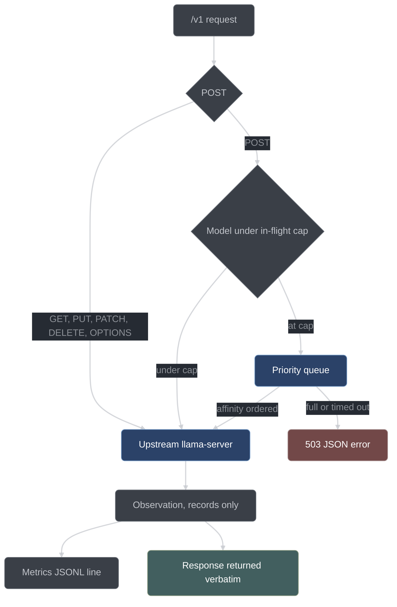

# llama-router

llama-router is the C++23 reverse proxy conductor puts between the opencode plugin and
`llama-server`. This page is for developers working on `router/`: what the router is
for, what it is forbidden to do, how each module behaves, and how it is built and tested.

The router is one process, launched beside `llama-server` by
[`scripts/serve.py`](../../scripts/serve.py) and supervised by a detached loop `serve.py`
starts for it. Every module under `router/` is header-only, so the binary and the test
suite compile the same code without a library target in between.

## Why a second layer at all

Conductor's layer 1 — the opencode plugin — is the only layer that can see a tool call, so
every gate lives there and nothing about correctness depends on the router. Layer 2 exists
because four jobs are structurally out of the plugin's reach: it does not own the model
server, it cannot influence slot scheduling, it cannot independently check a claim it
made itself, and it sees only its own traffic.

| Router job                                                                                               | Why the plugin structurally cannot do it                                                                         | Payoff                                                                                                                                       |
| -------------------------------------------------------------------------------------------------------- | ---------------------------------------------------------------------------------------------------------------- | -------------------------------------------------------------------------------------------------------------------------------------------- |
| Admission control — cap in-flight requests, priority queue                                               | The plugin does not own the server. Concurrent sub-sessions would thrash a 20 GB model and exceed its slot count | Six parallel reviewers do not grind generation to a halt                                                                                     |
| Group affinity — requests sharing a declared prefix group run contiguously                               | The plugin cannot influence server slot-reuse timing                                                             | N reviewers share one huge prefix (diff + plan + rubric); keeping it KV-hot is the largest single wall-clock lever available under one model |
| Schema observation — a tagged request should carry a schema; non-stream responses are checked against it | The claimant would be validating its own claim                                                                   | An independent record of how often local-model structured output actually conforms                                                           |
| Metrics ledger — tokens, timings, queue wait per request                                                 | The plugin sees only its own requests                                                                            | The POC's cost numbers are measured rather than estimated                                                                                    |

Swap-cost batching is deliberately absent. Under G13 one model serves every role, so there
are no swaps to batch and a batcher would be untestable dead weight carrying a fake clock.
It lives in the plan's stretch section alongside per-role model routing, which is the only
thing that would make it pay (plan §4.4, §10).

## The prime directive

**The router observes and schedules. It never enforces process, and it never returns a
status the direct path would not have returned.**

That is constraint G5 in the plan, and it is the reason the dependency direction works:
layer 1 fail-closed, layer 2 fail-soft. `serve.py --no-router` runs the identical workflow
over the same code path, and the G5 equivalence step tests that claim rather than asserting
it — the scripted end-to-end run executes twice, with and without the router, and must
produce the same terminal state, the same item dispositions, and the same commit set. The
transcript is [`docs/build/artifacts/12.1-g5-equivalence.md`](../build/artifacts/12.1-g5-equivalence.md);
the driver is [`conductor/tools/g5-equivalence.ts`](../../conductor/tools/g5-equivalence.ts).

What the directive rules out is concrete. An earlier design had the router return `400`
when a request tagged as needing structured output arrived without a schema field, and
wrap a non-conforming response body in an error envelope. Both give the router the power
to fail a request the direct path would have served, and both are rejected:

- A plugin bug that is survivable without the router becomes fatal with it. If the plugin
  forgets to attach a schema to one request, the direct path still gets an answer and the
  fan-out engine's receipt validation catches the malformed result and re-prompts. With an
  enforcing router, the same bug is a hard failure.
- The fail-soft dependency direction inverts. Once the router can fail requests, process
  integrity depends on the router being correct and up, which is exactly what layer 2 is
  designed never to be responsible for.

Enforcement of structured output belongs to the fan-out engine's receipt validation, which
runs in both configurations: it re-prompts with the validation error appended, up to two
retries, then marks the sub-task `env`-failed. What the router uniquely provides is an
*independent* record of how often real local-model output conforms — a POC deliverable
that needs no authority over the request to produce.

`schema.rejectOnMissing` exists in the config and defaults to `false`. It is present so
that the stricter posture is a configuration change rather than a fork, and it must stay
`false` in the base build.

## The request path



The proxy itself is transparent pass-through of `/v1/*` — chat completions, embeddings,
models — to the upstream, including SSE streaming, where `text/event-stream` chunks are
forwarded unbuffered. `GET`, `POST`, `PUT`, `PATCH`, `DELETE` and `OPTIONS` are registered
on `/v1/.*`; everything outside `/v1/*` and `/conductor/*` returns `404` without the
upstream being contacted.

Only `POST /v1/*` passes through admission. A `GET` carries no generation work and no body,
so admitting it would let a saturated queue stall opencode's `/v1/models` listing for
nothing. The router also forwards the request body **byte-verbatim** rather than
re-serializing it, so no whitespace, escape form or key order can shift under the caller;
a body it cannot parse as JSON is forwarded unchanged rather than refused.

The router mints a status of its own in exactly two situations, both a `502` carrying the
same JSON error envelope (`error.type` is `router_upstream_unreachable`) and neither
latched:

- an upstream it could not reach at all;
- an upstream that answered and then failed **mid-body** while the response was still
  buffered, so nothing had been written downstream yet. Relaying the partial bytes under
  the upstream's own `200` would hand the caller a short answer with a `Content-Length`
  matching the truncation, which no client can tell from a complete one.

A **streamed** relay whose upstream fails mid-body mints nothing: bytes are already
downstream, so it aborts the connection instead, leaving the chunked response without its
terminating chunk — a detectable error at the client rather than a clean end over an
aborted generation.

## Tagging

Conductor tags requests through opencode's `chat.headers` hook. `headersFor` in
[`adapter/inject.ts`](../../conductor/adapter/inject.ts) mints them from the session's
registry entry.

| Header                 | Values                                                                                      | Meaning                                                                      |
| ---------------------- | ------------------------------------------------------------------------------------------- | ---------------------------------------------------------------------------- |
| `X-Conductor-Role`     | `orchestrator`, `planner`, `testWriter`, `implementer`, `reviewer`, `skeptic`, `mechanical` | Which role issued the request; recorded in metrics                           |
| `X-Conductor-Priority` | `interactive`, `review`, `batch`                                                            | Dequeue class; `priorities` in the config maps each to a number, lower first |
| `X-Conductor-Group`    | The session's worktree/tree slug, or failing that its item id                               | Requests sharing a group share a large prompt prefix                         |
| `X-Conductor-Schema`   | `required`                                                                                  | This request is expected to carry a structured-output declaration            |

Role and priority are always present; the other two are conditional. The priority is
derived from the role, not chosen per request: `orchestrator` and `planner` tag
`interactive`, `testWriter`, `implementer`, `reviewer` and `skeptic` tag `review`, and
`mechanical` tags `batch`. A role the map does not know tags `interactive`.

`X-Conductor-Group` is **omitted entirely** for a session with neither a tree nor an item —
a tree-less orchestrator — so the router treats those requests as ungrouped rather than
lumping them into one bucket.

`X-Conductor-Schema` is emitted only when the dispatching job flags structured output.

**This section previously said no production call site sets that flag, that the header never
reaches the wire at HEAD, and that the router-side machinery is therefore inert. Measurement
says otherwise, and the machinery is live.** Across the 14.2 campaign's 550 ledger rows, 170
carry `schemaMissing: true` — a column the router writes *only* when `observation.tagged` holds,
and `tagged` means the request arrived carrying `X-Conductor-Schema: required`
(`router/schema-observer.hpp`: "an untagged request is never missing"). The router's own log
carries 242 of the matching warn lines:

```
carries 'X-Conductor-Schema: required' but declares no schema — counted schemaMissing (role 'mechanical', group '')
```

So the header does reach the wire from real sessions, at least on the `mechanical` role. What
holds is the *second* half of the old claim: those requests declare no schema in the body, which
is consistent with opencode 1.18.15 emitting no `response_format` for a prompt-shaped structured
output (see [scheduling-and-fanout.md](scheduling-and-fanout.md), "Independent schema validation
with bounded retry"). The observation is therefore doing exactly what §4.4 designed it to do —
recording, at `warn`, that a request which declared a schema requirement did not carry one — and
`schemaConformed` stays null throughout because no schema was ever there to conform to.

Read `schemaMissing` as a live signal about the *declaration*, not as dead code. Its companion
`schemaConformed` is the inert one: null on all 550 rows, which
[HONEST-LIMITS.md](../../conductor/docs/HONEST-LIMITS.md) records as limit 9's conditional
resolving.

`chat.headers` output reaching the provider as real HTTP headers is verified against
opencode 1.18.15 in [wire-notes.md](../../conductor/adapter/wire-notes.md), which also pins
a fallback: a key set through `chat.params` lands as a top-level provider-body field
`x_conductor`. The router extracts tags from that field and strips it before proxying if it
ever appears; with working `chat.headers` it never does.

**Untagged requests are priority `interactive` and bypass nothing.** A request with no
conductor headers still passes through admission, still gets a metrics line, and still
competes for slots. There is no privileged path around the router; the only way around it
is not to run it.

## Admission

The router keeps a per-model in-flight counter, inferring the model from the request
body's `model` field. Under G13 there is exactly one model, but the accounting is
per-model so a second one does not interfere: a request for model B passes while model A
is capped.

- Under the cap, the request goes straight upstream.
- At the cap, the request is enqueued. Dequeue order is priority first, then FIFO within a
  priority class. `admit()` blocks its handler thread for exactly that wait.
- Queue overflow past `maxQueued`, or a wait past `queueTimeoutMs`, produces a `503` with a
  JSON error body: `{"error":{"message":…,"type":"unavailable_error","code":"queue_overflow"|"queue_timeout"}}`,
  the OpenAI-compatible shape `llama-server` itself emits.

A request whose body carries no usable `model` field is admitted normally, under a reserved
empty-string counter key. A priority outside `interactive|review|batch`, and an absent one,
both order as `interactive`. Admission never refuses a request for what it *says* — only
for capacity.

**The two `503` codes are diagnostic only.** The plan describes a `503` "the fan-out engine
understands (backs off and retries; bounded)", and no such consumer exists or structurally
can: the fan-out reaches the router through opencode's provider `fetch`, which surfaces a
failed request as an error string with no body for anyone to parse. So the distinction
between `queue_timeout` and `queue_overflow` reaches a human reading the router log or the
metrics ledger, and reaches no backoff. Giving the envelope a reader has to start on the
conductor side.

`queueTimeoutMs` is deliberately smaller than the fan-out engine's
`parallel.subSessionTimeoutMs`, so a queue timeout is reported as a queue timeout and not
as two simultaneous unrelated failures.

### The distinct-model bound

There is a third refusal, and it is not a per-model capacity one. The `model` field is
client-controlled, and each distinct string opens its own in-flight counter — so a handful
of made-up model names would each seize `maxInflightPerModel` handler threads until the
listener's pool is exhausted and even the out-of-admission `/conductor/health` probe could
not be dispatched.

`maxDistinctInflightModels` bounds how many distinct model keys may hold in-flight slots at
once, at `1 + (margin - 1) / maxInflightPerModel` with the margin fixed at 8. A request for
a model string that has nothing in flight is refused `Overflowed` immediately — no wait,
even with free slots and an empty queue — once that many distinct keys are already busy. At
the shipped `maxInflightPerModel` of 6 the bound is **2 distinct models**, which is
generous under G13's single model and tight enough that one worker stays free for health.

**The load-bearing invariant:** `admission.maxInflightPerModel` must be at most
`llama-server`'s `--parallel` slot count. If admission cheerfully admits four requests
into a server with one slot, the fan-out serializes upstream and every parallelism claim
in the design is imaginary. The two numbers are never written independently:
`derive_slots(parallel.maxReaders)` in `scripts/conductor_wiring.py` produces the one value
that becomes both the server's `--parallel` and the generated config's
`maxInflightPerModel`, so equality holds by construction and they cannot drift apart. A
zero or negative `maxReaders` floors to one slot rather than telling the router to admit
nothing.

Queued requests block their handler thread, so the HTTP server's task queue is sized
explicitly at startup rather than left at the library default: `maxQueued +
maxInflightPerModel + 8`, saturated into a 256-thread budget, with the parse clamping
`maxQueued` when that sum would exceed it. cpp-httplib's default pool would starve under
exactly the fan-out load this system generates. The consequence worth testing is the
pool-exhaustion case: with a full queue, `/conductor/health` still answers.

## Group affinity

Among queued requests, the router dequeues same-`X-Conductor-Group` requests contiguously.
`llama-server`'s slot reuse then keeps the shared prompt prefix KV-hot instead of evicting
and re-ingesting it between interleaved requests from unrelated groups.

This matters because of how conductor fans out. Item review dispatches up to six reviewer
lenses over the same diff, the same plan, and the same rubric; the wave driver batches like
stages across items so all members' vet critics dispatch together and all members' review
lenses dispatch together. Every one of those requests shares an enormous prefix. Under one
model there are no model swaps to amortize, so prefix locality is the router's principal
wall-clock lever — the single largest one available.

Affinity is a **policy**, not a second queue: `router/affinity.hpp` holds no mutex, no
thread, no clock and no config file of its own. The admission controller projects its queue
into entries and asks the policy for an index, under the lock it already holds. That purity
is what lets the ordering law be tested without a thread or a fake clock.

The law, in order:

1. **Strict priority is the outer order.** Only entries at the minimum priority value
   present are ever eligible, so `interactive` before `review` before `batch` survives
   verbatim, and a higher-class arrival mid-drain wins the next dequeue even when it breaks
   a group's run.
2. With `affinity.contiguousDequeue` set `false` the policy is fully inert and the
   selection is the plain priority-then-arrival head, for every arrival sequence.
3. While a burst is active in the eligible class, the next pick is the lowest-arrival
   member of the burst's group **that was already queued when the burst started**. Members
   arriving mid-drain fall outside the burst and wait for the group's next turn — that is
   what stops a busy group from starving its neighbours inside its own class.
4. Otherwise a new burst starts at the eligible class's oldest-waiting head. An untagged
   head starts no burst, so affinity can push an untagged request back but never pull one
   forward.

Membership needs no clock: the arrival ordinal is assigned under the controller's queue
lock and only ever grows, so "queued when the burst started" is exactly "arrival at or
below the highest ordinal the burst has seen".

## Schema observation

A request tagged `X-Conductor-Schema: required` is expected to carry a structured-output
declaration: `response_format` with a `json_schema`, or a `grammar` / `json_schema` body
field. `llama-server` natively converts a JSON schema to GBNF and constrains sampling
accordingly, so the declaration is what makes the output well-formed.

A tagged request **without** one is journaled, counted as `schemaMissing`, and **proxied
unchanged**. That is the whole point of the module: the router records that the plugin
failed to attach a schema, and the request is served exactly as it would have been served
without the router in the path. Untagged requests pass untouched.

For a non-streaming tagged response, the body is validated against the declared schema
with `nlohmann_json_schema_validator` and the verdict is recorded in the request's metrics
line. The body is returned **verbatim** either way — conforming or not.

### What streaming does to this

Whether opencode's fan-out traffic streams was a scoping input, resolved in task 0.2
*before* Phase 11 was scoped rather than discovered while writing C++. The answer, verified
against opencode 1.18.15 and recorded in
[wire-notes.md](../../conductor/adapter/wire-notes.md):

> `session.prompt` issues a **streaming** provider request: body `stream: true` with
> `stream_options: {include_usage: true}`, and the reply is consumed as SSE
> `chat.completion.chunk` events terminated by `data: [DONE]`.

Three consequences follow directly:

1. Response observation on fan-out traffic sees no single JSON body to validate. The
   router's response path must parse SSE, and `schemaConformed` is recorded as `null` for
   streamed responses.
2. The schema observer's load-bearing deliverable is the request-side `schemaMissing`
   counter. Stream-body validation is out of scope and is recorded as an honest limit; no
   SSE is parsed, buffered or reassembled anywhere in `router/schema-observer.hpp`.
3. The router is justified by scheduling and metrics alone, and the schema dataset narrows
   to "how often did conductor actually ask for constrained output".

`schema.validateResponses` remains in the config and governs the non-streaming case, which
is what a `curl` probe or any non-streaming client produces.

### The opt-in refusal

`schema.rejectOnMissing` is `false` in the shipped config and must stay so in the base
build. Turning it on makes a tagged request that declares no schema answer `400` with
`{"error":{"type":"invalid_request_error","code":"schema_missing"}}`. Two properties keep
that posture honest rather than sprawling: it applies to `POST /v1/*` only — a bodyless
read can never carry a schema field — and it answers **before** admission, so a refusal
consumes no slot and no queue entry. The `schemaMissing` counter advances either way: the
refusal is a posture, the count is an observation.

## Metrics

The router writes one JSONL line per request to `metrics.ledgerPath`
(`.data/router/metrics.jsonl` by default). The ledger is the POC's cost and conformance
dataset.

| Field group | Contents                                                                                          |
| ----------- | ------------------------------------------------------------------------------------------------- |
| Identity    | `model`, `role`, `group`, `priority` (the resolved class, not the raw tag)                        |
| Timing      | `queueWaitMs`, `upstreamMs` (null when the upstream was never attempted)                          |
| Tokens      | `promptTokens`, `completionTokens`, plus `timings` copied verbatim from `llama-server`'s response |
| Observation | `schemaMissing`; `schemaConformed` as true, false, or `null` for streamed responses               |
| Outcome     | `status`, as returned to the client                                                               |

Every key is present on every line; an absent value is JSON `null`, never a missing key, so
a reader parses the ledger with a fixed column set. A write failure is logged at `warn` and
never thrown — the proxied response crosses unchanged and the in-memory counters still
advance, so the endpoint does not silently under-count what the file lost. The module only
appends, so a pre-existing ledger is preserved byte for byte.

Two endpoints sit outside `/v1/*`, both registered outside admission so they answer while
every slot and queue entry is held:

- `GET /conductor/health` — `200` with `{"status":"ok","version":"<router version>"}`. The
  version comes from `router_version()`, never a second constant. Answering under a full
  queue is what makes a health probe meaningful under load.
- `GET /conductor/metrics` — the in-memory aggregate. Serving it is never ledgered and
  never counted, so polling the endpoint cannot inflate the dataset it reports.

The aggregate carries nine keys: the six `MetricsSummary` names below, plus `waitMsP50`,
`waitMsP95`, and `schemaConformanceRate`. That rate is `null` — never `0` — when no verdict
exists, because a zero would misreport "nothing ever conformed". The aggregate is in-memory
since construction, so a prior run's lines contribute nothing to it; anything that needs
history reads the file.

The plugin's typed view is `MetricsSummary` in
[router-client.ts](../../conductor/adapter/router-client.ts): `totalRequests`,
`schemaMissing`, `schemaConformed`, `statusCounts`, `promptTokens`, `completionTokens`.
`conductor_report` accepts a metrics summary through an optional `metrics` seam, but the
composition root does not wire one, so a real session's report renders `Router contact:
ABSENT` and the metrics block reads `(unavailable)`. No production path passes it: the real
seam is passed only by the G5 equivalence driver and by the e2e suite
([`e2e.test.ts`](../../conductor/tests/e2e.test.ts) aims the ambient seam at its own arm's
port). `fetchMetricsSummary` is registered as production-unwired in
`conductor/tests/unreachable-exports.test.ts`, which is what keeps that gap visible rather
than quiet.

## Fail-soft

`serve.py` execs into the session shell and cannot supervise anything directly, so the
router runs under a small supervisor loop process (`scripts/conductor_wiring.py`) that
restarts it with capped exponential backoff — 500 ms doubling to a 30 s ceiling, reset
after a run that stayed healthy for 60 s — and dies with the shell the way the existing
server watchdog does. Exit codes 2 (usage), 3 (config) and 4 (bind failure) are treated as
fatal and never restarted: a config the router cannot parse will not parse on retry, and
the loop would spin forever over the one message that names the broken flag or field.

The other half of fail-soft lives in the plugin, in
[router-client.ts](../../conductor/adapter/router-client.ts). Its every call is bounded by
`probeTimeoutMs` and absorbs failure: `fetchMetricsSummary` resolves `null` for a refused
connection, a socket error, a non-200, a hang, or an unparseable body, and never throws or
rejects.

Failover is a per-session latch, `FailoverState`:

| Field             | Set when                       | Effect                                                                   |
| ----------------- | ------------------------------ | ------------------------------------------------------------------------ |
| `failovers`       | Every `noteRouterFailure` call | Counts router request failures this session                              |
| `useUpstream`     | First failover                 | `resolveBaseUrl` returns the upstream origin for the rest of the session |
| `metricsPartial`  | First failover                 | Marks the session's metrics partial                                      |
| `probingDisabled` | Second failover                | `resolveBaseUrl` resolves the upstream even if the latch were cleared    |

`resolveBaseUrl(routerCfg, upstreamCfg, failoverState)` is a synchronous pure resolver over
that latch: the router origin normally, the upstream origin once `useUpstream` or
`probingDisabled` is set.

**What the latch actually covers.** §4.4 reads as though a router outage fails the whole
run's traffic over to the upstream. It does not, and cannot as the run is wired: model
traffic goes opencode → the provider `baseURL` baked into the session config → the router,
and the plugin has no way to re-point a live opencode session mid-flight. So the latch
diverts exactly the HTTP conductor issues **itself** — the §2.1 setup proofs
(`setupProofRequest`'s `/v1/models` and `/v1/chat/completions` calls) and the closing
metrics read. Sub-sessions in flight when the router dies die with it, and the run takes
their `env` failures. Mid-run resilience against a dead router is the supervisor's restart,
not this module. That gap is a recorded deviation, not an oversight.

## Configuration

The router reads a single JSON document, `.data/configs/conductor-router.json`, generated
by `serve.py` and hand-editable. Its shape is plan §2.2:

```json
{
  "version": 1,
  "listen": { "host": "127.0.0.1", "port": 8088 },
  "upstream": { "host": "127.0.0.1", "port": 8080 },
  "admission": {
    "maxInflightPerModel": 6,
    "maxQueued": 64,
    "queueTimeoutMs": 600000
  },
  "priorities": { "interactive": 0, "review": 1, "batch": 2 },
  "affinity": { "header": "X-Conductor-Group", "contiguousDequeue": true },
  "schema": {
    "observeHeader": "X-Conductor-Schema",
    "validateResponses": true,
    "rejectOnMissing": false
  },
  "metrics": { "ledgerPath": "/abs/path/to/repo/.data/router/metrics.jsonl" },
  "logging": { "level": "info" }
}
```

`maxInflightPerModel` is `derive_slots(parallel.maxReaders)` — `6` at the default reader
count — and `ledgerPath` is written **absolute** rather than as the plan's bare relative
literal, because a router that inherited some other working directory would otherwise
write an invisible ledger instead of failing.

Regeneration is partial by design. `serve.py` refreshes only the machine-derived keys —
`version`, `listen.host`/`port`, `upstream.host`/`port`, `admission.maxInflightPerModel`
and `metrics.ledgerPath` — so a hand edit to any other key survives the next launch.

Three keys are optional and are filled in by the parser when absent:

| Key                          | Default  | Filled when                            |
| ---------------------------- | -------- | -------------------------------------- |
| `logging.level`              | `"info"` | the whole `logging` block is absent    |
| `schema.rejectOnMissing`     | `false`  | `schema` is present and is an object   |
| `affinity.contiguousDequeue` | `true`   | `affinity` is present and is an object |

The asymmetry is deliberate: `logging` is an optional **block**, while the other two are
optional **keys inside blocks that must already exist**. A `schema` or `affinity` of the
wrong type is left alone for the schema to reject it by name.

### Parsing and error reporting

[`router/config.hpp`](../../router/config.hpp) is header-only and defines
`parseRouterConfig(json, schemaPath)`, which runs in a fixed order:

1. Parse the input text as JSON.
2. Fill the three documented-optional keys with their defaults, so the completed document
   can satisfy the exported schema — which marks every key required. A block of the wrong
   type is left alone, for the schema to reject it by name.
3. Validate the completed document against the schema read from `schemaPath`.
4. Range-check the numbers the schema can only type as bare numbers: `listen.port` and
   `upstream.port` to 1..65535 inclusive, `admission.maxInflightPerModel` to 1..1000000,
   `admission.maxQueued` to 0..1000000, and `admission.queueTimeoutMs` to 0..86400000
   (24 hours). The upper bounds are three orders of magnitude past any thread budget, so
   they refuse no number an operator meant — only a typo or a unit mistake, by name,
   rather than wrapping an `int`. Then check that `logging.level` is one of `trace`,
   `debug`, `info`, `warn`, `error` — a level the router can actually apply, never a
   silent fallback.
5. Reconcile the admission block with the listener's thread budget. Queued requests block
   their handler thread, so `maxQueued` is clamped down if `maxQueued + maxInflightPerModel
   + 8` exceeds the 256-thread budget. The parse therefore yields the `maxQueued` the
   router will actually run with, not the one the file asked for.

**Note that the limits are the parser's, not the schema's.** The exported schema types
every number as a bare `number`; the ranges above live in `parseRouterConfig`. Reading the
schema file to learn what values are legal will mislead you.

Every violation throws `ConfigError`, whose contract is what makes a bad config
actionable:

- `field()` is the dotted path of the offending field — `listen.port`, `admission.bogus`,
  `logging.level`, `batching`. It is empty only when the schema file itself could not be
  read or parsed, in which case `what()` names that path instead.
- `what()` always contains `field()` verbatim. The constructor guarantees this
  structurally, whatever the throw site composed.

Building that path takes some care: the validator reports an RFC 6901 JSON Pointer that
stops at the enclosing object, naming the offending property only inside its message
("required property 'listen' not found in object"). `detail::offendingField` converts the
pointer to dotted form and extends it with the quoted name, so the path reaches the leaf.

`applyLoggingLevel(cfg)` maps the validated level onto spdlog: `trace`, `debug`, `info`,
`warn` map by name and `error` maps to `spdlog::level::err`. An unrecognized level reaching
that function is still refused by name rather than silently ignored.

### Where the schema comes from

The parser validates against whatever schema **file** it is handed; it carries no copy of
the shape. That file is `router/tests/schemas/RouterConfig.schema.json`, exported from
`conductor/core/types.ts` by `conductor/tools/export-schemas.ts` — the same single source
the plugin's own validation uses — into a gitignored directory regenerated by
`scripts/test-conductor.sh`. Every object in it carries `additionalProperties: false`, so
an unknown key anywhere is rejected and named: a top-level `batching` block, which belongs
to the stretch design and not to the base shape, fails validation by that name.

## Running the binary

`llama-router` takes two required flags, and two more that are accepted alone:

```bash
llama-router --config .data/configs/conductor-router.json \
             --schema router/tests/schemas/RouterConfig.schema.json
```

Both are required and neither has a default or a search path — a second way to locate the
config's shape is exactly what the exported-schema design exists to prevent. `--help` and
`--version` are accepted alone. A repeated `--config` or `--schema` is refused by name
rather than taking the last one, and a token beginning `--` is never consumed as another
flag's value.

The exit codes are what the supervisor reads:

| Code | Meaning                                                                              |
| ---- | ------------------------------------------------------------------------------------ |
| `0`  | Clean shutdown after `SIGINT`/`SIGTERM`, and the `--help` / `--version` paths        |
| `2`  | Usage error — stderr names the offending or missing flag, then prints the usage      |
| `3`  | `ConfigError`, or a config file that could not be read at all; stderr names the path |
| `4`  | Listen bind failure — stderr carries the `host:port` that could not be bound         |

Signal handling is minimal and async-signal-safe: the handler only sets a flag, and the
main thread observes it and calls `Router::stop()` itself.

## Building and testing

Four CMake targets exist in the tree; two of them carry the router:

| Target                | What it is                                                                       | Default |
| --------------------- | -------------------------------------------------------------------------------- | ------- |
| `llama-router`        | The router binary                                                                | built   |
| `router-tests`        | The doctest suite, registered with ctest as `router-tests`                       | built   |
| `conductor-dashboard` | The optional ftxui TUI over the metrics ledger, gated on `CONDUCTOR_DASHBOARD`   | off     |
| `membench`            | A dependency-free memory-bandwidth probe under [`tools/`](../../tools/README.md) | built   |

The **repo root** is the only user-code include root, and both router targets get exactly
that one directory. **Every in-workspace header is included by its full path from the
root** — `#include "router/version.hpp"`, never `#include "version.hpp"` — so an include
names where the header actually lives no matter which file includes it.

Dependencies come from vcpkg: `cpp-httplib`, `nlohmann-json`, `json-schema-validator`,
`doctest`, and `spdlog`. Neither router target links `llama` or `ftxui`. `ftxui` is linked
only by `conductor-dashboard`, and only when `CONDUCTOR_DASHBOARD=ON`; the dashboard's pure
aggregation header (`dashboard/ledger_view.hpp`) is compiled into `router-tests` regardless,
so its logic is always built and always run even when the TUI is not.

```bash
cmake --preset clang-relwdebinfo
cmake --build .out/build/clang-relwdebinfo --target llama-router
cmake --build .out/build/clang-relwdebinfo --target router-tests
ctest --test-dir .out/build/clang-relwdebinfo --output-on-failure
```

**Always build a named target.** `extern/llama-cpp` is added with `add_subdirectory` so its
configure step runs and its packages resolve, but no target here links it. A bare
`cmake --build` therefore compiles the entire vendored tree for nothing. The `llama-server`
this workspace runs comes from `scripts/fetch_models.py build`, out of tree.

Router unit tests run entirely against in-process fakes: a stub upstream `httplib::Server`
started by the test on an ephemeral port. No model and no `llama-server` are needed to run
the suite. `AUTOFORMAT_SRC_ON_CONFIGURE` defaults to **`ON`** and runs clang-format in place
over `router/`, `tools/` and `dashboard/` at configure time — it rewrites your working
tree, so pass `-D AUTOFORMAT_SRC_ON_CONFIGURE=OFF` if you would rather it did not.

## The upstream contract

[`router/UPSTREAM_CONTRACT.md`](../../router/UPSTREAM_CONTRACT.md) is the file
where the *measured* behavior of `llama-server` is recorded, stamped
`WIRE_CONTRACT_VERIFIED: <date>`. It is the router's equivalent of the plugin's
[wire-notes.md](../../conductor/adapter/wire-notes.md): assumptions about an external
program are measured against the real program and written down, never inferred.

The file carries a real stamp, and the acceptance script refuses one that still reads
`<pending>` — an unmet obligation wearing the shape of a met one. Six items were measured
against `llama-server` 10298: the `/v1/models` shape, `response_format`/`json_schema`
acceptance with GBNF constraining, `usage` and `timings` on a non-stream response, SSE
chunk framing, autoload latency for a non-resident model, and the effective concurrent slot
count. The first four were observed on the small smoke model `ornith-9b`; the last two on
`qwen3.6-27b`, the G13 model every role runs.

Two of the recorded findings are load-bearing on this repo's own code:

- **`--ctx-size` is llama-server's TOTAL context, divided among slots.** `--ctx-size 8192
  --parallel 6` served 1536 tokens per slot; the intended 8192 needed `--ctx-size 49152`.
  So `parallel_server_args` multiplies a per-slot window (`PER_SLOT_CONTEXT_TOKENS`, 32768) by the slot count
  rather than passing `--parallel` bare, which would silently cut every sub-session's
  window by a factor of N. At one slot with no explicit context it emits no `--ctx-size`
  at all.
- **A readiness probe must not treat a reachable server as a ready one.** `curl -s
  .../health` exits 0 on a `503`. Both readiness probes in this repo require
  `response.status == 200` from a `urllib` request instead.

`admission.maxInflightPerModel ≤ the upstream's slot count` is satisfied by construction
rather than by a check inside the router: `derive_slots` produces the one number that
becomes both `--parallel` and `maxInflightPerModel`, and `scripts/verify-acceptance.sh`
asserts the equality statically. The router itself never compares its own cap to the
upstream's slot count.

Four things the file records as **not** discharged, and they still are not: no run has
driven the router and the upstream together under load; no run drove `serve.py`'s own
invocation against a live server; items 1–4 remain observed on `ornith-9b` only; and F1's
thinking-suppression binding is recorded rather than implemented — no code path sends
`chat_template_kwargs.enable_thinking=false` or `reasoning_effort:"none"`.

Only observed output goes into that file. If a measurement cannot run, the rule is to
record `BLOCKED` plus the exact command lines — fabrication is the single worst outcome.

## See also

- [Architecture](architecture.md) — the three layers and the dependency direction
- [Scheduling and fan-out](scheduling-and-fanout.md) — the traffic the router schedules
- [Build system](build-system.md) — presets, vcpkg, and the target rules in full
- [Observability internals](observability-internals.md) — journal, ledgers, and the metrics path
- [`router/UPSTREAM_CONTRACT.md`](../../router/UPSTREAM_CONTRACT.md) — the measured upstream behavior
