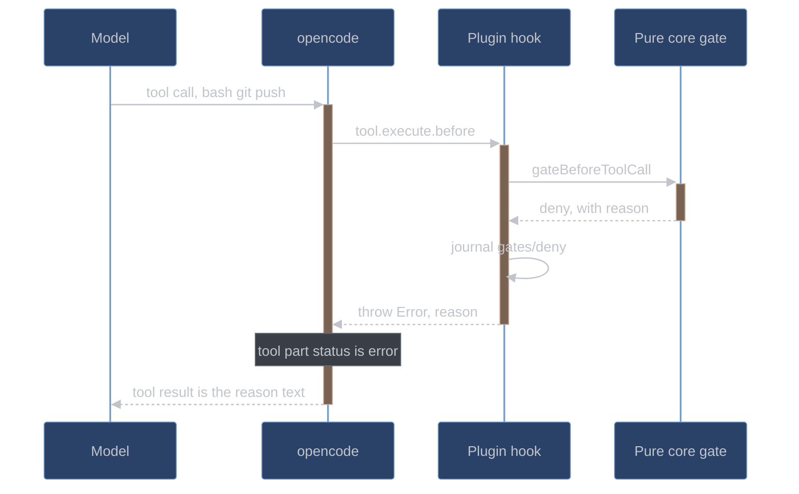

# opencode integration

How conductor attaches to opencode: the plugin surface it implements, the SDK calls the
fan-out engine makes, the config fragment that travels into a session, and every place
where the documented contract and the installed binary disagree. This page is for anyone
changing the adapter layer or debugging a session that behaves unlike the plan says it
should.

The authority for everything here is [`conductor/adapter/wire-notes.md`](../../conductor/adapter/wire-notes.md),
which records what was observed against the binary, and
[`conductor/tests/wire-contract.test.ts`](../../conductor/tests/wire-contract.test.ts),
which asserts it. Where the plan and the binary disagree, the binary wins and this page
describes the binary.

## Versions

| Thing                                    | Version                                              |
| ---------------------------------------- | ---------------------------------------------------- |
| Installed binary                         | opencode **1.18.15** at `/opt/homebrew/bin/opencode` |
| `@opencode-ai/plugin` dev dependency     | 1.18.10 (`conductor/package.json`)                   |
| `@opencode-ai/sdk` (resolved through it) | 1.18.10                                              |
| Plan §5 was written against              | 1.18.10                                              |

The gap is deliberate and it has one rule: **where the 1.18.10 SDK types and the 1.18.15
runtime disagree, the runtime won and is what the test pins.** The clearest instance is the
permission bus — the pinned types declare only `permission.updated` and
`permission.replied`, while the running binary also fires `permission.asked`, which is the
event the ask-gate is built on. The types are stale; the event is real; the test asserts
the event.

Conductor has zero runtime dependencies (G1): the opencode packages are dev dependencies
providing types. The one sanctioned runtime value import is `tool` from
`@opencode-ai/plugin`, needed to register custom tools. Its runtime value is
`(input) => input` with `tool.schema` bound to the package's bundled zod, and opencode
resolves the bare specifier from the plugin file's own `node_modules` walk
(`conductor/node_modules`) even under full XDG isolation.

## What opencode gives us

The enforcement center of gravity differs from hook-based harnesses. opencode's plugin API
cannot refuse a turn-end pre-emptively, but it can do five things the design leans on
entirely (plan §0.2):

| Capability                                                                                                  | Used for                                                                                                                                             |
| ----------------------------------------------------------------------------------------------------------- | ---------------------------------------------------------------------------------------------------------------------------------------------------- |
| `tool` hook — plugin-defined, schema-typed custom tools                                                     | The workflow is a state machine advanced ONLY by `conductor_*` tool calls; handlers run the tests and diffs themselves                               |
| `tool.execute.before` — throw to deny any tool call                                                         | Git policy, edit-scope gate, freeze gate, phase-order gate                                                                                           |
| SDK `session.create()` + `session.prompt()`                                                                 | Programmatic parallel sub-sessions with structured results — fan-out does not depend on the model emitting parallel task calls                       |
| `experimental.chat.system.transform`                                                                        | Live harness state — run phase, active item, the recommended next tool call — injected into EVERY request, re-stated every turn and never remembered |
| `permission.asked` bus event + HTTP adjudication + per-agent `edit` permissions + `session.idle` | A real ask-gate, and continuation by re-prompting on idle                                                                                            |

Two things it takes away:

- **No pre-emptive stop or turn-end hook.** Continuation is re-entry, not refusal: the
  `session.idle` event re-prompts the orchestrator with the exact next tool call, with a
  disengage backstop after three futile re-prompts (plan §3.7).
- **Deny is an exception, not a structured response.** A gate refuses by throwing inside
  `tool.execute.before`; the refusal reason has to ride the `Error` message.

The plan's third row originally read "`session.prompt()` with `format: {type:"json_schema"}`".
That half did not survive contact with 1.18.15 — see [The two drifts](#the-two-drifts).

## The plugin surface

A plugin is a factory: `(input: PluginInput) => Promise<Hooks>`. `PluginInput` carries
`project`, `client` (the SDK client), `directory`, `worktree`, `serverUrl`, `$` (the Bun
shell), and — beyond what plan §5.1 named — `experimental_workspace`. All of it is
verified present at 1.18.15.

Every hook name below fires on 1.18.15; the wire-contract suite asserts the whole set in
one coverage sweep at the end of the run, using a recorder plugin rather than conductor's
own. Conductor itself registers six of them plus the `tool` map:

| Hook                                 | What conductor does with it                                                                                                                                                                                   |
| ------------------------------------ | ------------------------------------------------------------------------------------------------------------------------------------------------------------------------------------------------------------- |
| `tool`                               | Registers the `conductor_*` tool inventory                                                                                                                                                                    |
| `tool.execute.before`                | Runs the gate stack; a throw denies the call                                                                                                                                                                  |
| `tool.execute.after`                 | The §3.8 session banner, prefixed to the session's FIRST non-`conductor_*` tool result — the one seam that puts plugin-authored text in front of an operator (`conductor/docs/HONEST-LIMITS.md`). No gate decision is made here: those are all made before the call                                            |
| `chat.message`                       | Creates a run when no live run exists, routes a mid-run prompt into the live one, and writes the orchestrator's session-registry entry. It fires for the fan-out's sub-sessions too, and a session already carrying a non-orchestrator role is left exactly as the fan-out wrote it ([`adapter/chat-message.ts`](../../conductor/adapter/chat-message.ts)) |
| `chat.params`                        | Per-role sampling temperature (`paramsForRole` in [`adapter/inject.ts`](../../conductor/adapter/inject.ts))                                                                                                   |
| `chat.headers`                       | The router tags `X-Conductor-Role`, `X-Conductor-Priority`, and `X-Conductor-Group` (`headersFor`)                                                                                                            |
| `event`                              | `session.idle` drives continuation; `permission.asked` and `permission.replied` drive the ask-gate; `session.created` is observed                                                                             |
| `experimental.chat.system.transform` | Appends the role's doctrine pack(s) plus the live state block to every request; a string pushed onto `output.system` arrives as its own `role:"system"` message in the provider request                       |

Which hooks conductor must register is itself declared as data, in
[`core/wiring-manifest.ts`](../../conductor/core/wiring-manifest.ts): nine wires naming the
six hook keys, the tool-name inventory, and the two modules the composition root must bind
(the fan-out engine and the state adapter's `openWorkspace`). A test constructs the real
plugin and does set equality in both directions between the declared hook keys and the keys
actually present. It exists because a whole subsystem once shipped green while never being
registered at all — every test proved its own helper, and nothing proved the wire.

There is one rule about the module itself, and it is load-bearing:

> **A plugin module may export ONLY plugin functions** (or `{server}` modules). Any other
> export — a constant, a string — makes the loader throw
> `TypeError("Plugin export is not a function")`, and the WHOLE plugin is skipped with a
> logged ERROR while the session continues ungated.

So [`conductor/plugin/index.ts`](../../conductor/plugin/index.ts) exports exactly its
factory, `ConductorPlugin`, and nothing else. Every shared constant — the tool-name
inventory, the gate entry point — lives in sibling modules such as
[`adapter/tools.ts`](../../conductor/adapter/tools.ts). An innocent-looking
`export const VERSION = "1"` in that file would silently remove every gate from every
session.

## Loading

opencode has three plugin loading paths: the project's `.opencode/plugins/` directory, the
global `~/.config/opencode/plugins/` directory, and the `"plugin": [...]` array in an
opencode config file (npm names or file paths).

Conductor uses the third, with an **absolute file path**. The config travels via the
`OPENCODE_CONFIG` environment variable that [`scripts/serve.py`](../../scripts/serve.py)
already exports for its session-scoped config, so the harness follows the user into
whatever workspace they `cd` into and **nothing is written into the target repo**.

[`scripts/serve.py`](../../scripts/serve.py) performs that merge itself: it reads the base
opencode config, calls `apply_conductor_wiring` in
[`scripts/conductor_wiring.py`](../../scripts/conductor_wiring.py) — which merges the
fragment, substitutes `${LLAMA_HARNESS_ROOT}`, points the provider's `baseURL` at the
router, and pins auto-update off — writes the result as the session config, and exports
`OPENCODE_CONFIG` pointing at it. The merge is idempotent, so re-running over an
already-fragment-aware config is a no-op.

Two verified properties matter:

- A config-listed absolute file path loads on 1.18.15 and is surfaced as a `file://` URL in
  `GET /config`. Plan §5.1's symlink-into-the-global-plugins-dir fallback is not needed.
- **Plugins load lazily at instance bootstrap** — on the first request carrying
  `?directory=`, not at `opencode serve` start.

Lazy loading is why the factory is construction-safe: it only builds closures and zod
schemas, touches no live opencode service, and does no blocking I/O. That also makes tool
registration unit-testable with a synthetic `PluginInput` and no running opencode.

## Custom tools

Custom tools are registered under the `tool` hook key, as a map from tool name to a
`tool({description, args, execute})` definition. `args` is a zod raw shape taken from the
package's bundled `tool.schema`.

```ts
const S = tool.schema;

return {
  tool: {
    conductor_submit_test: tool({
      description: "Run the item's test and assert a legal red (behavioral); PENDING to RED.",
      args: { itemId: S.string().describe("the queue item id") },
      execute: handler,
    }),
  },
};
```

The plugin builds this map by iterating `CONDUCTOR_TOOL_NAMES`, so a renamed or forgotten
tool cannot slip through: a name with no spec falls back to an argument-free definition
described as `Conductor tool <name>.` rather than disappearing. That fallback is a
diagnostic, not a shipping state — the wiring test refuses any registered tool still
carrying it, and it also asserts the registered keys equal `CONDUCTOR_TOOL_NAMES` exactly.
A name in the inventory with no handler binding is refused at call time with a message
saying so, rather than pretending the stage ran.

Registration is verified end to end. A registered tool appears in
`GET /experimental/tool/ids` and in the `tools` array of the provider request, it executes
when the model calls it, and the string its `execute` returns becomes the tool part's
output in the transcript.

## Deny mechanics

A gate denies by throwing. There is no typed refusal, so all three consequences follow from
the thrown `Error`:

1. The throw inside `tool.execute.before` **denies the call** — the tool never executes.
2. The tool part in the transcript gets `state.status = "error"` with `state.error` set to
   the thrown message.
3. **The same text goes back to the model** as the tool-result content, so the model learns
   why it was refused.

That is why gate reasons are written as prose an agent can act on, and why the hook body
stays thin: it parses the opencode input and delegates the entire decision to one adapter
function, `gateBeforeToolCall`, which returns to allow and throws to deny. Every deny is
journaled under `gates/deny` at `warn` with the input snapshot before the throw, so a
refusal is reproducible from the journal alone.



The gate itself is pure and lives in `conductor/core/`; the adapter only sequences the
gates in order and turns a `deny` decision into the throw. See
[gates.md](gates.md) for the stack and its ordering.

## The SDK surface the fan-out engine uses

The fan-out engine drives a small, deliberately structural subset of the SDK client handed
to the plugin, so a fake client satisfies the same interface in tests.

| Call                    | Shape                                                                                | Used for                                                                    |
| ----------------------- | ------------------------------------------------------------------------------------ | --------------------------------------------------------------------------- |
| `client.session.create` | `{body: {title, parentID?}}` → `{id}`                                                | One sub-session per fan-out job; `parentID` nests it under the orchestrator |
| `client.session.prompt` | `{path: {id}, body: {parts: [{type: "text", text}], model}}`                         | The job's prompt; `model` overrides the agent default                       |
| `client.session.abort`  | `{path: {id}}`                                                                       | The per-sub-session wall-clock watchdog, and halt handling                  |
| Permission adjudication | `postSessionIdPermissionsPermissionId({path: {id, permissionID}, body: {response}})` | The ask-gate and the inline-claim mechanism, in the continuation adapter    |

The fan-out engine's own client interface names exactly the first three; the continuation
adapter declares those three plus `session.messages` and the permission method. Both are
structural interfaces the adapter declares for itself rather than the SDK's full client
type, which is what lets a fake satisfy them.

Notes on each:

- **`parentID` on create is accepted** at 1.18.15, both through the HTTP API and through the
  client handed to the plugin, and is echoed on the session and by `/session/{id}/children`.
- **The model override reaches the provider.** A prompt body carrying
  `model: {providerID, modelID}` produces that model id in the provider request body, and
  the assistant message info echoes it back. The id is
  `config.models.roles[role] ?? config.models.default`, and setup writes `models.roles` empty, so
  under G13 every dispatch passes the same id — which is what keeps a multi-model experiment a
  config change rather than a code change.
- **A sub-session is registered before its first prompt.** The engine writes its
  `sessionID → role/item/tree` registry entry between create and prompt, so a sub-session
  can never make a tool call while unregistered.
- **An agent can be bound by name** by passing `agent: "<name>"` in the prompt body — the
  wire-contract suite drives sessions that way. The fan-out engine does not: it sends
  `parts` and `model` only, and the sub-session's role is carried by the doctrine the
  injection layer appends and by the registry entry the gates read.
- **No `format` field is ever set** on the prompt body. See the drift below.

## The config fragment

[`conductor/opencode-fragment.json`](../../conductor/opencode-fragment.json) is what merges
into the session config — deep merge, conductor keys win, with `${LLAMA_HARNESS_ROOT}`
substituted for this repository's absolute path at generation time. It contributes the
`plugin` array entry and seven agent definitions.

| Agent                    | Mode       | Permissions                                                                         | Tools                                |
| ------------------------ | ---------- | ----------------------------------------------------------------------------------- | ------------------------------------ |
| `conductor-orchestrator` | `primary`  | `edit: "ask"`; `bash: {"*": "allow", "git commit *": "deny", "git push *": "deny"}` | `{"task": false, "question": false}` |
| `conductor-implementer`  | `subagent` | —                                                                                   | `{"task": false, "question": false}` |
| `conductor-test-writer`  | `subagent` | —                                                                                   | `{"task": false, "question": false}` |
| `conductor-reviewer`     | `subagent` | `edit: "deny"`                                                                      | `{"task": false, "question": false}` |
| `conductor-skeptic`      | `subagent` | `edit: "deny"`                                                                      | `{"task": false, "question": false}` |
| `conductor-planner`      | `subagent` | `edit: "deny"`                                                                      | `{"task": false, "question": false}` |
| `conductor-mechanical`   | `subagent` | `edit: "deny"`                                                                      | `{"task": false, "question": false}` |

The `question` tool is removed from every agent's offered set rather than granted as an ask.
opencode offers `question` to its app/cli/desktop clients — headless `opencode run`, which every
benchmark cell uses, is the cli client — and an ask in a headless run is a prompt no one can
answer: the epoch-22 cell sat 78.7 minutes on one (register D50). `tools.question: false` both
omits the tool from the offered set and emits a `question * -> deny` rule, and the gate refuses
the tool itself as the latent-surface pin.

Four things about that table:

- **The orchestrator prompt is a one-line pointer, not the pack.** The orchestrator's
  `prompt` says the doctrine and live state arrive appended to the system prompt, and nothing
  more. The pack itself (`core.md`) reaches the session once, through the plugin's
  `experimental.chat.system.transform` hook (`adapter/inject.ts` `ROLE_PACKS`), journaled with
  its digest. Verified on the 13.2 smoke: a `{file:...core.md}` prompt *also* delivered the pack
  as the agent's own system message, so every orchestrator request carried it twice (~1.7k
  tokens); and an agent with no prompt at all gets opencode's 9.7k-character default system
  prompt instead, which is larger than the pack it displaced. A non-empty prompt that loads no
  file is the configuration that delivers the doctrine exactly once.
- **The per-agent spawn denial** is `tools: {"task": false}` on every agent — the exact key
  is discovery (iii) below. Agent permissions are defense-in-depth; the session-registry
  gate is the enforcement, and it denies spawning in every session, registered or not.
- **There is no separate `write` permission key** in opencode. The write and patch tools
  are governed by `edit`.
- **The fragment stays model-agnostic.** The model rides the prompt body, chosen per
  dispatch by the fan-out engine as `config.models.roles[role] ?? config.models.default`,
  so a per-role or multi-model configuration needs no fragment change.

The orchestrator's `edit: "ask"` is the inline-claim mechanism: each ask is adjudicated by
the plugin, allowing only when an active claim covers the path (plan §3.6). See
[gates-and-hatches.md](../user/gates-and-hatches.md).

## The two drifts

These are the two places where plan §5 describes a surface the binary does not have.

### Drift 1 — the prompt body has no `format` field

Plan §5.2 called for `format?: {type: "json_schema", schema}` on the prompt body. At
1.18.15 that field is not in the server's schema and the generated SDK types have no
`format` key. Sending it anyway is accepted *silently* and produces **neither**
`response_format` **nor** `json_schema` in the provider request — no schema'd body field is
emitted at all. The bundled ai-sdk provider *can* emit
`response_format: {type: "json_schema", json_schema: {schema, strict, name}}`, but
opencode's prompt path never invokes it. The test pins the absence, so an upstream fix
fails the suite and gets noticed.

What this forces:

1. **Structured output is prompt-shaped.** The job prompt names the schema and asks for a
   single JSON object; nothing constrains the provider.
2. **The fan-out engine validates independently.** It composes the reply's text parts,
   `JSON.parse`s them, and validates the result against the named schema with the pure core
   validator. This half was already required by G5 — the drift only removed the belt from
   the belt-and-braces.
3. **Retry is bounded.** At most three prompt calls per sub-session: the initial attempt
   plus two re-prompts. Each retry keeps the original instruction and appends the concrete
   validation errors the receipt failed on. When the budget is spent the job completes with
   an `env` error, never silently.

A second, stricter budget sits above that one in the planning handlers: a reply that is
schema-valid but violates a plan §3.2 rule earns exactly **one** re-prompt naming every
defect, and a still-invalid reply is rejected outright with nothing written.

### Drift 2 — permission adjudication is a path plus a body, not `permission.reply`

Plan §5.2 named `client.permission.reply({requestID, reply})`. The working 1.18.15 surface
is:

```text
POST /session/{id}/permissions/{permissionID}
body: {"response": "once" | "always" | "reject"}
→ true
```

The generated SDK method is
`client.postSessionIdPermissionsPermissionId({path: {id, permissionID}, body: {response}})`.
Three differences from the plan's name: the field is `response`, not `reply`; the
identifier is `permissionID`, not `requestID`; and the **session id is required in the
path**. Adapter constants use the path-plus-body shape.

The mechanism itself is fully verified end to end against an agent-level `edit: "ask"`.
`"once"` lets the tool run — the edit executes and the file changes. `"reject"` denies it —
the tool part errors with "The user rejected permission to use this specific tool call."
and the file is untouched. Only the named method drifted.

The event side is verified too: the `permission.asked` bus event fires with
`properties = {id: "per_…", sessionID, permission, patterns, metadata}`, and
`permission.replied` fires after adjudication. The typed `permission.ask` *plugin hook*
still exists in the types but is never dispatched — see the gaps table.

## The four discoveries

Four things live probing found that the plan did not anticipate. Each one scopes a later
part of the build.

**(i) Provider requests are streaming.** `session.prompt` issues a streaming provider
request: body `stream: true` with `stream_options: {include_usage: true}`, and the reply is
consumed as SSE `chat.completion.chunk` events terminated by `data: [DONE]`. llama-router's
response observation must therefore parse SSE rather than a single JSON body, which shrinks
the router's schema observer to a request-side `schemaMissing` counter. See
[llama-router.md](llama-router.md).

**(ii) A plugin that fails to initialize is logged and skipped, and the session continues
completely ungated.** A factory throw produces one
`level=ERROR message="failed to load plugin" … error=<thrown message>` line on the serve
log, and then session create and prompt proceed entirely normally with zero hooks installed
and no API-visible refusal. The same log-and-continue applies to module-load failures such
as a bad export. Nothing inside the session betrays that the gates are absent, which is
exactly why the liveness signal has to be out-of-band: the plugin writes
`.conductor/state/alive.json` the first time it opens the workspace, after the doctrine
packs have loaded and the workspace lock has been won, carrying `{pid, startMs, version,
sessionID}`. Its presence means a plugin that loaded, found its doctrine, and owns this
workspace; its absence — or a `pid` that is not running — means stop and fix the load. The
plan's visible session banner ("no banner, no conductor") is the intended at-a-glance form
of the same check and has no implementation in the plugin, so the beacon file is the check
that works. See [`conductor/docs/OPERATIONS.md`](../../conductor/docs/OPERATIONS.md).

**(iii) The per-agent spawn-denial key is `agent.<name>.tools: {"task": false}`.** The
built-in spawn tool's id is `task` (args `description`, `prompt`, `subagent_type`,
`task_id`). With the key set, `task` is omitted from the tools offered to that agent's
model, and a forced call is redirected to the built-in `invalid` tool: the transcript shows
`tool: "invalid"` with `state.input.tool = "task"` and output "Model tried to call
unavailable tool 'task'…". The control run confirms the other direction — the same call
from an unrestricted agent spawns a real child session whose `parentID` is the spawning
session.

**(iv) Session ids carry no signal.** Plugin-created sessions have the identical `ses_…` id
shape as any other session; there is no distinguishable shape to key on. Tool-call ids
(`callID`) are minted by the *provider* — the stub's `call_stub_*` ids came back verbatim —
so they carry no opencode-side signal either. The session-registry gate therefore cannot
lean on id shape and must keep its own `sessionID → role/item` map, exactly as plan §3.5
assumes.

## Traps

Five behaviors that will cost an afternoon if you meet them without warning.

| Trap                                           | What happens                                                                                                                                                                                                                  | What conductor does                                                                                      |
| ---------------------------------------------- | ----------------------------------------------------------------------------------------------------------------------------------------------------------------------------------------------------------------------------- | -------------------------------------------------------------------------------------------------------- |
| Brace-file references are scanned everywhere   | opencode scans EVERY config string for `{file:...}` references — one inside a description is resolved too — and a dangling reference is a hard `ConfigInvalidError`: the config endpoint returns 400 and no session can start | Keep literal brace tokens out of prose fields; only real, existing absolute paths appear in the fragment |
| Session directories are canonicalized          | macOS `/var/...` paths become `/private/var/...` inside opencode. A non-canonical directory makes in-project edits ask for `external_directory` instead of `edit`                                                             | serve.py and the adapter `realpath` every directory handed to opencode                                   |
| The edit tool validates before it asks         | A non-matching `oldString` fails with no permission ask ever raised                                                                                                                                                           | Ask-gate tests stage the target file first                                                               |
| `--port 0` does not allocate an ephemeral port | It lands on the default 4096                                                                                                                                                                                                  | Tests pick a concrete free port and never 8080, which is reserved for `llama-server`                     |
| `OPENCODE_TEST_HOME` alone is not isolation    | It overrides the homedir but does not redirect the global `~/.config/opencode` lookup                                                                                                                                         | A hermetic serve sets `OPENCODE_CONFIG`, `XDG_CONFIG_HOME`, and `OPENCODE_TEST_HOME` together            |

## Known gaps, designed around

From plan §5.4, updated where 1.18.15 changed the picture. None of these are hoped away;
each has a design consequence that is already built.

| Gap                                                                   | Design consequence                                                                                                                                                                                                   |
| --------------------------------------------------------------------- | -------------------------------------------------------------------------------------------------------------------------------------------------------------------------------------------------------------------- |
| No pre-emptive stop or turn-end hook                                  | Continuation is `session.idle` → SDK re-prompt with a disengage backstop (plan §3.7)                                                                                                                                 |
| `tool.execute.before` deny is an exception, not a typed response      | Gate reasons ride the `Error` message; tests assert the thrown text                                                                                                                                                  |
| Plugin hooks are async but not transactional                          | State writes are atomic (tmp + rename) and journaled write-ahead, so a crashed handler leaves a consistent last state                                                                                                |
| A sub-session's tool calls also hit our hooks                         | The session registry maps `sessionID → role/item` and the gates dispatch on that — a feature, because implementers are gated too                                                                                     |
| A session the plugin did not create has no registry entry             | Session-registry gate: reads allowed, all writes and all `conductor_*` calls denied; sub-agent spawning denied everywhere so unregistered sessions cannot be manufactured                                            |
| A plugin that throws at init leaves a normal-looking, ungated session | The §3.8 liveness beacon at `.conductor/state/alive.json`, written only after the doctrine packs load; confirmed by discovery (ii). The plan's visible session banner is not implemented, so the beacon is the check |
| `experimental.chat.system.transform` is explicitly experimental       | The test pins it; if it disappears upstream the fallback is prepending the state block to the first user part of each prompt — worse, workable, recorded in wire-notes                                               |
| The `permission.ask` plugin hook is typed but never dispatched        | The ask-gate uses static agent permissions plus the `permission.asked` bus event plus HTTP adjudication; the suite asserts zero dispatches across two full permission flows, so an upstream fix trips it             |

## Re-verifying the contract

[`conductor/tests/wire-contract.test.ts`](../../conductor/tests/wire-contract.test.ts)
asserts every point on this page against the **installed binary**. It starts
`opencode serve` headless against a throwaway fixture directory whose config loads a
recorder plugin by absolute file path, stands up a fake OpenAI-compatible server in place of
`llama-server`, and checks each row of `docs/build/specs/task-0.2.assertions.json` against
observed behavior — never against the hoped-for plan text.

```bash
bash scripts/test-conductor.sh 'conductor/tests/wire-contract.test.ts'
```

The suite is skip-tagged only when no opencode binary exists, and an unconditional guard
test (`0.2-noskip`) asserts that the skip flag is exactly coupled to binary absence and
that the suite really ran on a machine that has the binary. The test wrapper rejects any
skipped test, so on a developer machine a skip is a failure.

**The `[observed]` tag** in wire-notes marks behavior genuinely observed during live
probing that **no test pins**. An upstream regression in a tagged line would be
invisible to the suite. The tags are the honest record: they say where the safety net has
holes rather than implying uniform coverage.

The recorded assertion-coverage gaps, to tighten opportunistically if regressions bite:

- The `{file:...}` test asserts the file's content appears as a system message; it does not
  assert the default system prompt is absent, so an append would also pass.
- Only `"once"` and `"reject"` permission responses are exercised; `"always"` is never sent.
- The `permission.asked` payload's `id`, `sessionID`, and `permission` are asserted;
  `patterns` and `metadata` are not.
- The plugin path in `GET /config` is matched by `endsWith`; the `file://` URL shape and the
  lazy-load timing are not pinned.
- For the built-in tool list, membership and absence of specific names are asserted, never
  the full list.
- For `parentID`, the create-response echo is asserted for API-created sessions, and the
  `/children` echo only for the task-tool-spawned child.

## See also

- [`conductor/adapter/wire-notes.md`](../../conductor/adapter/wire-notes.md) — the source of
  record for every claim on this page
- [gates.md](gates.md) — the gate stack that runs inside `tool.execute.before`
- [scheduling-and-fanout.md](scheduling-and-fanout.md) — what the SDK surface is used to build
- [doctrine-system.md](doctrine-system.md) — what the system-prompt transform injects
- [testing-and-verification.md](testing-and-verification.md) — the test gate that runs the
  wire-contract suite
