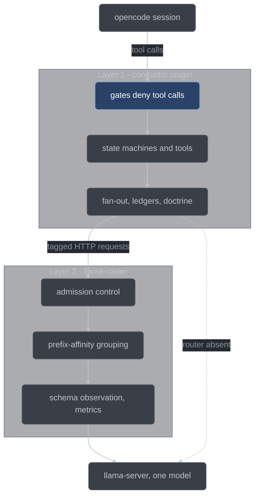

# Conductor overview

Conductor is an orchestration harness for [opencode](https://opencode.ai) that makes a
local ~27B model follow a test-first, adversarially-reviewed development process — not by
asking it to, but by making every other path deny. This page explains what it is and why
it exists; the pages linked at the bottom explain how to drive it.

## The problem

A local LLM developing software has the same chronic failure modes as any LLM, amplified
by smaller capacity. Context here is 32–64k, not 200k, and the model is one dense ~27B
served by `llama.cpp` on the same machine you are working on.

| Failure mode                     | What it looks like                                                                                      |
| -------------------------------- | ------------------------------------------------------------------------------------------------------- |
| Optimistic self-reporting        | "All tests pass" — reported without running them.                                                       |
| Process amnesia                  | The workflow is forgotten mid-session, especially near the context limit.                               |
| Test-after theater               | The implementation is written first, then a test that passes immediately and proves nothing.            |
| Anchored review                  | The model reviews its own work in the same context that produced it, and finds it good.                 |
| Over-building                    | A speculative abstraction and three unrequested features: the 400-line solution to the 12-line problem. |
| Shortcut-taking under difficulty | An assertion gets weakened, a failing test gets deleted, the reviewer gets skipped.                     |

## Why prose instructions do not fix it

Every one of those six is a failure to follow prose. A system prompt saying "always write
the test first" is read by the same model that forgets the workflow at 40k tokens, and a
rule saying "never delete a failing test" is advice to exactly the process that reaches
for shortcuts when the work gets hard. Adding more instructions adds more things to fail
to follow. The fix has to be mechanical: the model must be structurally unable to take the
wrong step, and the record of what happened must be produced by something other than the
model's say-so. That is constraint G9 in the plan — local models are assumed weak at prose
compliance, so every workflow obligation is a schema-constrained output, a tool the model
must call, or a gate that denies the wrong action. Instructions still exist, but only to
make the legal path obvious. They never carry enforcement.

## The mechanism

Four things do the work.

- **A state machine advanced only by typed tools.** A run and each of its items sit at a
  named position. The only way to move is to call a `conductor_*` tool, and its handler is
  the only writer of run and item state. There is no prose path from RED to GREEN.
- **Handlers that re-derive the evidence themselves.** The handler runs the test command,
  reads the diff, and inspects the tree. "The test went red" is true because the harness
  observed it go red, at a recorded `HEAD`, with a start-stamp that an edit to a staged
  behavioral file voids.
- **Gates that deny out-of-order or out-of-scope actions.** Every tool call passes through
  `tool.execute.before`, where an out-of-order stage tool, a destructive git command, or a
  write outside the current item's declared file scope is refused outright.
- **Adversarial review by fresh-context sub-sessions.** Reviewers are created for the
  review, given the diff, the item spec, and the test, and nothing else. They never saw the
  implementation happen, so they cannot be anchored by it. Their findings then face
  skeptics whose job is to refute them.

## The three layers

Conductor is three strictly separated layers, and the separation is the design.



| Layer                                                   | Job                                                                                                                                                                       | Failure posture                                                                                                                     |
| ------------------------------------------------------- | ------------------------------------------------------------------------------------------------------------------------------------------------------------------------- | ----------------------------------------------------------------------------------------------------------------------------------- |
| 1 — conductor plugin ([`conductor/`](../../conductor/)) | All enforcement: run and item state machines, gates, the `conductor_*` tools, the fan-out engine, the ledgers, doctrine injection                                         | **Fail-closed.** A crash inside gate evaluation while a guarded call is being judged denies the call.                               |
| 2 — llama-router ([`router/`](../../router/))           | Wall-clock and measurement: admission control, prefix-affinity grouping, wire-level schema observation, per-request metrics                                               | **Fail-soft.** If it is not running, the identical process is enforced, just slower. `serve.py --no-router` runs the same workflow. |
| 3 — wiring (`scripts/serve.py`)                         | Launches the router and injects the plugin, agents, and permissions into the session-scoped opencode config, so the harness travels into whatever workspace you `cd` into | If it does not run, the harness never enters the session at all — which is what the liveness beacon is for.                         |

Here is the sentence that makes the split click: **layer 1 is the only layer that can see a
tool call, so every gate lives there; layer 2 gets exactly the jobs the plugin structurally
cannot do.** The plugin does not own the server, so it cannot cap in-flight requests or
priority-queue them. It cannot influence server slot reuse, so it cannot keep six
reviewers' shared prefix KV-hot. It would be the claimant validating its own claim if it
checked its own schema conformance. And it sees only its own requests, so it cannot produce
a measured metrics ledger. A router-side gate, meanwhile, is structurally impossible — the
router sees HTTP, not tool calls.

The dependency direction is load-bearing. Process integrity never depends on the router
being up, and the router never converts a request the direct path would have served into a
failure: its schema guard observes and records, it does not reject.

## What happens to every prompt

There is nothing to invoke. Every user prompt arriving while no run is live creates a run
at `INTAKE`, and the run's first tool call is `conductor_classify`. Classification is
itself a recorded, adversarially-checked decision: a `mechanical` sub-session produces the
classification, one `skeptic` sub-session checks it, and disagreement escalates to the
stricter kind — which is what stops "everything is trivial" drift.

| Classification | Path                                                                   | Shape                                                                                                                                    |
| -------------- | ---------------------------------------------------------------------- | ---------------------------------------------------------------------------------------------------------------------------------------- |
| `question`     | `INTAKE → ANSWERED`                                                    | The orchestrator answers. No items, no pipeline, run archived. If answering turns out to require a change, it says so and you re-prompt. |
| `trivial`      | `INTAKE → EXECUTING → TRIVIAL_DONE`                                    | One synthesized item; decompose, plan, and plan review are skipped; item review runs with merged lenses; the report is a report-lite.    |
| `work`         | `INTAKE → DECOMPOSED → PLANNED → PLAN_REVIEWED → EXECUTING → REPORTED` | Decompose into a dependency DAG, plan, adversarial plan review iterated until no majors survive, execute items in waves, report.         |

The queue is per-prompt and ephemeral — created for the run, archived with it. There is no
global backlog.

Trivial compresses fan-out width, not process: the item state machine is never skipped.
Every item walks one of exactly two shapes.

```text
behavioral: true
  PENDING -> RED -> TEST_VETTED -> GREEN -> VALIDATED -> REVIEWED -> PUBLISHED

behavioral: false
  PENDING -> GREEN -> VALIDATED -> REVIEWED -> PUBLISHED
```

The non-behavioral shape exists because "fix the typo in this comment" otherwise has no
legal trajectory at all — a test-writer cannot make a comment fail an assertion. It is not
a shortcut the model may take for real code, and the reason is path arithmetic rather than
good intentions: **an item may declare `behavioral: false` only if every path in its
`fileScope` is disjoint from `verify.behavioralPaths`**, the repo's own declared list of
paths that hold behavior. The decompose handler checks that mechanically and rejects the
item otherwise. Skipping the failing test is impossible for production code and trivially
legal for a comment fix, and no judgment call sits in between.

## The orchestrator posture

The main session coordinates. It cannot edit source: its `edit` permission is `ask`, and
the plugin rejects every ask that no active claim covers. Implementation, review, and
critique happen in sub-sessions that the plugin creates itself over the opencode SDK —
each one fresh, given exactly the context it needs, returning a schema-constrained result.
The model does not get to spawn its own: opencode's `task` tool is denied in every session,
registered or not, because a model-spawned session would be an unregistered, unscoped
writer.

Inline work is still possible, through a record. `conductor_inline_claim` scopes the
orchestrator's edit permission to one item's `fileScope`, and is itself a recorded decision:
alongside the item and the reason it carries the scored options it was chosen over, because
dispatching was the alternative. The item state machine still applies in full — the claim
changes *who* edits, never *what* is enforced.

## Doctrine, not skills

The rule text conductor carries — the TDD iron law, the decision ladder, the minimality
ladder, the systematic-debugging protocol — could have shipped as an opt-in skill library.
It does not, for one blunt reason: **a local model self-activates an optional skill
approximately never.** An opt-in rule is subject to the same failure modes the rules exist
to prevent.

Instead the rules are compiled into nine short, role-scoped doctrine packs under
[`conductor/doctrine/`](../../conductor/doctrine/) — `core.md`, `decompose.md`, `plan.md`,
`tdd.md`, `test-vet.md`, `debug.md`, `review.md`, `skeptic.md`, `receive-review.md` — and
the plugin appends the role's pack, plus a live state block of at most 30 lines, to the
system prompt of *every* request. The state block carries the run state, the active item for
a sub-session bound to one, the single recommended next tool call with its item argument, a
*count* of the other legal tools, the open question count, blocked and deferred counts, taint
count, and overrides remaining. It names only the recommendation — the other legal tools are
counted, never listed, so nothing in the block can contradict the one next step. The process
is re-stated every request and never remembered. A missing pack is a startup error, raised
before the liveness beacon is written, so the beacon's absence proves initialization failed.

Doctrine is still only the courtesy. Every doctrine obligation that can be a gate is one:
the packs make the legal path obvious, and the gate is what makes the illegal path fail.
[`conductor/doctrine/core.md`](../../conductor/doctrine/core.md) is the pack every session
gets, and it is short enough to read in a couple of minutes.

## One model, many roles

Every sub-session and the orchestrator run the same served model — `qwen3.6-27b`, via
`config.models.default`. There is no role-to-weights mapping, and therefore no model-swap
cost anywhere in the design. A role selects four things, and never the weights.

| Role         | Doctrine pack                    | Sampling | Gate posture                   | Priority tag |
| ------------ | -------------------------------- | -------- | ------------------------------ | ------------ |
| orchestrator | `core.md`                        | 0.4      | edit: ask (inline claims only) | interactive  |
| planner      | `decompose.md` / `plan.md`       | 0.7      | edit: deny                     | interactive  |
| testWriter   | `tdd.md`                         | 0.5      | edit: `testScope` only         | review       |
| implementer  | `tdd.md` (+ `debug.md` in DEBUG) | 0.4      | edit: `fileScope` only         | review       |
| reviewer     | `review.md` / `test-vet.md`      | 0.3      | edit: deny                     | review       |
| skeptic      | `skeptic.md`                     | 0.3      | edit: deny                     | review       |
| mechanical   | `core.md`                        | 0.1      | edit: deny                     | batch        |

Two of the nine packs are not a role's primary doctrine and are delivered on a condition
instead: `debug.md` goes to an implementer whose item is in the debug posture, and
`receive-review.md` goes to exactly the dispatches that are receiving review findings. A pack
that is loaded but never delivered governs nothing, so both have a delivery trigger rather
than a place in the table above.

The single-model decision bought two things. First, wall clock: an earlier multi-model
design paid a full weight unload and reload — roughly 30 seconds for a 30 GB model — at
every role boundary, and roles alternate per *stage*, not per wave. A single item's walk
(test-writer, reviewer critics, implementer, reviewer lenses, skeptics, implementer) crosses
that boundary four to six times per review round, so a two-item run could spend five to
eight minutes reloading weights before generating a token of useful work. Under one model
that cost is identically zero.

Second, and more important for a proof of concept: it makes the quality delta attributable
to *process*. If the reviewers ran on bigger weights than the implementer, the measurement
would be confounded and the experiment would answer a different question. The fan-out
engine still groups jobs by resolved model, so a future multi-model configuration is a
config change rather than a redesign — under the default config that grouping is the
identity function.

## What it costs

Tokens are accepted; wall-clock is engineered. That is a stated constraint, not an
observation: no gate and no review stage may be weakened to save tokens, because the whole
point is to measure the quality-versus-cost trade honestly rather than to tune it away.
Wall-clock optimizations live in the wave scheduler and in llama-router, never in skipping
process.

The honest shape of the bill:

- Every item is implemented once and reviewed by three to six fresh sessions, one lens
  each. Every finding those sessions raise is then refuted by a further panel of skeptics.
- A plan is reviewed by a fan-out of fresh sessions and revised until a round produces no
  surviving majors, or the round cap is reached.
- Classification, decomposition, planning, test-vetting, review, and refutation are all
  sub-sessions on top of the implementation itself.

What buys the time back is scheduling, not omission. Items whose file scopes are disjoint
run in the same wave; the router caps in-flight requests so six concurrent reviewers do not
thrash a 20 GB model; and reviewers sharing one huge prefix — the diff, the plan, the
rubric — are grouped so that prefix stays KV-hot, which is the largest single wall-clock
lever available when there is only one model to schedule.

## What it cannot do

Conductor's limits are written down rather than papered over. The ones a user should know
before trusting it:

- **Gates fire inside opencode, and nowhere else.** A human at a raw terminal is ungated.
  Operational security is out of scope.
- **Conductor cannot detect its own absence.** If opencode fails to load the plugin, every
  gate described here is silently gone and the session looks completely normal. Nothing
  inside the session announces conductor's presence — there is no startup banner to look
  for. The out-of-band signal is the liveness beacon at
  `.conductor/state/alive.json`, written when the plugin opens the workspace and after the
  doctrine packs have loaded, so its absence is evidence that initialization failed. That
  makes absence *visible*, not *impossible*.
- **A second, plain `opencode` session in the same repo is ungated and invisible.** The
  harness travels through the config that `serve.py` hands its shell; another terminal
  running `opencode` in the same repo has no plugin, takes no lock, and races the conductor
  session's freshness stamps, quarantine moves, and freeze windows. (A second *conductor*
  session is the benign case: the workspace lock refuses it outright.)
- **Ledgers are records, not proofs.** They are strong records — every state-advancing one
  is written by a handler that re-derived the evidence itself — but the model's one
  remaining fabrication path is `conductor_override`, which is budgeted, taints the item,
  and is headlined in the report.
- **Verification trusts the target repo's own test command.** Vacuous tests get vacuous
  protection. The `TEST_VETTED` stage exists to raise that floor for the tests conductor
  itself writes, and does nothing for the ones already there.
- **The write-shape extractor is an enumeration, not a proof.** It reads the shapes it knows
  — redirects, `tee`, in-place editors, `mv`/`cp`/`rm`, and the recognized write calls inside
  `node -e` and `python -c` one-liners — and it is measured, not proven, against the ones it
  does not. A program that computes its target surfaces no path for the scope gate to judge.
  The state area is the one place this does not degrade: any interpreter text that merely
  names `.conductor` is refused whole. The journal records the command either way.
- **`behavioral: false` is only as honest as `behavioralPaths`.** The arithmetic is
  mechanical; the path list is human-confirmed at setup. A repo that lists `src/**` while
  keeping its logic in `lib/**` has handed the model a legal TDD bypass, which is why setup
  asks rather than defaults.
- **There is no pre-emptive turn-end hook in opencode.** Continuation is re-entry on idle,
  so between a turn ending and the re-prompt, the model has "stopped". A disengage backstop
  bounds it.
- **macOS on Apple Silicon only.** Nothing gratuitously breaks Linux; nothing verifies it.

## Where the build is

Conductor is under active construction against
[the plan](../plans/2026-08-07-conductor-harness-plan.md), which is the design authority.

Both of the things that would exercise this page end to end have since been run, and neither
was kind to it.

The **live smoke** — a real opencode session driving a real run against a real served model —
ran on 2026-08-21 ([`conductor/SMOKE.md`](../../conductor/SMOKE.md)). It found twenty-two
defects, including one that made every fan-out sub-session run on the wrong doctrine and one
that made a whole FSM stage unreachable. The **benchmark campaign**, the measurement that would
say whether the process buys the quality it costs, has run as a four-task probe
([`docs/build/artifacts/14.2-arm-campaign.md`](../build/artifacts/14.2-arm-campaign.md)). Its
standing result on the hardware measured: the `conductor` arm completed no cell at any tier,
while plain opencode finished every tier in under six minutes.

So the correct reading of this page has changed rather than relaxed. Its claims about what the
code *specifies* rest on the test suite and are in good standing. Its implicit promise — that
the specification adds up to a process worth its cost — is the open question, one campaign has
now been pointed at it, and the early answer is not yet a yes. Nothing here should be read as a
measured result; the two records above are where measured results live.

For what is committed and green, what is next, and what is deliberately deferred, see
[project status](../developer/project-status.md) — it is the single authoritative page for
build state, and this page deliberately does not duplicate it.

## See also

- [Run lifecycle](run-lifecycle.md) — the run and item state machines, stage by stage.
- [Gates and hatches](gates-and-hatches.md) — what gets denied, and the two ways out.
- [Tool reference](tool-reference.md) — every `conductor_*` tool and its arguments.
- [Architecture](../developer/architecture.md) — the same system from the inside.
- [Standing decisions](../../conductor/DECISIONS.md) — the recorded forks and why each won.
