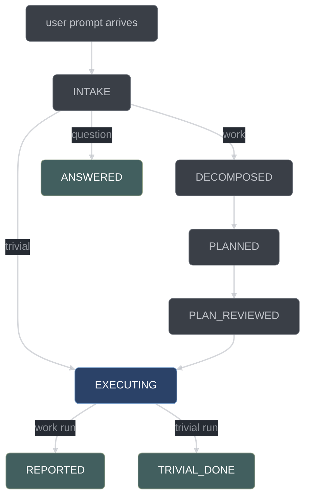

# Run lifecycle

What happens between the moment you type a prompt and the moment conductor writes a
report. This page is the narrative of one run, stage by stage, for people using conductor
rather than building it.

## A run is one prompt

A **run** is the unit of work conductor manages, created from exactly one user prompt. The
`chat.message` hook creates one when a prompt arrives and there is no live run — either
`current-run.json` points at nothing, or it points at a run that is terminal. Terminality has
one definition, used by every subsystem: a run is terminal when its state is `ANSWERED`,
`REPORTED`, or `TRIVIAL_DONE`, **or** when a stop record is present. Everything the run
produces goes into one self-contained directory in the target repo:

```text
.conductor/runs/<runId>/
├── run.json  queue.json  items/<itemId>.json    # the FSM state
├── plan.md   report.md                          # the human-readable artifacts
├── journal.jsonl  evidence.jsonl  decisions.jsonl  anomalies.jsonl  questions.jsonl
├── publish-batch.jsonl                          # what each publish staged, with its diff
└── answers/<Q-NNNN>.md                          # where the operator drops an answer
```

The queue is created *for* this run and archived *with* it. There is no long-lived backlog
across prompts, and no run resumes another run's queue. Old run directories are pruned at
run creation, newest first, under `retention.keepRuns` (default 20).

A prompt that arrives **during** a live run does not start a second run. It is routed into
the live run as orchestrator context and journaled as `user.midrun-prompt`. If you want a
new run, let the current one reach a terminal state — which it always does, because every
stop writes a report.

At creation the run captures four starting facts, because four later rules read them:

| Field              | What it is                                            | Who reads it later                        |
| ------------------ | ----------------------------------------------------- | ----------------------------------------- |
| `startHead`        | `HEAD` at run creation                                | branch discipline; publish's branch check |
| `startBranch`      | the branch at run creation                            | `git.branchPolicy` enforcement            |
| `startDirty`       | paths already dirty before conductor touched anything | publish, which never stages them          |
| `excludedStaleRed` | the stale-red registry entries in force for this run  | the quarantine computation; the report    |

The `excludedStaleRed` list is disclosed in the orchestrator's first response, in words:
*"3 test files from earlier runs are still red and are excluded from verification."*
Nothing is excluded silently.

## The run state machine

Eight positions, forward-only. The classification chosen at `INTAKE` picks exactly one of
three exits; `EXECUTING` closes one of two ways, depending on whether the run is a work run
or a trivial run.



The plan-review loop is not on this diagram on purpose. Revision rounds are internal to
the `conductor_plan_review` handler; the run state never regresses, and `PLAN_REVIEWED` is
reached only on a clean round or at the round cap.

| State           | Entered by                                                          | What the handler re-derives                                                             | What you see                                                               |
| --------------- | ------------------------------------------------------------------- | --------------------------------------------------------------------------------------- | -------------------------------------------------------------------------- |
| `INTAKE`        | the `chat.message` hook, on a prompt with no live run               | the run's starting facts (`startHead`, `startBranch`, `startDirty`, `excludedStaleRed`) | a run id and the stale-red disclosure                                      |
| `DECOMPOSED`    | `conductor_decompose`                                               | queue validity: DAG acyclicity, scopes, sizes, ponytail records                         | `queue.json` — items with their file scopes, test scopes, and dependencies |
| `PLANNED`       | `conductor_plan`                                                    | that `plan.md` was written; extracts its decision records into the ledger               | `plan.md`: per-item test strategy, alternatives, risks, execution order    |
| `PLAN_REVIEWED` | `conductor_plan_review`                                             | the whole fan-out — lens findings, skeptic verdicts, the revision loop                  | round count, and any surviving majors written as questions                 |
| `EXECUTING`     | `conductor_dispatch_wave`, or `conductor_classify` on a trivial run | the wave, then each member's item pipeline, concurrently                                | per-item stage progress; the recommended next tool call                    |
| `REPORTED`      | `conductor_report` on a work run                                    | a fresh, start-stamped full verify                                                      | `report.md`, and a stop kind derived from the run's dispositions           |
| `TRIVIAL_DONE`  | `conductor_report` on a trivial run                                 | the same handler in report-lite mode                                                    | `report.md` (lite), and the same derived stop kind                         |
| `ANSWERED`      | `conductor_classify` with kind `question`                           | the classifier plus one skeptic cross-check                                             | an answer, and no change to the repository                                 |

Transitions happen **only** inside `conductor_*` tool handlers. Every `conductor_*` call
passes a single legality choke point that asks two questions of a declared rule — who may
call this tool, and where in the run it may be called — and the position half delegates to
`legalTools` in [core/gates-phase.ts](../../conductor/core/gates-phase.ts) or to the
per-item `requireStageTool` path. The refusal names what is legal and what is recommended.
That one `legalTools` derivation is read by three subsystems — the gate that denies an
illegal call, the state block injected into every request's system prompt, and the
continuation engine that re-prompts an idle orchestrator — so they cannot disagree.

Conductor does **not** claim exactly one tool is legal at a time. With two items in flight,
`conductor_mark_green {I1}` and `conductor_submit_test {I2}` are legal simultaneously, and
`conductor_status`, `conductor_decide`, `conductor_surface`, and `conductor_defer` are legal
in every non-terminal state. The contract is a legal *set* plus a single *recommended*
action, and the recommendation is deterministic: the wave-order-first item's next stage
tool.

## Stage by stage

### INTAKE — classify the prompt

`conductor_classify` is the orchestrator's first legal tool. The handler dispatches a
`mechanical`-role sub-session with the `CLASSIFICATION` schema, then one `skeptic`-role
session with the `CLASSIFICATION_CHECK` schema — cheap, and it exists to stop "everything is
trivial" drift. Disagreement escalates to the stricter kind, where
`work` > `trivial` > `question`. A classification that fails its schema is re-prompted with
the validation error, up to 2 retries, then marks the sub-task `env`-failed.

- **`question`** — the orchestrator answers and the run goes to `ANSWERED`. A question run
  has no items, so there is nothing an inline claim could scope to. If answering turns out
  to need a change, the orchestrator says so and you re-prompt.
- **`trivial`** — the handler synthesizes the run's single item from
  `classification.trivialItem`, which is a complete queue item, not a hint. It re-checks
  `trivialMaxFiles` (default 2), test-scope non-emptiness, and the
  behavioral/`behavioralPaths` arithmetic; any violation escalates the run to `work`. The
  run enters `EXECUTING` flagged trivial: `DECOMPOSED`, `PLANNED`, and `PLAN_REVIEWED` are
  skipped, and item review runs with merged lenses. The item FSM is never skipped — trivial
  compresses fan-out width, not process.
- **`work`** — the run stays in `INTAKE` with the classification recorded, and
  `conductor_decompose` becomes the recommended and only pipeline-advancing tool.

### DECOMPOSED — split the work into items

`conductor_decompose` dispatches the `planner` role with the queue schema and the
`decompose.md` doctrine pack; every item carries its ponytail ladder rung and a reuse note.
The handler then validates, and each of these is a rejection with a named reason, not a
warning:

| Check                                                                       | Rejects                                                                                             |
| --------------------------------------------------------------------------- | --------------------------------------------------------------------------------------------------- |
| DAG acyclicity                                                              | a cycle in `dependsOn`                                                                              |
| non-empty `fileScope` per item                                              | an item that writes nothing                                                                         |
| non-empty `testScope` **iff `behavioral`**                                  | a behavioral item with no test paths; a non-behavioral item claiming test paths it will never write |
| `behavioral: false` implies `fileScope ∩ behavioralPaths = ∅`               | the TDD-skip loophole: an item cannot declare itself untestable while editing production code       |
| acceptance criteria phrased as observable checks                            | "make it better"                                                                                    |
| ponytail rung + reuse note under `ponytail: "full"` or `"ultra"`            | a `minimal-code` rung with no evidence that reuse was considered                                    |
| item size (scope beyond about 5 files, or more than one acceptance cluster) | one bounded re-split re-prompt round, then rejection                                                |
| no wildcard-headed `fileScope` entry                                        | `**`, `*.ts`, `{src,lib}/**` — an empty literal head names every path in the repository             |
| `testScope` disjoint from the item's own `fileScope`                        | an implementer licensed to rewrite the test that proves its own item                                |
| pairwise-disjoint `fileScope` across every pair of items                    | two items over one file: unattributable findings, and whichever publishes second commits the other's edits |
| no control character in any scope entry                                     | a newline that writes a line into the commit body or the runner's argv                              |

The `behavioral: false` row is the load-bearing one: `behavioral: false` skips `RED` and
`TEST_VETTED`, and the only way to earn it is path arithmetic against
`verify.behavioralPaths`, not the model's say-so. The inter-item disjointness rule is judged
with the same conservative overlap the wave scheduler uses, so `src/**` and `src/lex.mjs`
overlap, and it applies over every pair whatever each item's `behavioral` flag says —
territory, not tests, is what it is about.

After `PLAN_REVIEWED` the queue is immutable except through `conductor_queue_amend`, which
re-validates the DAG, scopes, and behavioral arithmetic and records a decision. Two of its
own rules matter in practice: the queue is amendable only before verification — `PENDING`,
`RED`, `TEST_VETTED`, `GREEN`; at `VALIDATED` the item carries a verify record the amended
scope would invalidate, and at `REVIEWED`/`PUBLISHED` its work is integrated. And an
`update` may not rewrite an item's scopes past `PENDING` — the item's existing red or green
was produced under the scope being replaced, so a re-scope must be stated as a `remove` then
an `add`, which reborns the item `PENDING` with no evidence.

### PLANNED — write the plan

`conductor_plan` dispatches the `planner` with the `plan.md` doctrine pack: exact paths,
bite-sized steps, complete code only where the item's acceptance and testScope leave a choice
open, no placeholders. "TBD", "add error handling", and "similar to task N" are plan defects
by name, not style preferences. The
output is `plan.md`: per-item test strategy, design alternatives considered (at least two
for every consequential fork, which the handler extracts into `decisions.jsonl`), risks, and
a proposed execution order.

### PLAN_REVIEWED — adversarial review of the plan

`conductor_plan_review` fans out `planReviewers` fresh sub-sessions (default 4, role
`reviewer`), each holding one lens over the whole plan and queue:

| Lens                           | Looks for                                                              |
| ------------------------------ | ---------------------------------------------------------------------- |
| correctness / design soundness | designs that will not work                                             |
| completeness vs the prompt     | requirements the plan silently dropped; placeholder scan folds in here |
| decomposition quality          | item size, scope disjointness, DAG honesty                             |
| minimality                     | unrequested abstractions, skipped reuse                                |

The roster never drops below the four lenses, whatever `parallel.maxReaders` says; a larger
`planReviewers` buys a second independent holder of a lens rather than a fifth kind of
review.

Every `major` finding then faces `skepticsPerFinding` refuters. Surviving majors send the
plan back to the planner with the findings attached; the plan is revised and the round
counter increments. The loop exits on a round that yields zero surviving majors, or at
`planReviewMaxRounds` (default 3).

**At the cap**, the run neither stalls nor silently proceeds. Each surviving major is
written to `questions.jsonl` with `origin: "plan-review-cap"`, and every item that finding's
claim and evidence name — by item id, or by a file path that intersects the item's
`fileScope` — is annotated `blocked: {questionId, reason, stage: "plan-review"}`, under the
same first-block-wins rule everywhere else applies: an item an earlier survivor already
blocks stays with that block. The later question still records that item in its own
`blocksItems`; only the ids it actually blocked come back in its result. The run proceeds on
the remaining items. That is the concrete meaning of "the rest block on
the human": a field on the item, a row in a ledger, and an unblock path
(`conductor_answer`).

### EXECUTING — drive the items

`conductor_dispatch_wave` moves the run to `EXECUTING` on its first call and is the run's
work engine, not a marker: it computes the wave, creates worktrees when configured, and runs
each wave member's item pipeline concurrently through the fan-out engine, returning when the
wave is drained or blocked. The per-item tools (`conductor_submit_test` through
`conductor_publish`) stay first-class and orchestrator-callable for single-item work, inline
claims, and recovery — they are the same handlers the driver calls, so there is one
implementation and one set of gates either way. What you see is items advancing through
their own state machine, one recommended tool call at a time, always naming an item id.

### REPORTED — close the run

`conductor_report` requires every item to be **settled**, and settlement is one derivation
with two consumers: the same predicate decides whether the gate offers the tool and whether
the handler accepts the call, so the two can never disagree. An item is settled when it is
`PUBLISHED`, or annotated `blocked` or `deferred`, or unable ever to advance in this run —
which covers an item waiting behind a dependency that is itself permanently stuck, and, in
§3.9 no-git mode, an item sitting at `REVIEWED`, which is as far as that mode can take it.
The refusal names which items are unfinished, not merely that some are. This holds for
trivial runs too: a trivial run closes report-lite, but only once its work is settled.

Settlement is deliberately *not* a verify. An unsettled item below `GREEN` has its own red
test in the exclusion set, so the closing verify would pass without ever executing the
failure that makes the run unfinished. Disposition is a property of persisted state and is
read from persisted state.

The handler re-runs the full verify itself, fresh and start-stamped, applying the same
foreign-red-set exclusion described below (a report is legal with blocked items whose red
tests linger). Then it writes `report.md` — what shipped per item (red proof, review rounds,
taint), what was blocked or deferred and why, open surfaced questions with their ids,
questions that are answered but still standing, the decision-ledger summary, any test files
newly added to the stale-red registry, the exclusions the closing verify applied, and the run
metrics.

The stop kind is chosen from those persisted dispositions and from the closing verify's own
result — it is never asserted by the writer. A green closing verify over a run that advanced
at least one item stops `done`; a run that settled everything without advancing anything
stops `noop`, naming how many were deferred; a run whose remaining work waits on a human
stops `blocked` or `surfaced`. A **red** closing verify can never stop `done`: an assertion,
missing-subject or unclassifiable failure stops `blocked`, and a runner that could not run
stops `env`. The plan calls the closing verify "verification-before-completion made
mechanical", and a law that cannot fail the completion is only advice.

### TRIVIAL_DONE and ANSWERED — the two short closes

`TRIVIAL_DONE` is the same report handler with the same completeness precondition and less
content. `EXECUTING → REPORTED` is work-only and `EXECUTING → TRIVIAL_DONE` is trivial-only;
each is denied for the other kind of run. `ANSWERED` has no queue, no plan, no items, and no
commits — the classification exists precisely to stop a "question" from quietly mutating the
repository.

## The item state machine

Seven positions and two chains that share one tail. Which chain an item walks was decided
at decompose time by path arithmetic, not at execution time by preference.


| Transition             | Tool                    | Evidence the handler re-derives                                                                                        |
| ---------------------- | ----------------------- | ---------------------------------------------------------------------------------------------------------------------- |
| `PENDING → RED`        | `conductor_submit_test` | runs the item test itself; requires exit non-zero with `failureClass` in `assertion` or `missing-subject`              |
| `PENDING → GREEN`      | `conductor_mark_green`  | non-behavioral items only; no test is owed or constructible, so the evidence is the full verify at `VALIDATED`         |
| `RED → TEST_VETTED`    | `conductor_vet_test`    | `vetCritics` critic verdicts over the item spec, the test diff, and the captured red output                            |
| `TEST_VETTED → GREEN`  | `conductor_mark_green`  | re-runs the item test itself; exit 0 required                                                                          |
| `GREEN → VALIDATED`    | `conductor_validate`    | quarantines the foreign red set, start-stamps, records `HEAD`, runs the required scopes (build first where configured) |
| `VALIDATED → REVIEWED` | `conductor_item_review` | reviewer and skeptic fan-out, path-routed fix loop; surviving findings must be zero                                    |
| `REVIEWED → PUBLISHED` | `conductor_publish`     | branch, stage, format, freshness, commit — in that order                                                               |

The handler runs the command; the model never reports its own evidence. An implementer is
never done by assertion: `TEST_VETTED → GREEN` fails until the test actually passes.

## What makes a red legal

Conductor will not accept a red just because a test failed. It accepts a red when the test
failed **for the right reason**, and "the right reason" is a closed vocabulary of three
failure classes:

| `failureClass`    | Means                                                                                                                                                                      | Legal red? |
| ----------------- | -------------------------------------------------------------------------------------------------------------------------------------------------------------------------- | ---------- |
| `assertion`       | the test ran, evaluated the behavior, and the behavior was wrong                                                                                                           | yes        |
| `missing-subject` | the test could not resolve the module or symbol it tests, and that unresolved path resolves inside **this item's** `fileScope`                                             | yes        |
| `error`           | anything else that prevented evaluation: a syntax error in the test, an unresolved import pointing outside the item's `fileScope`, a collection or build failure elsewhere | no         |

`missing-subject` exists because the first failing test of any new module cannot possibly
assert-fail — it fails to import a file that does not exist yet, and the test-writer is
scope-confined to `testScope` and so cannot create it. It is not a loophole, because the
unresolved thing must be the subject *this item is contracted to build*: a test that fails
to import a third-party package, or a module belonging to another item, is still `error`.
An `error` red is returned to the test-writer for repair, bounded by `testRepairAttempts`
(default 3); on exhaustion the item is annotated `blocked: {stage: "RED", reason}` and a
question is written.

**A test that passes immediately is rejected.** There are only two explanations, and both
are worth surfacing: either the behavior already exists — recorded as a decision, and the
item may be unnecessary, ponytail rung `skip` — or the test is wrong. Accepting a passing
test as a red would let an item walk the whole TDD chain having proven nothing.

## Test vetting

Between `RED` and `TEST_VETTED`, `conductor_vet_test` dispatches `vetCritics` parallel
critics (default 3, role `reviewer`, doctrine `test-vet.md`) with fresh contexts. Each one
gets the item spec, the test diff, and the captured red output — and **not** the
implementation. That omission is the point: no implementation exists yet, and once one does,
a critic reading it is anchored by code that already passes, so the question stops being
"would this test catch a subtly wrong implementation?" and becomes "does this test match the
code in front of me?". Only the first question is useful. The lenses are:

| Criterion             | Question                                                                                |
| --------------------- | --------------------------------------------------------------------------------------- |
| `observableBehavior`  | does it assert observable behavior rather than internals?                               |
| `wouldCatchWrongImpl` | would it fail for a subtly wrong implementation, or is it a tautology asserting a mock? |
| `rightLevel`          | is it at the right level — unit versus integration?                                     |
| `pinsAcceptance`      | does it pin *this* item's acceptance criteria?                                          |
| `antiPatterns`        | mock-behavior assertions, test-only production methods, incomplete mocks                |

`mustFix` items go back to the test-writer and the test is re-vetted, bounded by
`vetMaxRounds` (default 3).

## Review and skepticism

`conductor_item_review` dispatches fresh reviewers over the item's diff, spec, and test —
one lens each:

| Lens                        | Mandatory | Covers                                                                                     |
| --------------------------- | --------- | ------------------------------------------------------------------------------------------ |
| spec / contract             | yes       | spec compliance (missing requirements, unrequested extras) plus API and contract soundness |
| correctness                 | yes       | does it do the right thing                                                                 |
| guardrail                   | yes       | security, trust-boundary validation, data loss                                             |
| test-adequacy               | yes       | does the test still honestly pin the change now that the implementation exists             |
| minimality / simplification | yes       | unrequested abstraction, code that could be deleted                                        |
| perf                        | no        | performance, added when `itemReviewers` is 6                                               |

Session count is `clamp(min(itemReviewers, parallel.maxReaders), 3, 6)`, and a
trivial-classified run always uses 3. At 6, each lens gets its own session. Below 6, lenses
**merge pairwise from the tail** of the priority list rather than being dropped: 5 merges
minimality with perf; 4 additionally joins test-adequacy to spec/contract; 3 gives
spec+correctness, guardrail+minimality, and test-adequacy+perf — which is also the
trivial-run composition. The five mandatory lenses are never truncated away by
configuration.

The diff the reviewers are shown includes synthesized creation hunks for files the item
brings into existence. Without them a creation-shaped item has no diff at all, and the
read-witness check — the requirement that a reviewer name real contact with the change —
degenerates into echoing back a printed nonce.

All lenses dispatch in parallel. Adjudication preserves a two-stage ordering: surviving
spec/contract findings are fixed **first**, and quality-lens findings from a round that had
surviving spec findings are discarded and re-derived after the fix, because judging code
that is not yet spec-compliant is wasted judgment. Every finding then faces
`skepticsPerFinding` refuters (K, default 2), and survives if and only if the seats that did
not refute it reach `ceil(K/2)` — **a tie upholds**, so a split finding earns a fix round
rather than being dismissed.

A verdict counts as a refutation only when it carries evidence symmetric with the finding's:
a discriminating input, what was run, and the reading under which the finding fails. A
refutation missing any of the three is an **abstention**, and an abstention counts with the
upholds. A skeptic that could not evaluate a finding — a transport failure, a small model out
of its depth, a seat that answered in one unaudited line — cannot extinguish it. Refutation
stays cheap for a skeptic that did the work, and stays fatal to the finding.

Surviving findings are routed by the paths their fix touches, not by a fixed recipient:

| The fix touches                                                                                 | Dispatched to                          | Then                                                                                                                   |
| ----------------------------------------------------------------------------------------------- | -------------------------------------- | ---------------------------------------------------------------------------------------------------------------------- |
| `fileScope` only                                                                                | `implementer`                          | re-validate, then re-review                                                                                            |
| `testScope` — any test-adequacy finding, and any finding whose `suggestedFix` names a test path | `testWriter`                           | the changed test re-enters the test discipline: re-run it, re-vet it with `vetCritics`, then re-validate and re-review |
| both                                                                                            | `testWriter` first, then `implementer` | as above, sequentially                                                                                                 |

Both halves of that rule are load-bearing. The implementer is gated to `fileScope`, so
routing a test-adequacy finding to it produces a guaranteed denial, three wasted review
rounds, and a surfaced question — on a mandatory lens whose findings are common precisely
because the test was written before the implementation existed. The re-vet requirement on
the other side blocks the cheapest possible "fix": resolving a reviewer's finding by quietly
weakening the assertion that produced it.

A reviewer's claim is not automatically right. Doctrine `receive-review.md` requires it to be
verified against the code before the fix is implemented; a wrong finding is answered with
reasoning, which the handler routes back through one more skeptic round rather than
accepting silently. Fix, re-validate, re-review, bounded by `reviewMaxRounds` (default 3);
at the cap a question is written with the finding list and the item is annotated `blocked`.

## Publishing

`conductor_publish` runs five checks in a fixed order under `git.mode` `commit` or
`commit-and-push`. The model never runs `git commit` itself — the git-policy gate denies it,
and publishing *is* the tool. The commit is executed by the handler via `execFile`.

1. **Branch check.** `HEAD` must equal the `head` recorded in the verify being published; a
   mismatch denies, naming both commits, and the item re-validates. A green on another
   branch is not a green here, and a checkout moves the tree without touching a single staged
   file's mtime, so the mtime rule alone would pass this case.
2. **Stage.** The item's `fileScope ∪ testScope` changes, **minus every path in
   `run.startDirty`** — the tests are the deliverable's proof and ship in the same commit.
   Under `git.preexistingDirty: "refuse"` a dirty pre-existing path inside the item's scope
   denies publish and writes a question; under `"exclude"` it is skipped and listed in the
   report. Staging by raw glob is how unrelated work-in-progress ends up inside a conductor
   commit whose message and red proof describe something else.
3. **Format.** The configured format rules are applied to the staged files. A crashing
   formatter denies publish and never overwrites the file — its output is not a verdict.
4. **Freshness.** Re-checked against the staged set: the verify's start stamp must postdate
   the staged behavioral files' mtimes, and its recorded `head` must still be current. Stale
   triggers an automatic re-verify with the same foreign-red-set exclusion. **If that
   re-verify fails, the item drops to `GREEN`** — its own test still passes, the tree does
   not — `debugging` is set, and the debug protocol applies. Publish does not loop.
5. **Commit.** The message comes from a pure template in core, naming the item and its red
   proof: a message is not a judgment, and a template cannot hallucinate a red proof.
   Attribution trailers are denied by a case-insensitive denylist — `Co-Authored-By`,
   `Signed-off-by`, `Generated with`, and the robot emoji. Push happens only under
   `commit-and-push`.

Every publish appends a batch line to `publish-batch.jsonl` — the item, the mode, the staged
files, the diff, the suggested message and the verify verdict — and the report renders it.
Under `git.mode: "read-only"` the paths are still computed and the format rules still run,
but nothing is added to the index and no commit is made, so that batch line is the whole
record of what the item would have shipped; the item still advances to `PUBLISHED`.

The mode that parks an item at `REVIEWED` instead is §3.9 no-git — a workspace that is not a
git repository at all. There `conductor_publish` is not offered by the gate and refuses if
called, and `REVIEWED` is the item's terminal position for that run.

Three paths move an item **backwards** to `GREEN`, and all are administrative store writes
rather than FSM edges — there is no `REVIEWED → GREEN` transition in the table. The first is
step 4 above: a stale verify's automatic re-verify comes back red. The second and third are
worktree mode's merge-back: a merge that conflicts is aborted and the item drops back for
re-validation, and a merge that lands but whose integrated-tree re-validate goes red holds
the item back while the merge stands. In every case the item's own committed work survives,
it goes back to `GREEN` for debugging, and the journal records it as an item update.

## Waves

A **wave** is the maximal set of items conductor will work on at the same time. Membership
has four conditions:

| Condition               | Meaning                                                                                           |
| ----------------------- | ------------------------------------------------------------------------------------------------- |
| dependency-ready        | every id in `dependsOn` maps to a `PUBLISHED` item; nothing below `PUBLISHED` unlocks a dependent |
| pairwise scope-disjoint | no two members' `fileScope` globs intersect, under a conservative glob-intersection check         |
| not annotated           | neither `blocked` nor `deferred`                                                                  |
| within the cap          | at most `parallel.maxImplementers` members (default 2)                                            |

Order is intrinsic: DAG depth ascending, then item id ascending, so the same queue content
always produces the same wave and the same recommended next action regardless of how the
items are arranged in the file. The scope check is deliberately conservative: a
**degenerate** scope — an empty `fileScope`, or a glob whose first path segment is
wildcard-headed — conflicts with everything and never shares a wave, because a false positive
costs only parallelism while a false negative would cost correctness.

**The driver, not the model, owns concurrency.** `conductor_dispatch_wave`'s handler runs
one async pipeline per wave member, each walking that item's FSM through the same handlers
the per-item tools call, all sharing the fan-out engine's concurrency budget. This is the
only arrangement that works: a single opencode session executes tool calls sequentially, so
a marker-only dispatch would need the orchestrator model to emit concurrent tool calls —
exactly the dependency the design refuses to take. Within a wave the driver also batches like
stages, dispatching all members' vet critics together and all members' review lenses
together, which keeps the read fan-out saturated and shares prefix locality through the
router's group affinity.

Three things serialize, and the driver owns all three:

| Serialized                                       | Why                                                                                                                                                                                         |
| ------------------------------------------------ | ------------------------------------------------------------------------------------------------------------------------------------------------------------------------------------------- |
| `conductor_publish`, in item order               | the git index is a singleton                                                                                                                                                                |
| `conductor_validate`, per tree                   | a second validate against a tree with a live verify marker is denied naming the running verify — two verifies in one tree produce two records each describing a tree the other was mutating |
| writes, per tree, under `parallel.writes: "off"` | while a verify marker is live, the freeze gate denies every edit in that tree, production and test files alike, and no write-capable sub-session is dispatched into a frozen tree at all    |

Under worktree mode (`parallel.writes: "worktrees"`) each wave member gets its own `git
worktree` outside the repository, created at wave setup before any stage dispatch so every
sub-session is born bound to its own tree. The edit-scope gate binds each session to that
worktree path, and merge-back happens inside `conductor_publish` with a re-validate against
the integrated tree before `PUBLISHED` — a green in isolation is not a green in company. The
worktrees are removed at run teardown. Worktree creation is work-preserving: it prunes
first, adopts a still-registered worktree only after verifying its branch, and reuses a
surviving branch rather than deleting and recreating it, so a crash-recovered run does not
throw away committed work. Under the default `"off"` none of this runs a single git command.

## Annotations: blocked, deferred, debugging

These three are fields on the item, not FSM positions. Any state may carry them.

| Annotation  | Means                                                              | Set by                                                                                                                                                                        | Cleared by                                                      |
| ----------- | ------------------------------------------------------------------ | ----------------------------------------------------------------------------------------------------------------------------------------------------------------------------- | --------------------------------------------------------------- |
| `blocked`   | the item cannot move until a human answers something               | test-repair exhaustion, implementer `BLOCKED` escalation, the plan-review round cap, the review round cap, `conductor_surface {blocksItems}`, a debug architecture escalation | `conductor_answer` with the answer, or `conductor_queue_amend`  |
| `deferred`  | an explicit "not this run" disposition                             | `conductor_defer {itemId, reason}`, which also writes a decision record                                                                                                       | nothing this run — the report accepts it as a final disposition |
| `debugging` | the systematic-debugging protocol is currently active on this item | a verify failure that resists fixes; carries `{sinceMs, hypothesis}`                                                                                                          | the fix that turns the verify green                             |

A `blocked` item makes **no** transition at all, even an otherwise legal one, until the named
question is answered; that rule is applied before the transition table, not inside it. An item
carries exactly one `blocked` annotation, so blocking is first-block-wins and blocks hand off:
when the question an item is blocked on is answered, the item is immediately re-blocked on the
oldest still-open question that also names it, and is released only when none remains. Both
`blocked` and `deferred` also remove the item from wave scheduling and from the legal
stage-tool set. `debugging` does neither: it vetoes nothing, and its only effect is that the
injection layer delivers the `debug.md` doctrine pack to the item's implementer. The debug
protocol is bounded — root cause before fix, one hypothesis at a time — and after
`debugFixCap` failed fixes (default 3) an architecture question is written with
`origin: "debug-architecture"` and the item is blocked. `debugging` is what distinguishes
"three fixes tried, resolved" from "currently stuck".

## When a run ends

There are six stop kinds and no others:

| Stop kind   | Meaning                                                                                                                                                 |
| ----------- | ------------------------------------------------------------------------------------------------------------------------------------------------------- |
| `done`      | the run advanced at least one item, the closing verify is green, and nothing is outstanding                                                             |
| `noop`      | either three consecutive futile idle re-prompts — the run-state signature did not change — recorded with a `disengage` anomaly, after which re-prompting stops; or a settle in which not one item was advanced |
| `blocked`   | items remain blocked, or the closing verify came back red on an assertion or missing subject                                                             |
| `surfaced`  | human questions are still open and nothing is actionable                                                                                                |
| `env`       | tooling is broken: the closing verify's runner could not run, the orchestrator could not be reached, or the override budget is exhausted                |
| `interrupt` | a human aborted, or the halt file is present                                                                                                            |

A run may leave `EXECUTING` only via `conductor_report` or a recorded stop of one of these
kinds. `conductor_report` does not always record `done`: its kind is derived from the run's
persisted dispositions and the closing verify's result, so a report over a run that published
nothing closes `noop`, and a report whose closing verify is red can close `blocked` or `env`.
The `noop`-on-nothing-advanced rule closes a measured escape: defer every item, close on a
green verify that executed none of the deferred work, and the run reads as completion.

Two kinds are recorded outside that derivation. `interrupt` comes from halt handling.
`env`-on-exhausted-override is recorded by the override handler itself.

The wedge and budget rules fire **even with items still open**. A run wedged in a futile
re-prompt loop, or one that has spent its override budget to the cap, stops immediately
rather than burning tokens or making every gate advisory.

**Every terminal path writes a report.** Recording a stop is not by itself a terminal action:
the recorder must invoke the report writer first. The writer has three modes and one
implementation — **full** (the `done` path), **lite** (trivial runs), and **stop-report**
(any non-`done` stop: the same content, the stop kind and reason as the headline, and no
closing verify, because a wedged or interrupted run has no claim to prove and may be
mid-edit). That rule closes the worst failure shape in the design: `conductor_report` refuses
while an item is unpublished and unblocked, the continuation engine re-prompts, nothing
changes, the run stops `noop` — and ends with no human-readable artifact at all. That is
precisely the run you most need to read.

**A stop is not always the end.** A run that stopped on a resumable kind while a question was
still open keeps its current-run pointer, and answering that question clears the stop and
brings the run back to life — the answer is what the run was waiting for, and the earlier
behaviour lost committed work while the run that deferred the same item closed clean. The
revival is narrow on purpose. It never applies to a run terminal by FSM state, since that run
has been closed by `conductor_report` and reviving it would mean inventing a backwards edge;
and it never applies to a §6.2 human-territory question answered through the tool channel,
which is released by the operator's own answer file and nothing else.

## Leftovers between runs

Runs are per-prompt and ephemeral. The working tree is not. A blocked item leaves a
deliberately-red test file behind, and the next prompt creates a new run whose queue knows
nothing about it. Left alone, that leftover is expensive: run 2's first `conductor_validate`
runs run 1's red test, goes red, enters the debug protocol, spends `debugFixCap` fix attempts
hunting a bug that is really a leftover, then escalates an architecture question about code
it never wrote.

The **workspace stale-red registry** at `.conductor/state/stale-red.json` prevents that. It
is workspace-level and survives runs:

```jsonc
{ "version": 1,
  "entries": [
    { "path": "tests/i2.test.ts", "itemId": "I2", "runId": "r-20260807-a1b2",
      "sinceMs": 1754560000000, "reason": "item blocked at RED (test-repair exhausted)" } ] }
```

Entries are written when a run terminates with any item below `GREEN` whose test files exist
on disk; a declared-but-never-written test poisons nothing and is not registered. A path
already in the registry is not re-added and not re-reported, so a second terminal path in the
same workspace discloses nothing twice. Nothing removes an entry on its own — not deleting
the file, not a later run driving the test green. `conductor_forget_stale {path}` is the only
way one leaves, and it exists for the case where you resolved the red yourself.

Every quarantine computation unions this registry with the current run's sub-`GREEN` test
scopes. That union is the **foreign red set** — the tests that are supposed to be red and
must not poison an unrelated verify. Before start-stamping, those files are moved outside the
repository entirely, with a manifest written before any move so a crash replays the pending
restores; the item's own tests are never excluded. Silently excluding files would be its own
hazard, so nothing is silent: the active entries are disclosed at run start, and every report
lists the exclusions in force for its closing verify.

## See also

- [Conductor overview](conductor-overview.md) — the three layers and what each one does
- [Tool reference](tool-reference.md) — every `conductor_*` tool, its arguments, and its preconditions
- [Gates and hatches](gates-and-hatches.md) — what is denied, and the two deliberate escapes
- [State machines](../developer/state-machines.md) — the FSM tables and their tests
- [Scheduling and fan-out](../developer/scheduling-and-fanout.md) — the wave scheduler and the sub-session engine
- [Project status](../developer/project-status.md) — where the build stands
