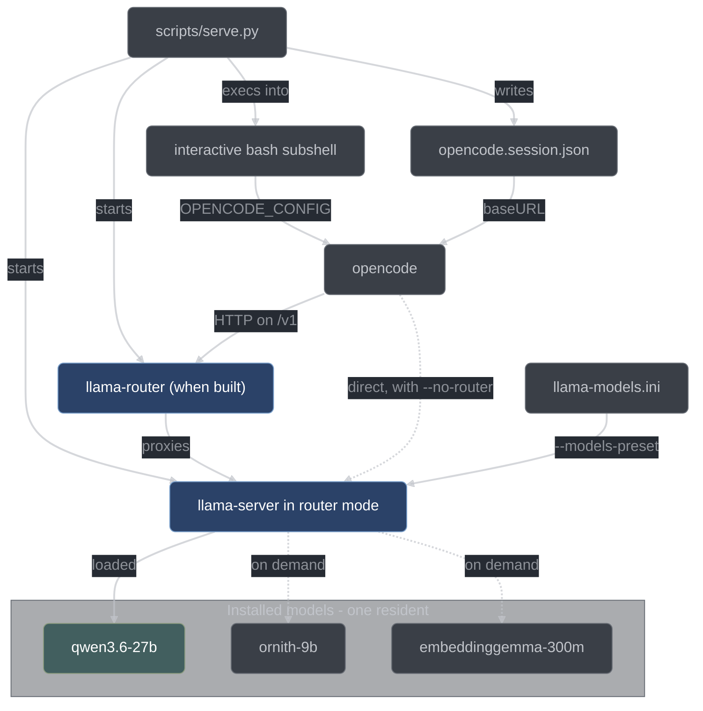

# Serving models

How a model gets from disk into a session you can talk to: one `llama-server` in router
mode, one endpoint, and a shell that opencode is already wired to. This page covers
[`scripts/serve.py`](../../scripts/serve.py) and everything it sets up for you.

Two different things in this workspace are called a router, and it is worth separating them
once. *Router mode* is a feature of `llama-server` itself: one process that holds several
models and loads whichever one a request names. `llama-router` is this repository's own C++
proxy, which sits in front of `llama-server` and adds admission control, priority queueing
and metrics. `serve.py` starts `llama-server` in router mode always, and starts `llama-router`
in front of it whenever both the binary and the exported router schema are present.

## One server, many models

Every installed model is served by a **single** `llama-server` process running in *router
mode*. It reads the generated preset at `.data/configs/llama-models.ini`, publishes every
section in that file at `/v1/models`, and loads and unloads weights on demand as requests
arrive. There is no per-model process and no per-model port.

```bash
llama-server --models-preset .data/configs/llama-models.ini \
             --models-max 1 --models-autoload \
             --host 127.0.0.1 --port 8080 --jinja --metrics \
             --parallel 6 --ctx-size 196608
```

`--parallel` and `--ctx-size` are derived, not typed: `--parallel` is the number of concurrent
sub-sessions the session is sized for (`--max-readers`, default 6), and `--ctx-size` is
`llama-server`'s *total* context, which it divides among those slots — so 6 slots at the
32768-token per-slot window is 196608. `--metrics` is not derived and takes no value: it turns on
the `/metrics` endpoint carrying the server's slot and cache counters. Because the total is divided, a `ctx-size` written in the
preset file is overridden on the command line whenever more than one slot is requested. At one
slot `serve.py` emits no `--ctx-size` at all unless you pass `--ctx`, and each model's preset
value applies.

The preset is generated by `scripts/fetch_models.py` and is not meant to be edited by hand. A
leading `[*]` section carries the defaults applied to every model; each remaining section name
is exactly the model id opencode uses. Keys are `llama-server` long options with the leading
dashes removed:

```ini
[*]
n-gpu-layers = 999
flash-attn = auto
jinja = true

[qwen3.6-27b]
model = /…/.data/models/qwen3.6-27b/Qwen3.6-27B-Q6_K.gguf
ctx-size = 65536
tags = general
temp = 0.7
```

`--models-max 1` is the important flag. It caps how many models are resident at once, so
requesting a different model transparently evicts the previous one. On the reference host —
an Apple M4 Max with 64 GiB of unified memory, of which macOS gives Metal roughly 75% — a
single 27B model at Q6_K plus its KV cache is a large fraction of the budget, and two
resident models is how you get an out-of-memory failure instead of a model swap.

Raise it only for combinations that genuinely fit side by side, such as a small coder plus
a 0.3 GB embedder:

```bash
scripts/serve.py --models-max 2
```

The value is remembered in `.data/configs/serve-session.json` and reused on the next run.

Utility models (embeddings, rerankers) are in the preset and are served like anything else,
but `serve.py` does not offer them in the model picker — opencode cannot use one as an agent
model, so picking one would only produce a broken session. Pass `--include-utility` if you
want them listed anyway.



## What serve.py does

Running `scripts/serve.py` with no arguments performs these steps in order:

1. **Checks the tools.** `fetch_models.py`'s build stamp is compared against the pinned
   `extern/llama-cpp` submodule, and the `llama-*` binaries are rebuilt if the submodule
   moved. `--no-build-check` skips this.
2. **Picks a model.** Installed chat-capable models are listed with quant, size and category;
   you answer with a number or an id. Naming a model on the command line skips the picker,
   and so does having exactly one model installed.
3. **Decides about the router.** `serve.py` looks for a `llama-router` binary and for the
   exported router schema. With neither flag given, finding both means the router launches and
   missing either means the session talks to `llama-server` directly, with a notice saying so.
   An explicit `--router` that cannot be honored is refused instead, so a request for the
   router never silently becomes a session without it. `--no-router` decides without
   consulting either: the lookup still runs, but its answer is ignored.
4. **Resolves the ports.** The wanted port is probed by binding it; if it is taken, the next
   free port is found and offered. The router's listen port is probed the same way, but
   non-interactively — a busy router port moves to the next free one and says so rather than
   asking — and it is additionally forbidden from landing on `llama-server`'s port: that port
   is still unbound at this moment, so without the exclusion the same free number would be
   handed out twice.
5. **Saves the choices** to `.data/configs/serve-session.json`.
6. **Starts `llama-server`** in the background, with stdout and stderr redirected to
   `.data/configs/server.log`.
7. **Waits for readiness** by polling `http://<host>:<port>/health` every half second until
   it answers 200, for up to 600 seconds. If the process dies first, or the timeout expires,
   `serve.py` kills the server and prints the last 15 lines of the log.
8. **Starts the router**, when step 3 chose to. It writes `.data/configs/conductor-router.json`,
   launches `llama-router` under a detached supervisor, and polls the router's
   `/conductor/health` for up to 30 seconds. A router that does not come up in that budget is
   stopped, and the session falls back to a direct connection with a notice.
9. **Writes a session opencode config** to `.data/configs/opencode.session.json`, with the
   provider `baseURL` on whichever endpoint step 8 settled on and the chosen model as the
   default. This is deliberately last: a config aimed at a router that never came up would 502
   from its first prompt.
10. **Arms a watchdog.** A detached Python process polls the pid this process is about to
    become, once a second, and when it disappears sends the server `SIGTERM` and then
    `SIGKILL` if it has not exited within ten seconds.
11. **Execs an interactive bash subshell** with a generated rcfile that exports
    `OPENCODE_CONFIG` and installs a cleanup trap. `exec` keeps the pid, so the shell you land
    in is the server's parent — and the pid the router's supervisor watches.

Steps 10 and 11 overlap on purpose. The bash `EXIT`/`HUP`/`INT`/`TERM` trap is the fast path,
but bash defers traps until the current foreground command returns — so closing a terminal
while `opencode` is running could otherwise leave the model resident. The watchdog is started
in a new session so it survives the terminal, and it cleans up even after a `SIGKILL` that no
trap could catch. Everything runs under bash regardless of your login shell, so the session
behaves identically whether you started from fish, zsh or bash.

## The session shell

The subshell sources `/etc/bashrc` and your `~/.bashrc` first, so it still feels like your
shell, then adds a prefixed prompt naming the served model:

```text
model served: qwen3.6-27b
  endpoint     : http://127.0.0.1:8080
  opencode cfg : /…/.data/configs/opencode.session.json

cd into any workspace and run: opencode
llama_status / llama_log to inspect; exit to stop the model

(qwen3.6-27b) ~/development/some-project $
```

These environment variables are exported. The first four are always present; the other three
depend on the session, as noted in the table. Environment is the channel rather than a config
key because opencode rejects a config containing keys it does not recognize, so nothing in the
session config can carry the router's address.

| variable                     | value                                                        |
| ---------------------------- | ------------------------------------------------------------ |
| `OPENCODE_CONFIG`            | path to `.data/configs/opencode.session.json`                |
| `LLAMA_HARNESS_MODEL`        | the model id you picked                                      |
| `LLAMA_HARNESS_URL`          | `http://<host>:<port>` — always `llama-server`, never the router |
| `LLAMA_HARNESS_ROUTER`       | `1` when the session goes through `llama-router`, `0` otherwise |
| `LLAMA_HARNESS_SERVER_PID`   | pid of the `llama-server` process (absent under `--print-env`) |
| `LLAMA_HARNESS_ROUTER_URL`   | the router's origin, router sessions only                    |
| `LLAMA_HARNESS_ROUTER_CONFIG`| path to `.data/configs/conductor-router.json`, router sessions only |

Two helper functions come with it:

| function       | what it does                                                                               |
| -------------- | ------------------------------------------------------------------------------------------ |
| `llama_status` | `GET $LLAMA_HARNESS_URL/v1/models`, pretty-printed; says so if the server is not answering |
| `llama_log`    | `tail -f` on `.data/configs/server.log`                                                    |

Typing `exit`, pressing Ctrl-D, or closing the terminal stops the model. That is the whole
lifecycle: the server is a child of this shell, and it does not outlive it.

## Flags

| flag                           | effect                                                                        |
| ------------------------------ | ----------------------------------------------------------------------------- |
| `MODEL` (positional, optional) | model id to serve; skips the picker                                           |
| `--fresh`                      | ignore saved settings and ask for everything                                  |
| `--host HOST`                  | bind host (default `127.0.0.1`)                                               |
| `--port PORT`                  | bind port (default `8080`)                                                    |
| `--ctx N`                      | override the served *per-slot* context size for this session                  |
| `--models-max N`               | models resident at once (default 1)                                           |
| `--no-shell`                   | run the server in the foreground; do not open a shell                         |
| `--router`                     | launch `llama-router` and point opencode at it; the default when the binary and the exported schema are both present |
| `--no-router`                  | talk to `llama-server` directly; the identical workflow, without the router    |
| `--router-port PORT`           | router listen port (default `8088`)                                           |
| `--max-readers N`              | concurrent sub-sessions to size `--parallel` and admission from (default 6)   |
| `--print-env`                  | print the session environment and exit, for scripting                         |
| `--include-utility`            | also offer embedding and reranker models in the picker                        |
| `--no-build-check`             | skip verifying the `llama-*` tools against the submodule                      |

Values resolve in one order everywhere: an explicit flag wins, then the saved session, then
the built-in default. `--ctx` is the one with no built-in default. It sets the window *per
slot*, not the total: `serve.py` multiplies it by the slot count before handing `llama-server`
a `--ctx-size`. Omit it and the per-slot window is 8192 tokens whenever more than one slot is
requested; at a single slot, omitting it leaves each model's `ctx-size` from the preset in
force.

`--max-readers` is the single number the concurrency of a session is derived from. It becomes
`llama-server`'s `--parallel` and the router config's `admission.maxInflightPerModel` at the
same time, so admission control can never let through more concurrent work than the upstream
has slots to serve.

## Remembered settings

The model, host, port, `models_max`, `ctx`, `max_readers` and `router_port` from every run are
written to `.data/configs/serve-session.json`:

```json
{
  "model": "qwen3.6-27b",
  "host": "127.0.0.1",
  "port": 8080,
  "models_max": 1,
  "ctx": null,
  "max_readers": 6,
  "router_port": 8088,
  "saved_at": "2026-08-07T06:57:50Z",
  "_comment": "Written by scripts/serve.py. These values are reused on the next run; pass --fresh to ignore them."
}
```

The next run pre-selects that model and reuses those settings. `--fresh` ignores the file
rather than deleting it — a one-off experiment can never destroy a working setup, and the run
after it goes back to the remembered values. A missing or unparseable file is treated as no
saved settings at all.

## How opencode is wired

`scripts/fetch_models.py config` generates the base config at
`.data/configs/opencode.json`. It declares one provider, `llamacpp`, backed by the
`@ai-sdk/openai-compatible` npm package and pointed at the local endpoint. The same step also
merges in the conductor fragment described below, so the base config already carries the
plugin and the agent definitions — regenerating it mid-session cannot strip conductor out from
under a running session. Its `baseURL` stays direct, because no router port exists at
generation time; pointing at the router is a session-time decision `serve.py` makes.

```json
{
  "provider": {
    "llamacpp": {
      "npm": "@ai-sdk/openai-compatible",
      "name": "llama.cpp (local router)",
      "options": {
        "baseURL": "http://127.0.0.1:8080/v1",
        "apiKey": "local",
        "timeout": 1800000,
        "headerTimeout": 600000
      },
      "models": { "qwen3.6-27b": { "…": "…" } }
    }
  },
  "model": "llamacpp/qwen3.6-27b",
  "small_model": "llamacpp/qwen3.6-27b",
  "autoupdate": false,
  "plugin": ["/…/conductor/plugin/index.ts"],
  "agent": { "conductor-orchestrator": { "…": "…" } }
}
```

There is no real credential anywhere. `apiKey` is the literal placeholder `"local"`, present
only because the OpenAI-compatible client expects the field; `llama-server` does not check
it. The long timeouts (30 minutes total, 10 minutes to first header) exist because a local
model that has to load 20 GB of weights before its first token is normal, not a hang.
`llamacpp` is the only provider in the config, so llama.cpp is the only path between opencode
and any model — nothing reaches a hosted API.

`autoupdate` is pinned to `false` because the wire contract this harness depends on was
verified against one specific opencode build; letting the tool update itself mid-session would
let that contract change underneath a run.

`serve.py` never edits that base config. It reads it, re-applies the conductor fragment (the
merge is idempotent, so doing it twice changes nothing), rewrites
`provider.llamacpp.options.baseURL` to the endpoint routing settled on, sets `model` and
`small_model` to `llamacpp/<chosen id>` if that id is one the provider declares, and writes the
result to `.data/configs/opencode.session.json`. Switching models for one session therefore
cannot corrupt the config you keep. If the base config does not exist, `serve.py` stops and
tells you to run `scripts/fetch_models.py config`. Before writing, it checks every `{file:…}`
reference the config contains and refuses on any that names a path that does not exist, since
opencode would otherwise fail at first use with an error that names nothing useful. One
constraint worth knowing if you hand-edit either file: opencode rejects a config containing
keys it does not recognize, which is why the generated session config carries no metadata
block.

## Using an existing server

Nothing about opencode requires the session shell. If a server is already up, point opencode
at a config yourself:

```bash
OPENCODE_CONFIG=$PWD/.data/configs/opencode.json opencode
```

`--print-env` reports a session rather than creating one. It starts nothing and writes
nothing — not the server, not the router, not the session opencode config a running session is
reading, and not even a socket bind, because binding a port would turn a report about a live
session into a claim about a port nobody is on. It reports the model you named or the one the
last run saved, the port the last run resolved to, and — by asking the router's
`/conductor/health` once — whether the router is actually answering.

```bash
scripts/serve.py --print-env
# OPENCODE_CONFIG=/…/.data/configs/opencode.session.json
# LLAMA_HARNESS_MODEL=qwen3.6-27b
# LLAMA_HARNESS_URL=http://127.0.0.1:8080
# LLAMA_HARNESS_ROUTER=1
# LLAMA_HARNESS_ROUTER_URL=http://127.0.0.1:8088
# LLAMA_HARNESS_ROUTER_CONFIG=/…/.data/configs/conductor-router.json
```

Standard output is `NAME=value` lines and nothing else, so the whole thing is safe to
`eval "$(scripts/serve.py --print-env)"`. Every notice — nothing listening on the port, no
session config written yet, the router not answering — goes to standard error instead. There
is no `LLAMA_HARNESS_SERVER_PID` line, because no server was started for this report to have a
pid for.

`--no-shell` runs `llama-server` in the foreground of the current terminal — useful under a
process supervisor, or when you want the server's output on your screen. There is no subshell
and no watchdog in that mode, and no router either: `--no-shell` replaces `serve.py` with
`llama-server`, so no process survives to supervise a router and no session shell exists for
it to die with. Combining `--no-shell` with an explicit `--router` is refused rather than
silently downgraded. Ctrl-C stops the server.

## Ports and collisions

The port check is a real bind, not a connect probe: `serve.py` opens a socket on the wanted
host and port and asks the kernel. If that fails, it scans the next 39 ports and offers the
first free one:

```text
port 8080 is already in use
Port to use instead [8081]:
```

Press Enter to take the suggestion or type another number. The prompt only appears when the
run is interactive **and** you did not pass `--port` explicitly — an explicit `--port` that
is busy moves to the next free port and tells you, rather than asking. If nothing in the
whole 40-port window is free, the run stops with an error naming the port it started from.
The resolved port is what goes into both the `llama-server` command line and the session
opencode config, so the two can never disagree.

## The conductor session

Conductor travels into the workspace you `cd` into, and `serve.py` is what carries it. Two
things get added to the session.

**The router.** `--router` / `--no-router` control it, and the default is the router whenever
a `llama-router` binary and the exported router schema are both present. When it is enabled,
`serve.py` generates `.data/configs/conductor-router.json` from the host and ports it resolved,
launches `llama-router` under a small supervisor process, and rewrites the session config's
`baseURL` to the router's port instead of `llama-server`'s. `--no-router` leaves `baseURL`
pointing straight at `llama-server`, and the identical workflow runs — just without admission
control and metrics.

The supervisor restarts a router that dies, backing off 500 ms and doubling to a 30-second cap,
and resetting that counter after any run that stayed up a full minute. Three exit codes are
treated as fatal and never restarted, because retrying them would loop forever: `2` (the
command line was rejected), `3` (the config could not be parsed) and `4` (the listen address
could not be bound). The supervisor is started in its own process session and dies with the
session shell, exactly like the server watchdog.

Only seven keys of `conductor-router.json` are machine-owned and refreshed on every run —
`version`, `listen.host`, `listen.port`, `upstream.host`, `upstream.port`,
`admission.maxInflightPerModel` and `metrics.ledgerPath`. Everything else you edit by hand
survives regeneration, unless you pass `--fresh`, which drops the hand edits and regenerates
the whole file. The same generation step computes `llama-server`'s `--parallel <slots>` and the
router config's `maxInflightPerModel` from one number, so admission control can never admit
more concurrent work than the upstream has slots for.

The router's own log is `.data/configs/router.log`, written by the supervisor with the router's
standard error merged into it.

**The fragment.** [`conductor/opencode-fragment.json`](../../conductor/opencode-fragment.json)
is deep-merged into the session config, conductor keys winning, with `${LLAMA_HARNESS_ROOT}`
substituted for this repository's absolute path. That token is a literal placeholder the merge
replaces — not shell or JSON interpolation — so the committed fragment stays machine-independent.
Objects merge key by key; every other value, arrays included, is replaced wholesale rather than
appended to, so what the fragment declares is exactly what the session gets. It contributes the
plugin entry — `${LLAMA_HARNESS_ROOT}/conductor/plugin/index.ts` — and seven agent definitions:

| agent                    | mode     | role                                           | permissions                                                                 |
| ------------------------ | -------- | ---------------------------------------------- | --------------------------------------------------------------------------- |
| `conductor-orchestrator` | primary  | coordinates the workflow; does not edit source | `edit: ask`; `bash: {"*": allow, "git commit *": deny, "git push *": deny}` |
| `conductor-planner`      | subagent | decomposes and plans                           | `question: ask`, `edit: deny`                                               |
| `conductor-test-writer`  | subagent | writes one item's failing test                 | `question: ask`                                                             |
| `conductor-implementer`  | subagent | implements one item                            | `question: ask`                                                             |
| `conductor-reviewer`     | subagent | reviews with one lens                          | `question: ask`, `edit: deny`                                               |
| `conductor-skeptic`      | subagent | refutes one finding                            | `question: ask`, `edit: deny`                                               |
| `conductor-mechanical`   | subagent | small schema-bound tasks                       | `question: ask`, `edit: deny`                                               |

Every one of the seven also carries `"tools": { "task": false }`, which disables opencode's
built-in sub-agent spawning tool for that agent. The orchestrator additionally loads
[`conductor/doctrine/core.md`](../../conductor/doctrine/core.md) as its system prompt via
opencode's `{file:…}` syntax.

None of the permissions above are the enforcement. They are defense in depth: the plugin's
gates are what actually decide, and they decide on every call in every session. Agent
permissions are a version-dependent config detail; the gates are not. Spawn denial is
deliberately expressed in both places, because a model-spawned session would be a session
conductor never registered — no role, no item, no file scope, and therefore an ungated writer.
No agent definition names a model either: the fan-out engine passes the model id per
dispatch, so the fragment stays model-agnostic.

## See also

- [`scripts/README.md`](../../scripts/README.md) — the deep reference for the model harness
- [Models](models.md) — the catalog, installation, and what fits in 64 GB
- [Configuration](configuration.md) — every conductor config key
- [Troubleshooting](troubleshooting.md) — when the server or the session misbehaves
- [llama-router](../developer/llama-router.md) — what layer 2 does and why it is fail-soft
